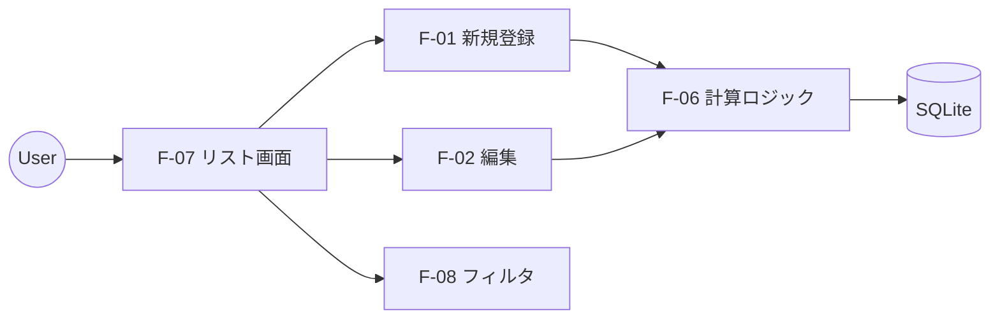

# R-02 機能要件定義書

## 1. はじめに
本ドキュメントは、「Task Manager Pro」に実装する機能要件を定義する。

## 2. 機能一覧 (Function List)

| 機能ID | 機能分類 | 機能名称 | 概要 | 優先度 |
|---|---|---|---|---|
| F-01 | タスク管理 | タスク新規登録 | タイトル、期日、工数、スコア属性を入力しタスクを作成する。 | 高 |
| F-02 | タスク管理 | タスク編集 | 既存タスクの属性を変更する。 | 高 |
| F-03 | タスク管理 | タスク削除 | 不要なタスクを削除（論理削除）する。 | 中 |
| F-04 | タスク管理 | タスク完了 | ステータスを完了にし、リストから除外（またはグレーアウト）する。 | 高 |
| F-05 | タスク管理 | クイック作成 | タイトルのみで素早くタスクを作成する（属性はデフォルト値）。 | 低 |
| F-06 | ロジック | 優先度自動計算 | 属性変更時にリアルタイムで優先度スコアを再計算する。 | 高 |
| F-07 | 表示・検索 | リスト表示 | 計算された優先度順にタスクをソート表示する。 | 高 |
| F-08 | 表示・検索 | フィルタリング | カテゴリ、期日、完了未完了で表示等の絞り込みを行う。 | 中 |
| F-09 | カテゴリ | カテゴリ管理 | カテゴリ（プロジェクト）の作成・色設定・編集・削除。 | 中 |
| F-10 | データ | 自動保存 | 変更を即座にローカルDB(SQLite)に永続化する。 | 高 |

## 3. ユースケース定義

### UC-01: タスクの優先度判断
**アクター**: ユーザー
**前提条件**: 複数のタスクが登録済みであること。
**基本フロー**:
1. ユーザーはアプリを開く。
2. システムは「未完了」タスクを検索し、各タスクの優先度スコアを計算する。
   - 計算式: $P = \frac{(Urgency \times 2.0) + (Impact \times 1.5)}{Effort} + DateBonus$
3. システムはスコアの降順でリストを表示する。
4. ユーザーはリスト最上位のタスクを確認する。

### UC-02: 詳細な見積もり入力
**アクター**: ユーザー
**目的**: タスクの優先度を精緻化する。
**基本フロー**:
1. ユーザーはタスク詳細画面を開く。
2. 工数を「0.5h」から「2.0h」に修正する（思ったより時間がかかりそう）。
3. 影響度を「5」から「8」に修正する（完了時のメリットが大きい）。
4. 保存ボタンを押す。
5. システムはスコアを再計算し、リスト内順位を更新する。

## 4. 画面・機能関連図

