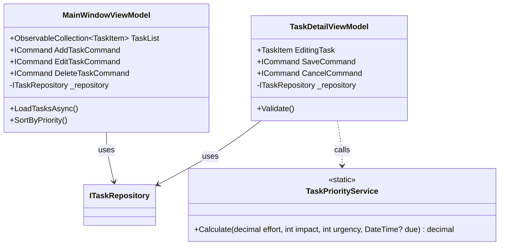

# D-01-01 クラス設計書

## 1. クラス図 (Logic Layer)

## 2. クラス定義詳細

### 2.1 ViewModels
**Namespace**: `TaskManagerPro.App.ViewModels`

| クラス名 | ベースクラス | 概要 | プロパティ/メソッド |
|---|---|---|---|
| **MainWindowViewModel** | `ObservableObject` | メイン画面ロジック。リスト管理と画面遷移制御。 | `Tasks`: 一覧データ `IsBusy`: ローディング状態 |
| **TaskDetailViewModel** | `ObservableObject` | 詳細ダイアログロジック。入力値保持と保存処理。 | `Title`, `Effort`, `Impact` 等のバインド用プロパティ |

### 2.2 Domain Services
**Namespace**: `TaskManagerPro.Data.Services`

| クラス名 | 概要 | 備考 |
|---|---|---|
| **TaskPriorityService** | 優先度計算を行う純粋関数群。 | ステートレスなstaticメソッドとして実装。単体テスト容易性を確保。 |

### 2.3 Data Access
**Namespace**: `TaskManagerPro.Data.Repositories`

| クラス名 | 実装IF | 概要 |
|---|---|---|
| **SqliteTaskRepository** | `ITaskRepository` | EF Coreを用いたSQLiteアクセス実装。 |
