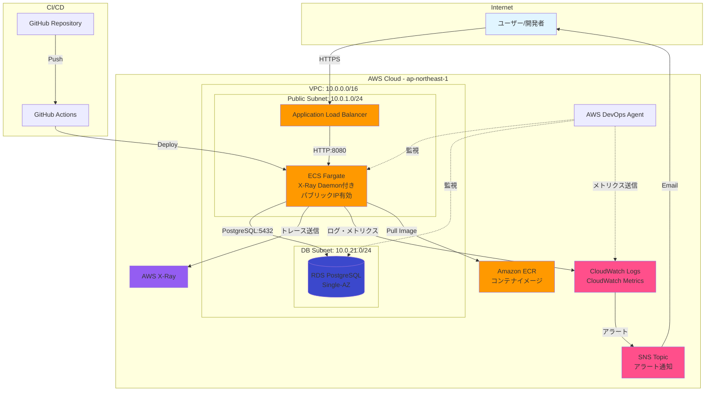
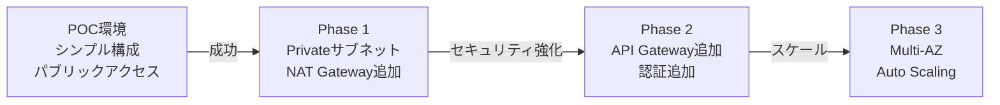
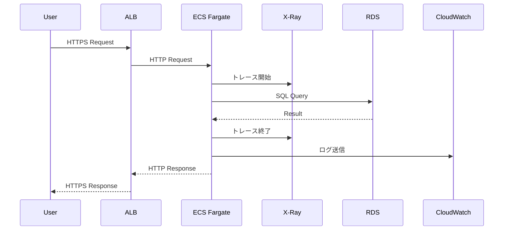
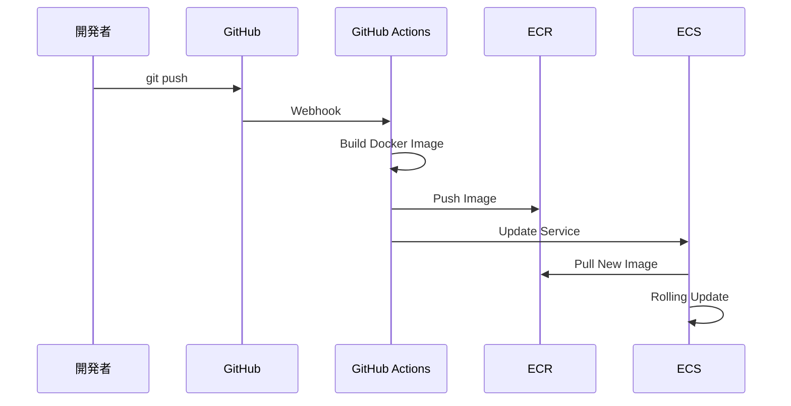
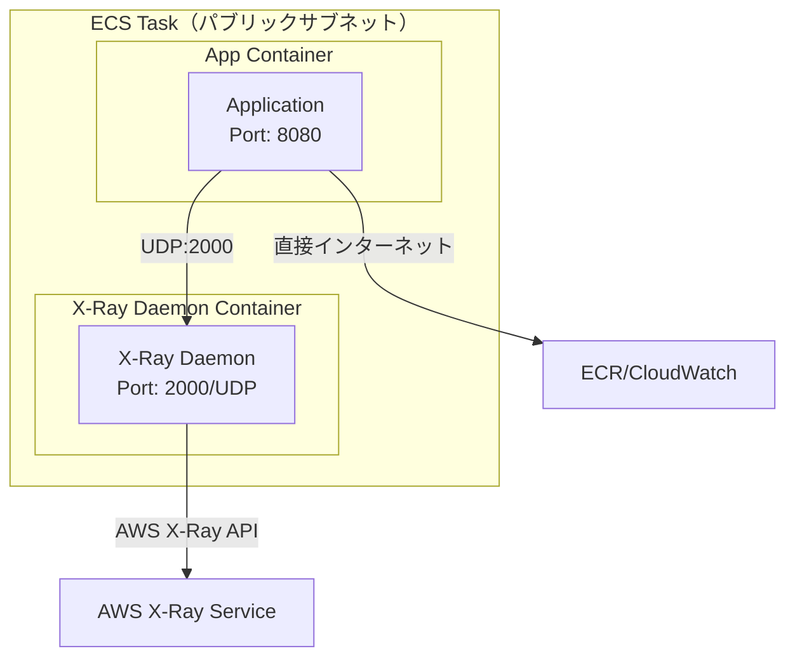
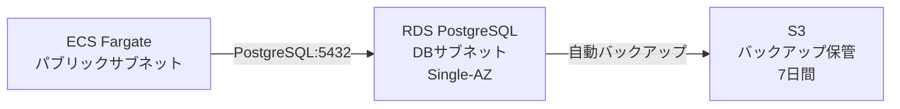

# システムアーキテクチャ

## 全体構成図

## システム構成要素

### コンピュートレイヤー

| コンポーネント | AWS サービス | 用途 | 冗長化 | POC制約 |
|--------------|-------------|------|--------|---------|
| ロードバランサー | Application Load Balancer | トラフィック分散、ヘルスチェック | 単一AZ | Multi-AZは本番時 |
| コンテナ | ECS Fargate | アプリケーション実行、X-Ray Daemon | 単一AZ | Multi-AZは本番時 |
| コンテナレジストリ | Amazon ECR | Dockerイメージ保管 | マルチAZ（デフォルト） | - |

### データレイヤー

| コンポーネント | AWS サービス | 用途 | 冗長化 | POC制約 |
|--------------|-------------|------|--------|---------|
| データベース | RDS PostgreSQL | データ永続化 | Single-AZ | Multi-AZは本番時 |
| バックアップ | RDS自動バックアップ | データ保護 | S3（マルチAZ） | 7日間保持 |

### 監視・ログレイヤー

| コンポーネント | AWS サービス | 用途 | 冗長化 | POC制約 |
|--------------|-------------|------|--------|---------|
| 分散トレーシング | AWS X-Ray | パフォーマンス分析、ボトルネック検出 | マルチAZ（デフォルト） | - |
| ログ管理 | CloudWatch Logs | アプリケーションログ、監査ログ | マルチAZ（デフォルト） | 7日間保持 |
| メトリクス | CloudWatch Metrics | リソース監視、カスタムメトリクス | マルチAZ（デフォルト） | - |
| 運用監視 | AWS DevOps Agent | 統合監視、オペレーション分析 | マルチAZ（デフォルト） | - |
| アラート通知 | SNS | Email通知 | マルチAZ（デフォルト） | - |

### ネットワークレイヤー

| コンポーネント | AWS サービス | 用途 | 冗長化 | POC制約 |
|--------------|-------------|------|--------|---------|
| VPC | Amazon VPC | ネットワーク分離 | リージョン単位 | 単一AZ |
| Internet Gateway | Internet Gateway | パブリックサブネット通信 | リージョン単位 | - |

### CI/CDレイヤー

| コンポーネント | 外部サービス | 用途 | 備考 |
|--------------|-------------|------|------|
| ソース管理 | GitHub | コード管理、バージョン管理 | - |
| CI/CD | GitHub Actions | ビルド、テスト、デプロイ | AWS認証はOIDC |

## アーキテクチャ特性

### POC向け最適化

| 特性 | 設計方針 | 理由 |
|------|---------|------|
| コスト | 最優先（月額1,000円目標、スクラップ&ビルド） | POC予算制約 |
| 可用性 | 単一AZ許容 | コスト削減、検証優先 |
| セキュリティ | 基本的な保護（認証なし、パブリックアクセス許容） | 検証簡略化 |
| 監視 | X-Ray/CloudWatch/DevOps Agent | POC主目的 |
| スケーラビリティ | 最小構成 | 検証のみ、負荷試験なし |

### シンプル構成の採用理由

**削除したコンポーネント**:
1. **NAT Gateway**: ECSをパブリックサブネットに配置することで不要（月額$45削減）
2. **NLB**: API Gateway削除により不要（月額$22削減）
3. **API Gateway**: ALB直接公開で十分（月額$0.5削減）

**合計削減額**: 約$67/月

**トレードオフ**:
- ✅ コスト大幅削減
- ⚠️ ECSがパブリックIP保有（POCでは許容）
- ⚠️ API管理機能なし（レート制限、認証等）

### 本格導入への移行パス

POC成功後、以下を段階的に追加:

## リクエストフロー

### 通常のAPIリクエスト

### デプロイフロー

## コンポーネント詳細

### ECS Fargate タスク構成

**注**: ECSタスクがパブリックIPを持つため、NAT Gateway不要

### データベース構成

## 技術スタック

| レイヤー | 技術 | バージョン | 備考 |
|---------|------|----------|------|
| IaC | AWS CloudFormation | - | AWSネイティブ |
| コンテナ | Docker | 最新 | Fargate互換 |
| ランタイム | ECS Fargate | 最新プラットフォーム | Fargate 1.4.0推奨 |
| データベース | PostgreSQL | 15.x | RDSマネージド |
| 監視 | X-Ray + CloudWatch + DevOps Agent | - | POC検証対象 |
| CI/CD | GitHub Actions | - | OIDC認証 |

## 非機能要件の実現方針

| 要件 | 実現方式 | POC制約 |
|------|---------|---------|
| 可用性 | ALB ヘルスチェック、ECS 自動復旧 | Single-AZ（99.5%目標） |
| 性能 | Fargate 0.25vCPU/0.5GB（最小構成） | 負荷試験なし |
| セキュリティ | Security Groups、IAMロール、TLS | 認証なし、パブリックアクセス許容 |
| 監視 | X-Ray、CloudWatch、DevOps Agent | POC主目的 |
| スケーラビリティ | タスク数1固定 | Auto Scalingなし |
| コスト | 月額1,000円目標（スクラップ&ビルド） | 最優先 |

## スクラップ&ビルド運用

### 想定稼働パターン

| 稼働パターン | 稼働時間 | 用途 |
|------------|---------|------|
| 検証時のみ起動 | 1日2時間×月10日 = 月20時間 | X-Ray検証、動作確認 |
| 検証完了後 | 即削除 | コスト最小化 |

### コスト削減効果

**24時間稼働の場合**: 月額約$30-40
**20時間稼働の場合**: 月額約$2-3（約93%削減）

**重要**: 検証時以外は必ず削除すること

## ADR参照

- [ADR-001: POC向け単一AZ構成の採用](INDEX.md#adr-001-poc向け単一az構成の採用)
- [ADR-002: IaCツールにCloudFormationを採用](INDEX.md#adr-002-iacツールにcloudformationを採用)
- [ADR-003: 認証なしのパブリックアクセス許容](INDEX.md#adr-003-認証なしのパブリックアクセス許容)
- [ADR-004: NAT Gateway削除（シンプル構成採用）](INDEX.md#adr-004-nat-gateway削除シンプル構成採用)
- [ADR-005: API Gateway削除（ALB直接公開）](INDEX.md#adr-005-api-gateway削除alb直接公開)

## 参照ドキュメント

- [02_ネットワーク設計.md](02_ネットワーク設計.md) - VPC、サブネット詳細
- [06_コンピュート設計.md](06_コンピュート設計.md) - ECS、ALB詳細
- [08_監視・アラート設計.md](08_監視・アラート設計.md) - X-Ray、CloudWatch詳細
- [13_コスト設計.md](13_コスト設計.md) - コスト見積もり
