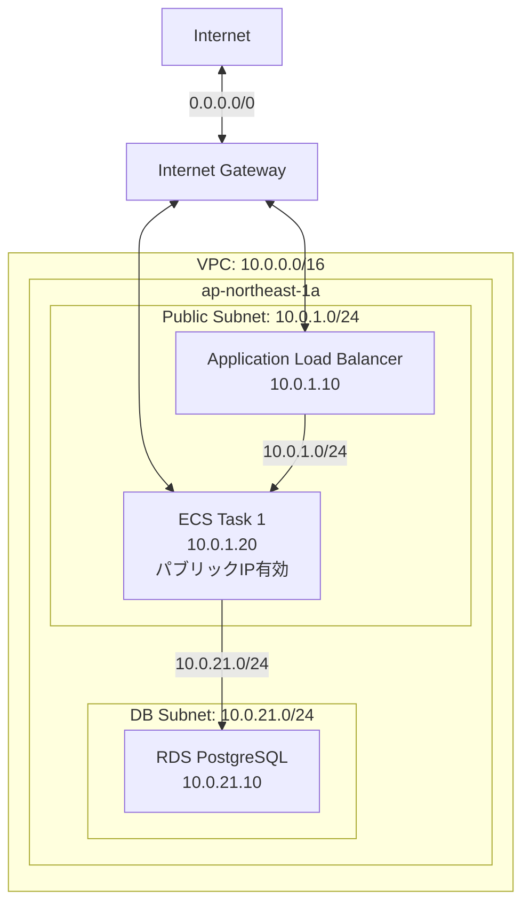
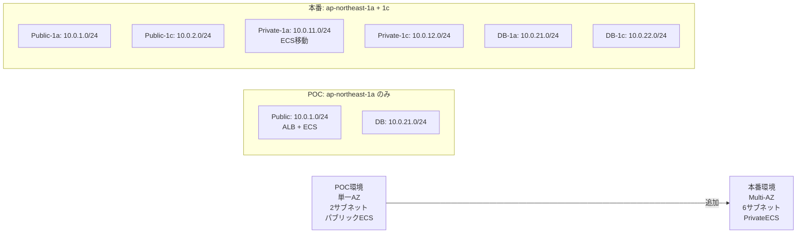
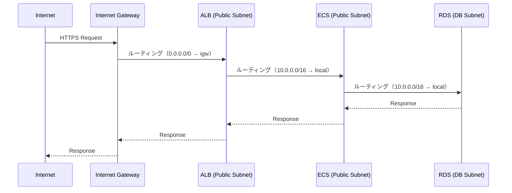
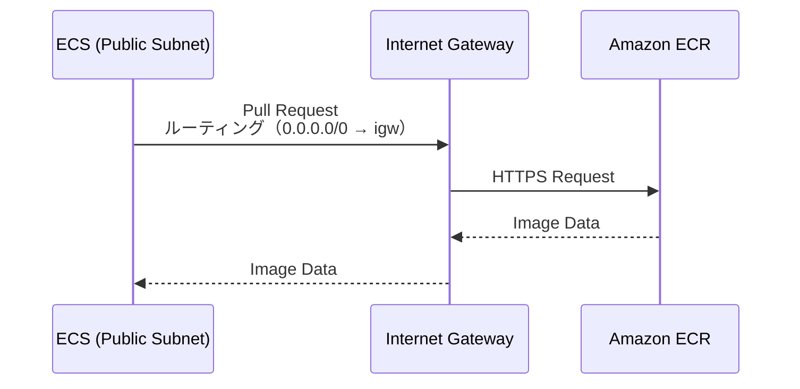
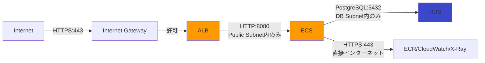

# ネットワーク設計

## VPC設計

### 基本構成

| 項目 | 値 | 備考 |
|------|-----|------|
| VPC CIDR | 10.0.0.0/16 | 65536個のIPアドレス |
| リージョン | ap-northeast-1 | 東京リージョン |
| AZ | ap-northeast-1a のみ | POC向け単一AZ（コスト削減） |
| DNS解決 | 有効 | RDS接続に必要 |
| DNSホスト名 | 有効 | RDS接続に必要 |

### VPC構成図（シンプル構成）

**重要な変更点**:
- ECSをパブリックサブネット配置（パブリックIP有効）
- NAT Gateway削除（不要）
- Privateサブネット削除（不要）

## サブネット設計

### サブネット一覧

| サブネット名 | CIDR | AZ | タイプ | 用途 | 使用可能IP数 |
|------------|------|-----|--------|------|-------------|
| xray-poc-public-1a | 10.0.1.0/24 | ap-northeast-1a | Public | ALB、ECS Fargate | 251 |
| xray-poc-db-1a | 10.0.21.0/24 | ap-northeast-1a | Private | RDS | 251 |

**注**: 各サブネットで AWS が予約する 5つのIPアドレス（.0, .1, .2, .3, .255）を除く

### サブネット設計の考慮事項

#### POC向け簡素化

- **単一AZ**: コスト削減（Multi-AZは本番時に追加）
- **2サブネットのみ**: Public（ALB + ECS）、DB の2つのみ
- **NAT Gateway不要**: ECSがパブリックIPを持つため外部通信可能

#### 本格導入時の拡張パス

## ルーティング設計

### パブリックサブネット ルートテーブル

| 宛先 | ターゲット | 用途 |
|------|-----------|------|
| 10.0.0.0/16 | local | VPC内通信 |
| 0.0.0.0/0 | Internet Gateway (igw-xxx) | インターネット通信 |

**関連付け**: xray-poc-public-1a

### DBサブネット ルートテーブル

| 宛先 | ターゲット | 用途 |
|------|-----------|------|
| 10.0.0.0/16 | local | VPC内通信 |

**関連付け**: xray-poc-db-1a

**注**: DBサブネットはインターネットアクセス不要（完全プライベート）

## ルーティングフロー

### インバウンドトラフィック（APIリクエスト）

### アウトバウンドトラフィック（ECRイメージ取得）

**重要**: ECSがパブリックIPを持つため、NAT Gateway不要

## NAT Gateway削除によるコスト削減

### ADR-004: NAT Gateway削除（シンプル構成採用）

#### 旧構成 vs 新構成

| 項目 | 旧構成（NAT Gateway有） | 新構成（NAT Gateway削除） | 差分 |
|------|----------------------|------------------------|------|
| **ECS配置** | Privateサブネット | Publicサブネット | - |
| **パブリックIP** | なし | あり | ECSがインターネット直接通信 |
| **NAT Gateway** | あり（$45/月） | **削除** | **-$45/月** |
| **データ処理費** | $0.19/月 | $0（不要） | -$0.19/月 |
| **月額合計削減** | - | - | **-$45.19/月** |

#### 決定理由

1. **コスト削減**: NAT Gateway（$45/月）が最大コスト要因だった
2. **POCでは十分**: X-Ray検証にPrivateサブネット配置は不要
3. **セキュリティトレードオフ**: POCでは許容範囲

#### トレードオフ

**メリット**:
- ✅ 大幅コスト削減（約$45/月）
- ✅ 構成シンプル化
- ✅ トラブルシューティング容易

**デメリット**:
- ⚠️ ECSがパブリックIPを持つ（本番では推奨されない）
- ⚠️ Security Groupsでアクセス制御必須
- ⚠️ 外部サービス連携時に送信元IPがECSタスクIPになる

**本番環境での対応**:
- Privateサブネット配置 + NAT Gateway復活
- Security Groups強化
- WAF追加

## ネットワークACL

### デフォルトNACL使用

POC期間中は **デフォルトNACL（すべて許可）** を使用

| 方向 | ルール# | タイプ | プロトコル | ポート範囲 | ソース/送信先 | 許可/拒否 |
|------|--------|------|-----------|-----------|-------------|----------|
| Inbound | 100 | All Traffic | All | All | 0.0.0.0/0 | ALLOW |
| Outbound | 100 | All Traffic | All | All | 0.0.0.0/0 | ALLOW |

**理由**:
- Security Groupsで十分なセキュリティ制御
- NACLは本番環境で詳細設計
- POC簡素化

## DNS設定

### Route 53（オプション）

POC期間中は **使用しない**

- ALBのデフォルトDNS名使用
- 独自ドメインは本番環境で検討

### VPC DNS設定

| 設定項目 | 値 | 理由 |
|---------|---|------|
| enableDnsHostnames | true | RDSエンドポイントのDNS名解決 |
| enableDnsSupport | true | VPC内DNS解決 |

## ネットワークセキュリティ

### 通信経路の制限

### セキュリティ原則

1. **最小権限の原則**: 必要な通信のみ許可（Security Groupsで制御）
2. **レイヤー分離**: Public/DB サブネットで分離
3. **DBインターネット直接アクセス禁止**: RDSはDBサブネット配置

## トラフィック推定（POC、月20時間稼働）

| 通信種別 | 方向 | 推定量 | 備考 |
|---------|------|--------|------|
| APIリクエスト | Inbound | 20リクエスト/日 × 10日 = 200リクエスト/月 | 検証用 |
| ECRイメージ取得 | Outbound | 500MB/デプロイ（月1〜2回） | コンテナイメージ |
| X-Rayデータ送信 | Outbound | 1MB/日 × 10日 = 10MB/月 | トレースデータ |
| CloudWatch Logsデータ送信 | Outbound | 5MB/日 × 10日 = 50MB/月 | ログデータ |
| **合計データ転送量** | - | **約1GB/月** | コスト計算に使用 |

**注**: 月20時間稼働（1日2時間×10日）を想定

## 参照ドキュメント

- [01_システムアーキテクチャ.md](01_システムアーキテクチャ.md) - システム全体構成
- [03_セキュリティ設計.md](03_セキュリティ設計.md) - Security Groups詳細
- [06_コンピュート設計.md](06_コンピュート設計.md) - ECS、ALB詳細
- [13_コスト設計.md](13_コスト設計.md) - コスト詳細
