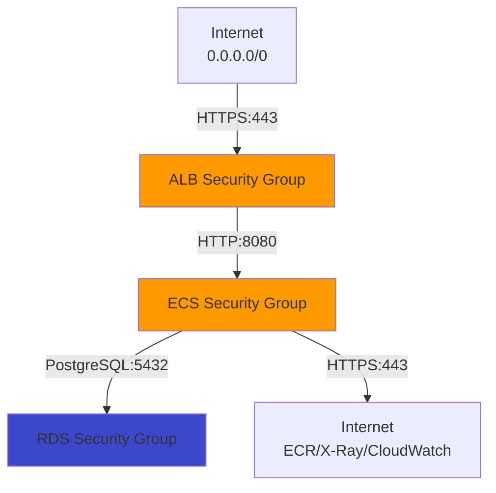
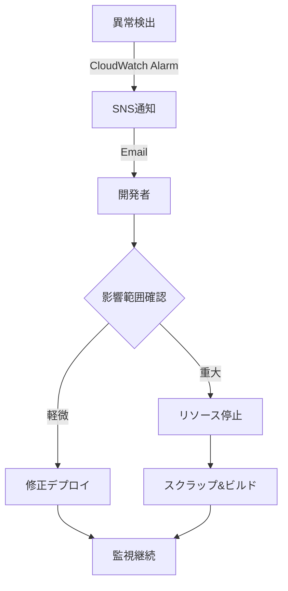

# セキュリティ設計

## セキュリティ設計方針

### POC向け簡素化

| セキュリティ領域 | POC方針 | 本番環境での追加 |
|---------------|---------|----------------|
| 認証・認可 | **なし（パブリックアクセス）** | Cognito、API Key、IAM認証 |
| WAF | なし | AWS WAF（DDoS対策、SQLインジェクション対策） |
| ネットワーク | Security Groups、NACL（デフォルト） | カスタムNACL、PrivateLink |
| 暗号化 | TLS 1.2+、RDS暗号化 | KMS CMK、アプリケーションレベル暗号化 |
| 監査ログ | CloudTrail（デフォルト）、VPC Flow Logs（オプション） | 長期保管、SIEM連携 |

### セキュリティ原則

1. **最小権限の原則**: IAMロール、Security Groupsで必要最小限の権限
2. **多層防御**: ネットワーク分離、暗号化、ログ監視
3. **監査証跡**: CloudTrail有効化
4. **暗号化**: 転送中・保管時の暗号化

## Security Groups設計

### 1. ALB Security Group

**名前**: `xray-poc-alb-sg`

| 方向 | プロトコル | ポート | 送信元/送信先 | 用途 |
|------|-----------|--------|--------------|------|
| **Inbound** | TCP | 443 | 0.0.0.0/0 | インターネットからのHTTPS（API Gateway VPC Link経由） |
| **Outbound** | TCP | 8080 | xray-poc-ecs-sg | ECSへのHTTP転送 |

**注**: API Gateway VPC Linkからのトラフィックも 0.0.0.0/0 として扱われる

### 2. ECS Security Group

**名前**: `xray-poc-ecs-sg`

| 方向 | プロトコル | ポート | 送信元/送信先 | 用途 |
|------|-----------|--------|--------------|------|
| **Inbound** | TCP | 8080 | xray-poc-alb-sg | ALBからのHTTPトラフィック |
| **Outbound** | TCP | 5432 | xray-poc-rds-sg | RDSへのPostgreSQL接続 |
| **Outbound** | TCP | 443 | 0.0.0.0/0 | ECR、X-Ray、CloudWatch、DevOps Agent API |
| **Outbound** | UDP | 2000 | 127.0.0.1/32 | X-Ray Daemon（サイドカー） |

**X-Ray Daemon通信**:
- ECSタスク内のアプリコンテナ → X-Ray Daemonコンテナ（UDP:2000）
- 同一タスク内のコンテナ間通信のため、Security Group不要（ループバック）

### 3. RDS Security Group

**名前**: `xray-poc-rds-sg`

| 方向 | プロトコル | ポート | 送信元/送信先 | 用途 |
|------|-----------|--------|--------------|------|
| **Inbound** | TCP | 5432 | xray-poc-ecs-sg | ECSからのPostgreSQL接続 |

**注**: Outboundルールは不要（RDSは受信のみ）

### 4. VPC Endpoint Security Group（将来用）

本番環境で VPCエンドポイント を使用する場合:

**名前**: `xray-poc-vpce-sg`

| 方向 | プロトコル | ポート | 送信元/送信先 | 用途 |
|------|-----------|--------|--------------|------|
| **Inbound** | TCP | 443 | xray-poc-ecs-sg | ECSからのHTTPS（ECR、CloudWatch等） |

## Security Groups 依存関係図



## IAMロール設計

### 1. ECS Task Execution Role

**名前**: `xray-poc-ecs-task-execution-role`

**用途**: ECSタスク起動時にFargateが使用（ECRイメージ取得、CloudWatch Logsへのログ送信）

**信頼ポリシー**:
```json
{
  "Version": "2012-10-17",
  "Statement": [
    {
      "Effect": "Allow",
      "Principal": {
        "Service": "ecs-tasks.amazonaws.com"
      },
      "Action": "sts:AssumeRole"
    }
  ]
}
```

**アタッチするAWSマネージドポリシー**:
- `arn:aws:iam::aws:policy/service-role/AmazonECSTaskExecutionRolePolicy`

**カスタムポリシー（必要に応じて）**:
```json
{
  "Version": "2012-10-17",
  "Statement": [
    {
      "Effect": "Allow",
      "Action": [
        "ecr:GetAuthorizationToken",
        "ecr:BatchCheckLayerAvailability",
        "ecr:GetDownloadUrlForLayer",
        "ecr:BatchGetImage"
      ],
      "Resource": "*"
    },
    {
      "Effect": "Allow",
      "Action": [
        "logs:CreateLogStream",
        "logs:PutLogEvents"
      ],
      "Resource": "arn:aws:logs:ap-northeast-1:*:log-group:/ecs/xray-poc:*"
    }
  ]
}
```

### 2. ECS Task Role

**名前**: `xray-poc-ecs-task-role`

**用途**: ECSタスク内のアプリケーションが使用（X-Ray、CloudWatch、RDS接続等）

**信頼ポリシー**:
```json
{
  "Version": "2012-10-17",
  "Statement": [
    {
      "Effect": "Allow",
      "Principal": {
        "Service": "ecs-tasks.amazonaws.com"
      },
      "Action": "sts:AssumeRole"
    }
  ]
}
```

**カスタムポリシー**:
```json
{
  "Version": "2012-10-17",
  "Statement": [
    {
      "Sid": "XRayAccess",
      "Effect": "Allow",
      "Action": [
        "xray:PutTraceSegments",
        "xray:PutTelemetryRecords"
      ],
      "Resource": "*"
    },
    {
      "Sid": "CloudWatchAccess",
      "Effect": "Allow",
      "Action": [
        "logs:CreateLogGroup",
        "logs:CreateLogStream",
        "logs:PutLogEvents",
        "cloudwatch:PutMetricData"
      ],
      "Resource": "*"
    },
    {
      "Sid": "RDSAccess",
      "Effect": "Allow",
      "Action": [
        "rds-db:connect"
      ],
      "Resource": "arn:aws:rds-db:ap-northeast-1:*:dbuser:*/app_user"
    }
  ]
}
```

### 3. GitHub Actions Role（OIDC）

**名前**: `xray-poc-github-actions-role`

**用途**: GitHub ActionsからAWSリソースへのデプロイ

**信頼ポリシー**:
```json
{
  "Version": "2012-10-17",
  "Statement": [
    {
      "Effect": "Allow",
      "Principal": {
        "Federated": "arn:aws:iam::{ACCOUNT_ID}:oidc-provider/token.actions.githubusercontent.com"
      },
      "Action": "sts:AssumeRoleWithWebIdentity",
      "Condition": {
        "StringEquals": {
          "token.actions.githubusercontent.com:aud": "sts.amazonaws.com"
        },
        "StringLike": {
          "token.actions.githubusercontent.com:sub": "repo:{GITHUB_ORG}/{REPO_NAME}:*"
        }
      }
    }
  ]
}
```

**カスタムポリシー**:
```json
{
  "Version": "2012-10-17",
  "Statement": [
    {
      "Sid": "ECRPushAccess",
      "Effect": "Allow",
      "Action": [
        "ecr:GetAuthorizationToken",
        "ecr:BatchCheckLayerAvailability",
        "ecr:GetDownloadUrlForLayer",
        "ecr:BatchGetImage",
        "ecr:PutImage",
        "ecr:InitiateLayerUpload",
        "ecr:UploadLayerPart",
        "ecr:CompleteLayerUpload"
      ],
      "Resource": "*"
    },
    {
      "Sid": "ECSDeployAccess",
      "Effect": "Allow",
      "Action": [
        "ecs:UpdateService",
        "ecs:DescribeServices",
        "ecs:DescribeTaskDefinition",
        "ecs:RegisterTaskDefinition"
      ],
      "Resource": "*"
    }
  ]
}
```

## 暗号化設計

### 転送中の暗号化

| 通信経路 | 暗号化方式 | 証明書 |
|---------|-----------|--------|
| Internet → API Gateway | TLS 1.2+ | AWS Certificate Manager（デフォルト） |
| API Gateway → ALB | TLS 1.2+（VPC Link） | AWS管理 |
| ALB → ECS | HTTP（暗号化なし） | - |
| ECS → RDS | TLS 1.2+（強制） | RDS証明書 |
| ECS → AWS APIs | TLS 1.2+ | AWS管理 |

**ALB → ECS間の暗号化**:
- POCではHTTP使用（VPC内部通信）
- 本番環境ではHTTPS化を検討

### 保管時の暗号化

| 対象 | 暗号化方式 | キー管理 |
|------|-----------|---------|
| **RDS（PostgreSQL）** | AES-256 | AWS管理キー（デフォルト） |
| **RDSバックアップ** | AES-256 | AWS管理キー（デフォルト） |
| **ECRイメージ** | AES-256 | AWS管理キー（デフォルト） |
| **CloudWatch Logs** | AES-256 | AWS管理キー（デフォルト） |
| **S3（バックアップ用）** | AES-256 | SSE-S3 |

**KMS CMK（Customer Managed Key）**:
- POCでは不使用（コスト削減）
- 本番環境で検討

## 認証・認可設計

### POC方針: 認証なし

**理由**:
1. 検証簡略化
2. 開発コスト削減
3. スクラップ&ビルド運用

**リスク**:
- パブリックアクセス可能（誰でもAPI呼び出し可）
- データ漏洩リスク（POCデータは非本番データのみ使用）

**対策**:
- POCデータは個人情報・機密情報を含まない
- API Gatewayのログ監視（異常なアクセスパターン検出）
- POC終了後に即座にリソース削除

### 本番環境での認証・認可方式（参考）

| 方式 | 用途 | 実装 |
|------|------|------|
| **Amazon Cognito** | ユーザー認証 | User Pool、JWT |
| **API Gateway API Key** | API呼び出し制限 | x-api-key ヘッダー |
| **IAM認証** | AWS内部サービス認証 | SigV4 |
| **OAuth 2.0** | サードパーティ連携 | Cognito連携 |

## 監査ログ設計

### CloudTrail

**有効化**: デフォルトで有効（AWSアカウント単位）

| 設定項目 | 値 | 備考 |
|---------|---|------|
| ログ保管期間 | 90日間 | CloudTrail Event History |
| S3保管 | なし | POCではコスト削減 |
| ログ対象 | 管理イベント（読み取り・書き込み） | データイベントは不要 |

### VPC Flow Logs（オプション）

**有効化**: POCでは不使用（コスト削減）

本番環境での設定（参考）:

| 設定項目 | 値 | 備考 |
|---------|---|------|
| ログ送信先 | CloudWatch Logs | S3も選択可 |
| ログ対象 | VPC全体 | サブネット単位も可 |
| フィルター | ACCEPT、REJECT両方 | トラフィック分析用 |
| 保管期間 | 7日間 | コスト削減 |

### アプリケーションログ

| ログ種別 | 送信先 | 保管期間 |
|---------|--------|---------|
| アプリケーションログ | CloudWatch Logs | 7日間 |
| アクセスログ（ALB） | CloudWatch Logs | 7日間 |
| X-Rayトレース | AWS X-Ray | 30日間（デフォルト） |

## セキュリティモニタリング

### CloudWatch Alarms

| アラート名 | メトリクス | 閾値 | 通知先 |
|-----------|-----------|------|--------|
| RDS CPU使用率高 | CPUUtilization | > 80% | SNS Topic |
| ECS CPU使用率高 | CPUUtilization | > 80% | SNS Topic |
| ALB 5xx エラー | HTTPCode_Target_5XX_Count | > 10 | SNS Topic |
| 不正アクセス検出 | 4xx エラー急増 | > 100/5分 | SNS Topic |

### AWS DevOps Agent監視

- ECS、RDS、ALBのメトリクス収集
- 異常検出時のアラート
- 詳細は [08_監視・アラート設計.md](08_監視・アラート設計.md) 参照

## インシデント対応

### POC期間中のインシデント対応フロー



### POC終了時のリソース削除

**手順**:
1. CloudFormation スタック削除（逆順）
2. 手動リソース削除確認（S3バケット、CloudWatch Logsロググループ等）
3. IAMロール削除
4. CloudTrailログ確認（削除証跡）

## セキュリティチェックリスト

### デプロイ前チェック

- [ ] Security Groups: 最小権限設定確認
- [ ] IAMロール: 必要最小限のポリシー確認
- [ ] RDS暗号化: 有効化確認
- [ ] CloudTrail: 有効化確認
- [ ] パブリックアクセス: 意図した設定か確認
- [ ] シークレット管理: ハードコード禁止確認

### 運用中チェック（週次）

- [ ] CloudWatch Alarmsログ確認
- [ ] CloudTrail異常アクセス確認
- [ ] コスト確認（予算超過チェック）

## 参照ドキュメント

- [02_ネットワーク設計.md](02_ネットワーク設計.md) - ネットワーク構成詳細
- [04_監査・コンプライアンス設計.md](04_監査・コンプライアンス設計.md) - 監査ログ詳細
- [08_監視・アラート設計.md](08_監視・アラート設計.md) - 監視設定詳細
