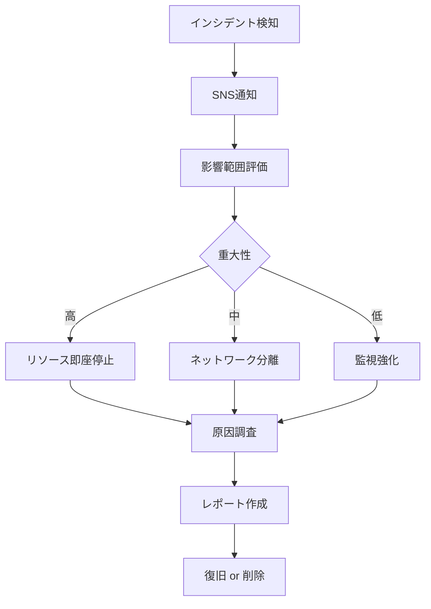

# 監査・コンプライアンス設計

## 監査設計方針

### POC向け簡素化

| 監査領域 | POC方針 | 本番環境での追加 |
|---------|---------|----------------|
| 操作ログ | CloudTrail（デフォルト有効） | 長期保管（S3）、SIEM連携 |
| アクセスログ | CloudWatch Logs（7日間） | 長期保管、分析基盤 |
| VPC Flow Logs | なし（コスト削減） | 有効化、異常検知 |
| 変更管理 | CloudFormation変更履歴 | Config、Systems Manager |
| コンプライアンス | 不要（POCデータ） | GDPR、個人情報保護法対応 |

### 監査証跡の保管期間

| ログ種別 | 保管期間 | 保管先 | コスト |
|---------|---------|--------|--------|
| CloudTrail（Event History） | 90日間 | AWS管理 | 無料 |
| CloudWatch Logs（アプリケーション） | 7日間 | CloudWatch Logs | 有料 |
| CloudWatch Logs（ALB） | 7日間 | CloudWatch Logs | 有料 |
| X-Rayトレース | 30日間 | AWS X-Ray | 有料 |
| RDSバックアップ | 7日間 | S3（AWS管理） | 有料 |

## CloudTrail設定

### デフォルト設定（AWSアカウント単位）

**有効化**: すでに有効（AWSアカウント作成時にデフォルト有効）

| 設定項目 | 値 | 備考 |
|---------|---|------|
| Trail名 | AWS管理（デフォルト） | カスタムTrailは作成しない |
| ログ対象 | 管理イベント（読み取り・書き込み） | データイベントは不要 |
| ログ保管期間 | 90日間 | Event Historyで確認可能 |
| S3保管 | なし | POCではコスト削減 |
| CloudWatch Logs統合 | なし | POCではコスト削減 |

### 記録される主要なイベント

| イベント例 | 用途 |
|-----------|------|
| `CreateStack` | CloudFormationスタック作成 |
| `UpdateStack` | CloudFormationスタック更新 |
| `DeleteStack` | CloudFormationスタック削除 |
| `CreateDBInstance` | RDSインスタンス作成 |
| `ModifyDBInstance` | RDSインスタンス変更 |
| `CreateService` | ECSサービス作成 |
| `UpdateService` | ECSサービス更新 |
| `PutRolePolicy` | IAMポリシー変更 |

### CloudTrailログの確認方法

**AWS Management Console**:
1. CloudTrail → Event history
2. フィルター: イベント名、ユーザー名、リソース名
3. 期間: 過去90日間

**AWS CLI**:
```bash
# 過去1日のイベント取得
aws cloudtrail lookup-events --max-items 100

# 特定のイベント名でフィルター
aws cloudtrail lookup-events --lookup-attributes AttributeKey=EventName,AttributeValue=CreateStack
```

## CloudWatch Logs設定

### 1. アプリケーションログ

**ロググループ**: `/ecs/xray-poc`

| 設定項目 | 値 | 備考 |
|---------|---|------|
| 保管期間 | 7日間 | POCではコスト削減 |
| 暗号化 | AES-256（デフォルト） | AWS管理キー |
| ログストリーム | タスクID毎 | ECS Fargateが自動作成 |

**ログフォーマット（推奨）**:
```json
{
  "timestamp": "2025-12-10T12:00:00Z",
  "level": "INFO",
  "message": "Request processed successfully",
  "trace_id": "1-67890abc-def1234567890abc",
  "user_id": "user123",
  "request_id": "req-456",
  "duration_ms": 120
}
```

### 2. ALBアクセスログ

**ロググループ**: `/aws/elasticloadbalancing/xray-poc-alb`

| 設定項目 | 値 | 備考 |
|---------|---|------|
| 保管期間 | 7日間 | POCではコスト削減 |
| ログフォーマット | ELB標準形式 | 自動生成 |

**ログ項目**:
- リクエスト時刻
- クライアントIP
- リクエストURI
- HTTPステータスコード
- レスポンスタイム
- ユーザーエージェント

### 3. CloudWatch Logs Insights クエリ例

**エラーログ抽出**:
```
fields @timestamp, level, message, trace_id
| filter level = "ERROR"
| sort @timestamp desc
| limit 100
```

**レスポンスタイム分析**:
```
fields @timestamp, duration_ms
| stats avg(duration_ms), max(duration_ms), min(duration_ms) by bin(5m)
```

**X-Ray Trace ID検索**:
```
fields @timestamp, message, trace_id
| filter trace_id = "1-67890abc-def1234567890abc"
| sort @timestamp asc
```

## VPC Flow Logs（オプション）

### POC方針: 無効化

**理由**:
- コスト削減（月額 $5〜10程度だが、POC予算1,000円制約）
- セキュリティ要件が低い（認証なしPOC）

### 本番環境での設定（参考）

| 設定項目 | 値 | 備考 |
|---------|---|------|
| ログ対象 | VPC全体 | サブネット単位も可 |
| フィルター | ACCEPT、REJECT両方 | トラフィック分析用 |
| 送信先 | CloudWatch Logs | S3も選択可 |
| 保管期間 | 7日間 | コスト削減 |
| フォーマット | デフォルト | カスタムフォーマットも可 |

**ログフォーマット**:
```
<version> <account-id> <interface-id> <srcaddr> <dstaddr> <srcport> <dstport> <protocol> <packets> <bytes> <start> <end> <action> <log-status>
```

## 変更管理

### CloudFormation変更履歴

**自動記録**: CloudFormationスタックの変更履歴は自動的に記録

**確認方法**:
1. CloudFormation Console → スタック選択
2. 「変更セット」タブ: 変更内容の事前確認
3. 「イベント」タブ: 変更履歴

### GitHub変更履歴

**コードの変更管理**: GitHubリポジトリで管理

| 項目 | 管理方法 |
|------|---------|
| CloudFormationテンプレート | Git管理、Pull Request |
| アプリケーションコード | Git管理、Pull Request |
| 環境変数・シークレット | GitHub Secrets（暗号化） |

**監査証跡**:
- Gitコミット履歴
- Pull Requestレビュー履歴
- GitHub Actionsデプロイ履歴

## RDSバックアップ

### 自動バックアップ設定

| 設定項目 | 値 | 備考 |
|---------|---|------|
| バックアップ保持期間 | 7日間 | POC最小設定 |
| バックアップウィンドウ | 18:00-19:00 JST | アクセス少ない時間帯 |
| スナップショット | 自動（毎日） | S3に自動保存 |

### ポイントインタイムリカバリ（PITR）

**有効化**: オプション（POCでは無効化）

**理由**:
- コスト削減（追加料金が発生）
- POCデータは重要度が低い

**本番環境**: 有効化を強く推奨

## コンプライアンス設計

### POC方針: 最小限の対応

**理由**:
- POCデータは非本番データ（個人情報・機密情報なし）
- 検証目的のみ
- スクラップ&ビルド運用

### 本番環境での対応（参考）

#### 個人情報保護法対応

| 要件 | 実装方法 |
|------|---------|
| 個人情報の暗号化 | RDS暗号化、TLS通信 |
| アクセスログ | CloudWatch Logs、CloudTrail |
| 利用目的の明示 | アプリケーションUI、プライバシーポリシー |
| 削除要求対応 | アプリケーション機能、RDSバックアップ削除 |

#### GDPR対応（EU展開時）

| 要件 | 実装方法 |
|------|---------|
| データポータビリティ | エクスポート機能 |
| 忘れられる権利 | 完全削除機能、バックアップからの削除 |
| データ最小化 | 必要最小限のデータ収集 |
| データ保護影響評価 | リスク評価、セキュリティ対策 |

## 監査レポート

### 週次レポート（POC期間中）

**内容**:
1. CloudTrailイベント確認
   - 異常な操作がないか
   - 意図しないリソース変更がないか
2. CloudWatch Logsエラーログ確認
   - アプリケーションエラー
   - 5xxエラー
3. コスト確認
   - 予算超過チェック
   - 異常なコスト増加

**フォーマット**:
```markdown
# POC監査レポート（2025/12/10-12/16）

## CloudTrailイベント
- CreateStack: 2回（正常）
- UpdateStack: 5回（正常）
- 異常操作: なし

## CloudWatch Logsエラー
- ERROR: 3件（既知の問題、対応済み）
- 5xxエラー: 0件

## コスト
- 今週のコスト: $45.20
- 月間予測: $180.80（予算超過）
- 対策: NAT Gateway使用時間削減検討
```

### POC終了時の最終監査

**チェックリスト**:
- [ ] すべてのCloudFormationスタック削除確認
- [ ] RDSインスタンス削除確認
- [ ] S3バケット削除確認（手動作成分）
- [ ] CloudWatch Logsロググループ削除確認（オプション）
- [ ] IAMロール削除確認（カスタム作成分）
- [ ] CloudTrailで削除証跡確認

## ログ分析ツール

### CloudWatch Logs Insights

**用途**: ログ検索、集計、可視化

**クエリ例**:
```
# エラー率計算
fields @timestamp
| stats count(*) as total,
        sum(level = "ERROR") as errors by bin(1h)
| fields bin, (errors / total * 100) as error_rate
```

### X-Ray Analytics

**用途**: トレース分析、パフォーマンス分析

- レスポンスタイム分布
- エラー率
- サービスマップ

詳細は [08_監視・アラート設計.md](08_監視・アラート設計.md) 参照

## セキュリティインシデント対応

### インシデント検知

**検知方法**:
1. CloudWatch Alarms（異常なメトリクス）
2. CloudTrail（異常な操作）
3. X-Ray（異常なトレース）

### インシデント対応フロー



### インシデントレポート

**記録項目**:
- 発生日時
- 検知方法
- 影響範囲
- 原因
- 対応内容
- 再発防止策

## 参照ドキュメント

- [03_セキュリティ設計.md](03_セキュリティ設計.md) - Security Groups、IAM詳細
- [08_監視・アラート設計.md](08_監視・アラート設計.md) - 監視設定詳細
- [05_データベース設計.md](05_データベース設計.md) - RDSバックアップ詳細
