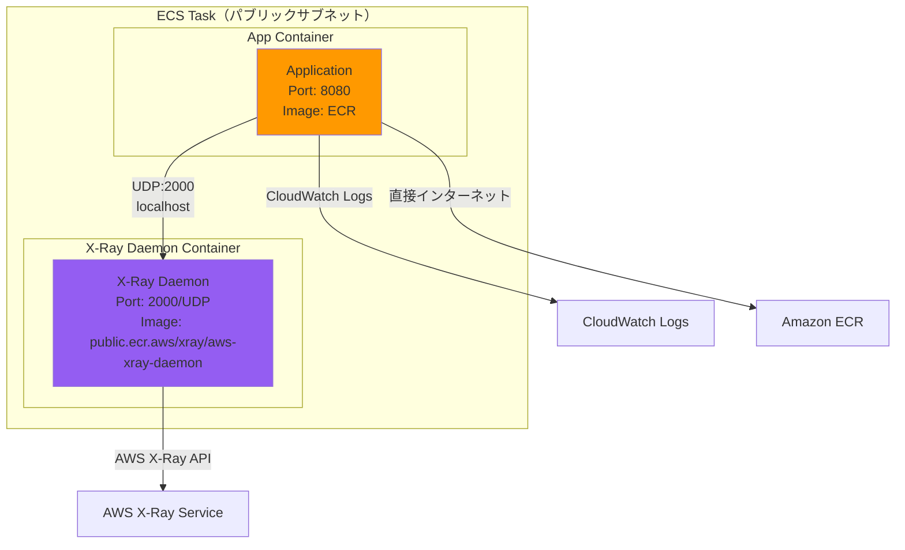
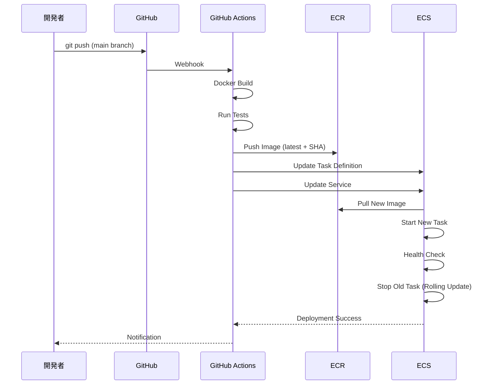

# コンピュート設計

## コンピュート設計方針

### POC向け最小構成

| 項目 | POC方針 | 本番環境での追加 |
|------|---------|----------------|
| コンピュート | ECS Fargate | - |
| タスク数 | 1（固定） | Auto Scaling（2〜10） |
| CPU/メモリ | 0.25vCPU / 0.5GB（最小） | 0.5vCPU / 1GB以上 |
| AZ | 単一AZ | Multi-AZ |
| サブネット配置 | **パブリックサブネット** | Privateサブネット |
| ロードバランサー | ALB（単一AZ） | ALB（Multi-AZ） |
| コンテナレジストリ | ECR | - |

**重要な変更点**:
- ECSをパブリックサブネット配置（パブリックIP有効）
- NLB削除（不要）

## ECS Fargate構成

### クラスター

**名前**: `xray-poc-cluster`

| 設定項目 | 値 | 備考 |
|---------|---|------|
| クラスタータイプ | Fargate | サーバーレス |
| Container Insights | 有効 | メトリクス収集 |
| デフォルト名前空間 | なし | サービスディスカバリ不使用 |

### タスク定義

**名前**: `xray-poc-task`

**ファミリー**: `xray-poc-task`

#### タスクレベル設定

| 設定項目 | 値 | 備考 |
|---------|---|------|
| 起動タイプ | Fargate | - |
| OS | Linux/X86_64 | - |
| タスクCPU | 0.25 vCPU（256 CPU units） | 最小構成 |
| タスクメモリ | 0.5 GB（512 MB） | 最小構成 |
| タスク実行ロール | `xray-poc-ecs-task-execution-role` | ECRイメージ取得、ログ送信 |
| タスクロール | `xray-poc-ecs-task-role` | X-Ray、CloudWatch、RDS接続 |
| ネットワークモード | awsvpc | Fargate必須 |

#### コンテナ構成（マルチコンテナ）

**タスク構成図**:



**注**: パブリックIPを持つため、ECR/X-Ray/CloudWatchへ直接通信可能

### コンテナ1: アプリケーション

**名前**: `app`

| 設定項目 | 値 | 備考 |
|---------|---|------|
| イメージ | `{ACCOUNT_ID}.dkr.ecr.ap-northeast-1.amazonaws.com/xray-poc-app:latest` | ECRから取得 |
| CPU | 200 CPU units | タスクCPUの78% |
| メモリ | 384 MB（ソフトリミット） | タスクメモリの75% |
| メモリ（ハードリミット） | 448 MB | タスクメモリの87.5% |
| ポートマッピング | 8080/tcp | ALBからのトラフィック |
| 必須コンテナ | Yes | このコンテナが停止したらタスク終了 |

**環境変数**:

| 変数名 | 値 | 備考 |
|-------|---|------|
| `AWS_XRAY_DAEMON_ADDRESS` | `localhost:2000` | X-Ray Daemonアドレス |
| `AWS_REGION` | `ap-northeast-1` | - |
| `DB_HOST` | CloudFormationから注入 | RDSエンドポイント |
| `DB_PORT` | `5432` | - |
| `DB_NAME` | `xray_poc_db` | - |
| `DB_USER` | `app_user` | - |
| `LOG_LEVEL` | `INFO` | `DEBUG`、`INFO`、`WARN`、`ERROR` |

**シークレット（AWS Secrets Manager）**:

| 変数名 | Secrets Managerキー | 備考 |
|-------|-------------------|------|
| `DB_PASSWORD` | `xray-poc/db/password` | RDSパスワード |

**ヘルスチェック**:
```dockerfile
HEALTHCHECK --interval=30s --timeout=3s --start-period=10s --retries=3 \
  CMD curl -f http://localhost:8080/health || exit 1
```

**ログ設定**:

| 設定項目 | 値 | 備考 |
|---------|---|------|
| ログドライバー | awslogs | CloudWatch Logs |
| ロググループ | `/ecs/xray-poc` | - |
| リージョン | `ap-northeast-1` | - |
| ストリームプレフィックス | `app` | - |

### コンテナ2: X-Ray Daemon

**名前**: `xray-daemon`

| 設定項目 | 値 | 備考 |
|---------|---|------|
| イメージ | `public.ecr.aws/xray/aws-xray-daemon:latest` | AWS公式イメージ |
| CPU | 56 CPU units | タスクCPUの22% |
| メモリ | 64 MB（ソフトリミット） | タスクメモリの12.5% |
| メモリ（ハードリミット） | 128 MB | - |
| ポートマッピング | 2000/udp | X-Rayトレース受信 |
| 必須コンテナ | No | このコンテナが停止してもタスク継続 |

**環境変数**:

| 変数名 | 値 | 備考 |
|-------|---|------|
| `AWS_REGION` | `ap-northeast-1` | - |

**ログ設定**:

| 設定項目 | 値 | 備考 |
|---------|---|------|
| ログドライバー | awslogs | CloudWatch Logs |
| ロググループ | `/ecs/xray-poc` | - |
| リージョン | `ap-northeast-1` | - |
| ストリームプレフィックス | `xray-daemon` | - |

### ECSサービス

**名前**: `xray-poc-service`

| 設定項目 | 値 | 備考 |
|---------|---|------|
| タスク定義 | `xray-poc-task:latest` | - |
| 起動タイプ | Fargate | - |
| プラットフォームバージョン | LATEST（1.4.0推奨） | - |
| タスク数 | 1（固定） | Auto Scalingなし |
| デプロイメント設定 | Rolling update | - |
| 最小ヘルシーパーセント | 0% | 単一タスクのため |
| 最大パーセント | 200% | 新タスク起動後、旧タスク削除 |
| サブネット | `xray-poc-public-1a` | **パブリックサブネット** |
| Security Group | `xray-poc-ecs-sg` | - |
| パブリックIP | **有効** | **重要**: インターネット直接通信 |

**ロードバランサー統合**:

| 設定項目 | 値 | 備考 |
|---------|---|------|
| ターゲットグループ | `xray-poc-tg` | ALB用 |
| コンテナ | `app` | - |
| ポート | 8080 | - |
| ヘルスチェックパス | `/health` | - |

## Application Load Balancer（ALB）

### ALB設定

**名前**: `xray-poc-alb`

| 設定項目 | 値 | 備考 |
|---------|---|------|
| スキーム | Internet-facing | パブリックアクセス |
| IPアドレスタイプ | IPv4 | - |
| サブネット | `xray-poc-public-1a` | 単一AZ |
| Security Group | `xray-poc-alb-sg` | - |
| 削除保護 | 無効 | POCではスクラップ&ビルド |

### ターゲットグループ

**名前**: `xray-poc-tg`

| 設定項目 | 値 | 備考 |
|---------|---|------|
| ターゲットタイプ | IP | Fargate必須 |
| プロトコル | HTTP | - |
| ポート | 8080 | - |
| VPC | `xray-poc-vpc` | - |
| ヘルスチェックプロトコル | HTTP | - |
| ヘルスチェックパス | `/health` | - |
| ヘルスチェック間隔 | 30秒 | - |
| ヘルスチェックタイムアウト | 5秒 | - |
| 正常しきい値 | 2回 | - |
| 異常しきい値 | 2回 | - |
| 登録解除の遅延 | 30秒 | デプロイ時のダウンタイム最小化 |

### リスナー

**リスナー1: HTTPS**

| 設定項目 | 値 | 備考 |
|---------|---|------|
| プロトコル | HTTPS | - |
| ポート | 443 | - |
| デフォルトアクション | Forward to `xray-poc-tg` | - |
| SSL証明書 | ACM証明書 | AWS Certificate Manager |

**リスナールール**:
- デフォルトルール: すべてのリクエストを `xray-poc-tg` に転送

### アクセスログ

**有効化**: POCでは無効（コスト削減）

**本番環境**:
- 送信先: S3バケット
- プレフィックス: `alb-logs/`
- 保持期間: 90日間

## Amazon ECR

### リポジトリ

**名前**: `xray-poc-app`

| 設定項目 | 値 | 備考 |
|---------|---|------|
| イメージタグのミュータビリティ | Mutable | `latest`タグの上書き許可 |
| スキャン設定 | プッシュ時にスキャン | 脆弱性検出 |
| 暗号化 | AES-256（デフォルト） | - |
| ライフサイクルポリシー | 最新10イメージ保持、それ以外削除 | コスト削減 |

**イメージタグ戦略**:

| タグ | 用途 | 例 |
|------|------|---|
| `latest` | 常に最新イメージ | `latest` |
| Git SHA | コミット特定用 | `abc1234` |
| バージョン | リリース管理 | `v1.0.0` |

**ライフサイクルポリシー**:
```json
{
  "rules": [
    {
      "rulePriority": 1,
      "description": "Keep last 10 images",
      "selection": {
        "tagStatus": "any",
        "countType": "imageCountMoreThan",
        "countNumber": 10
      },
      "action": {
        "type": "expire"
      }
    }
  ]
}
```

## デプロイフロー

### GitHub Actions → ECS デプロイ



### ローリングアップデート

**手順**:
1. 新しいタスク定義を作成
2. 新しいタスクを起動（タスク数: 2になる）
3. ALBヘルスチェック合格待ち
4. 旧タスクを停止（タスク数: 1に戻る）

**ダウンタイム**: なし（ヘルスチェック成功後に切り替え）

**ロールバック**:
```bash
# AWS CLI
aws ecs update-service \
  --cluster xray-poc-cluster \
  --service xray-poc-service \
  --task-definition xray-poc-task:PREVIOUS_REVISION
```

## スケーリング設計

### POC方針: スケーリングなし

**タスク数**: 1（固定）

**理由**:
- コスト削減
- 負荷試験不要
- 検証目的のみ

### 本番環境でのAuto Scaling（参考）

**ターゲット追跡スケーリング**:

| メトリクス | ターゲット値 | スケールアウト | スケールイン |
|-----------|------------|-------------|------------|
| CPU使用率 | 70% | タスク数+1 | タスク数-1 |
| メモリ使用率 | 70% | タスク数+1 | タスク数-1 |
| ALBリクエスト数/ターゲット | 1000 | タスク数+1 | タスク数-1 |

**タスク数範囲**:
- 最小: 2（Multi-AZ）
- 最大: 10
- 希望数: 2

## モニタリング

### Container Insights メトリクス

**有効化**: 有効

**収集メトリクス**:
- タスクレベルCPU使用率
- タスクレベルメモリ使用率
- ネットワークI/O
- タスク数

### CloudWatch Alarms

| アラート名 | メトリクス | 閾値 | アクション |
|-----------|-----------|------|----------|
| ECS CPU高 | CPUUtilization | > 80% | SNS通知 |
| ECS Memory高 | MemoryUtilization | > 80% | SNS通知 |
| タスク停止 | RunningTasksCount | < 1 | SNS通知 |
| ALB 5xxエラー | HTTPCode_Target_5XX_Count | > 10 | SNS通知 |

詳細は [08_監視・アラート設計.md](08_監視・アラート設計.md) 参照

## コスト見積もり（月20時間稼働）

### ECS Fargate

| 項目 | 単価 | 使用量 | 月額 |
|------|------|--------|------|
| vCPU | $0.04656/vCPU/時間 | 0.25vCPU × 20時間 | $0.23 |
| メモリ | $0.00511/GB/時間 | 0.5GB × 20時間 | $0.05 |
| **Fargate合計** | - | - | **$0.28** |

### ALB

| 項目 | 単価 | 使用量 | 月額 |
|------|------|--------|------|
| ALB時間 | $0.0243/時間 | 20時間 | $0.49 |
| LCU | $0.008/LCU/時間 | 最小1LCU × 20時間 | $0.16 |
| **ALB合計** | - | - | **$0.65** |

### ECR

| 項目 | 単価 | 使用量 | 月額 |
|------|------|--------|------|
| ストレージ | $0.10/GB/月 | 1GB（イメージ10個） | $0.10 |
| データ転送（アウト） | $0.09/GB | 1GB/月 | $0.09 |
| **ECR合計** | - | - | **$0.19** |

**コンピュート合計**: $1.12/月

**注**: 東京リージョン（ap-northeast-1）の料金、月20時間稼働想定

詳細は [13_コスト設計.md](13_コスト設計.md) 参照

## トラブルシューティング

### よくある問題と対処法

| 問題 | 原因 | 対処法 |
|------|------|--------|
| タスク起動失敗 | ECRイメージ取得失敗 | Task Execution Role権限確認 |
| タスクすぐ停止 | アプリケーションエラー | CloudWatch Logsでエラー確認 |
| ヘルスチェック失敗 | `/health`エンドポイントなし | アプリケーション実装確認 |
| RDS接続失敗 | Security Group設定ミス | ECS → RDS 5432許可確認 |
| X-Rayトレース表示されない | X-Ray Daemon未起動 | タスク定義でDaemonコンテナ確認 |

### ECS Execでのデバッグ

**有効化**: 本番環境で検討（POCでは不使用）

**使用方法**:
```bash
# タスクIDを取得
aws ecs list-tasks --cluster xray-poc-cluster --service-name xray-poc-service

# コンテナにシェル接続
aws ecs execute-command \
  --cluster xray-poc-cluster \
  --task TASK_ID \
  --container app \
  --interactive \
  --command "/bin/sh"
```

## 参照ドキュメント

- [01_システムアーキテクチャ.md](01_システムアーキテクチャ.md) - システム全体構成
- [02_ネットワーク設計.md](02_ネットワーク設計.md) - パブリックサブネット配置詳細
- [03_セキュリティ設計.md](03_セキュリティ設計.md) - IAMロール、Security Groups詳細
- [08_監視・アラート設計.md](08_監視・アラート設計.md) - Container Insights詳細
- [09_CI_CD設計.md](09_CI_CD設計.md) - GitHub Actionsデプロイ詳細
- [13_コスト設計.md](13_コスト設計.md) - ECS、ALBコスト詳細
