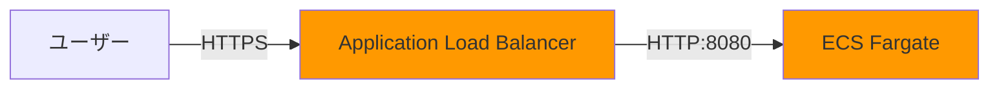
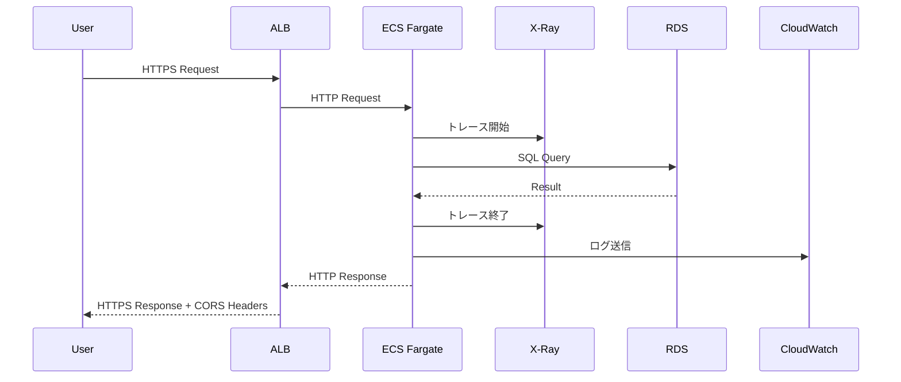

# フロントエンド配信設計

## フロントエンド配信方針

### POC向け構成: ALB直接公開

| 項目 | POC方針 | 本番環境での追加 |
|------|---------|----------------|
| API公開方法 | **ALB直接公開** | API Gateway追加 |
| 認証 | なし | API Key、Cognito、IAM認証 |
| カスタムドメイン | なし | Route 53 + ACM |
| CDN | なし | CloudFront（オプション） |
| レート制限 | なし | API Gateway、WAF |
| CORS | ALBで設定（すべてのオリジン） | 特定オリジンのみ |

## ADR-005: API Gateway削除（ALB直接公開）

### 設計判断

**決定**: API Gateway不使用、ALB直接公開

**理由**:
1. **コスト削減**: API Gateway（$0.5/月）+ NLB（$22/月）= 約$22.5/月削減
2. **POCでは十分**: X-Ray検証にAPI管理機能（レート制限、認証等）は不要
3. **構成シンプル化**: API Gateway + NLB + ALB の3層から ALB のみに簡素化

**トレードオフ**:
- ✅ 大幅コスト削減（約$22.5/月）
- ✅ 構成シンプル化
- ⚠️ API管理機能なし（レート制限、リクエスト/レスポンス変換等）
- ⚠️ 認証機能なし
- ⚠️ カスタムドメイン設定が別途必要（Route 53）

### 旧構成 vs 新構成

| 項目 | 旧構成 | 新構成 | 差分 |
|------|-------|-------|------|
| **エンドポイント** | API Gateway → NLB → ALB → ECS | ALB → ECS | API Gateway + NLB削除 |
| **月額コスト** | $22.5 | $0 | **-$22.5/月** |
| **認証** | API Gateway（API Key、Cognito等） | なし（POCで許容） | - |
| **レート制限** | API Gateway | なし（POCで許容） | - |

## 新しいエンドポイント構成

### ALB直接公開



**エンドポイントURL**: `https://{alb-dns-name}`

**例**: `https://xray-poc-alb-123456789.ap-northeast-1.elb.amazonaws.com`

### CORS設定（ALBレスポンスヘッダー）

ALBのレスポンスヘッダーでCORSを設定（POCでは全オリジン許可）

**ALB リスナールール**:
```yaml
- Condition: PathPattern /api/*
  Action:
    - Type: forward
      TargetGroupArn: xray-poc-tg
    - Type: set-header
      HeaderName: Access-Control-Allow-Origin
      HeaderValue: "*"
    - Type: set-header
      HeaderName: Access-Control-Allow-Methods
      HeaderValue: "GET, POST, OPTIONS"
    - Type: set-header
      HeaderName: Access-Control-Allow-Headers
      HeaderValue: "Content-Type"
```

**本番環境**: 特定オリジンのみ許可（例: `https://example.com`）

## リクエスト/レスポンスフロー

### 通常のAPIリクエスト



### OPTIONSプリフライト（CORS）

**方法1**: ECSアプリケーションで処理（推奨）

```python
# FastAPI例
@app.options("/api/{path:path}")
async def options_handler():
    return Response(
        status_code=200,
        headers={
            "Access-Control-Allow-Origin": "*",
            "Access-Control-Allow-Methods": "GET, POST, OPTIONS",
            "Access-Control-Allow-Headers": "Content-Type",
        }
    )
```

**方法2**: ALBで固定レスポンス（簡易版）

```yaml
- Condition:
    - Field: http-request-method
      HttpRequestMethodConfig:
        Values: ["OPTIONS"]
  Action:
    - Type: fixed-response
      FixedResponseConfig:
        StatusCode: "200"
        ContentType: "text/plain"
```

## API Gateway不使用の影響

### 削除される機能

| 機能 | API Gateway | ALB直接公開 | 対応方針 |
|------|------------|-----------|---------|
| **レート制限** | あり | なし | POCでは不要、本番でWAF追加 |
| **認証（API Key、Cognito）** | あり | なし | POCでは不要、本番でCognito追加 |
| **リクエスト変換** | あり | なし | POCでは不要 |
| **レスポンス変換** | あり | なし | POCでは不要 |
| **カスタムドメイン** | あり | Route 53で代替 | 本番で検討 |
| **X-Rayトレーシング** | API Gateway統合 | ALB + ECS統合 | 影響なし（ECSで検証） |

### 本番環境での追加機能

**Phase 1: セキュリティ強化**:
- 認証（Cognito User Pool、API Key）
- レート制限（WAF）

**Phase 2: API Gateway追加**:
- API Gateway REST API追加（ALB前段）
- リクエスト/レスポンス変換
- ステージ管理（dev/stg/prd）

## モニタリング

### ALB メトリクス

| メトリクス | 説明 | アラーム閾値 |
|-----------|------|------------|
| `RequestCount` | リクエスト数 | - |
| `HTTPCode_Target_4XX_Count` | クライアントエラー数 | > 100/5分 |
| `HTTPCode_Target_5XX_Count` | サーバーエラー数 | > 10/5分 |
| `TargetResponseTime` | レスポンス時間 | > 1000ms |

### X-Ray トレーシング

**有効化**: 有効

**トレース内容**:
- ALBでの処理時間
- ECSでの処理時間
- RDSクエリ時間

**サービスマップ**:
```
User → ALB → ECS → RDS
         ↓
       X-Ray
```

詳細は [08_監視・アラート設計.md](08_監視・アラート設計.md) 参照

## カスタムドメイン（本番環境用、参考）

### Route 53 + ACM

**POC方針**: 不使用（ALBデフォルトDNS名使用）

**本番環境での設定（参考）**:

| 設定項目 | 値 | 備考 |
|---------|---|------|
| ドメイン | `api.example.com` | Route 53で管理 |
| SSL証明書 | ACM証明書 | `*.example.com` |
| DNS設定 | Aレコード（Alias）: `api.example.com` → ALB | - |

## セキュリティ設定

### 認証・認可（本番環境用、参考）

**POC方針**: 認証なし

**本番環境での選択肢**:

| 認証方式 | 用途 | 実装 |
|---------|------|------|
| Cognito User Pool | ユーザー認証 | JWT検証（ECSアプリで実装） |
| IAM認証 | AWS内部サービス認証 | SigV4（Lambda等） |
| API Gateway Authorizer | カスタム認証 | API Gateway追加時に検討 |

### リクエストバリデーション

**POC方針**: 最小限（ECSアプリで実装）

**本番環境での設定（参考）**:
- ECSアプリでスキーマ検証（Pydantic、JSONSchema等）
- WAF でSQLインジェクション、XSS対策

## CloudFront（本番環境用、参考）

### POC方針: 不使用

**理由**:
- コスト削減
- グローバル配信不要（日本国内のみ）
- ALBで十分

### 本番環境での追加メリット

| メリット | 説明 |
|---------|------|
| エッジキャッシング | レイテンシ削減 |
| DDoS保護 | AWS Shield Standard統合 |
| WAF統合 | セキュリティ強化 |
| カスタムSSL証明書 | ブランディング |
| グローバル配信 | 海外展開時 |

## コスト見積もり

### ALB直接公開（POC、月20時間稼働）

**月額コスト**: $0（API Gateway + NLB削除により）

**削減内訳**:
- API Gateway削除: -$0.5/月
- NLB削除: -$22/月
- **合計削減**: -$22.5/月

**注**: ALB自体のコストは [06_コンピュート設計.md](06_コンピュート設計.md) 参照

詳細は [13_コスト設計.md](13_コスト設計.md) 参照

## デプロイ

### CloudFormation経由

**リソース**:
- ALB（すでに存在）
- Route 53（カスタムドメイン使用時のみ）

**デプロイコマンド**:
```bash
aws cloudformation deploy \
  --template-file templates/alb.yaml \
  --stack-name xray-poc-alb \
  --parameter-overrides \
      VpcId=vpc-xxx \
      SubnetId=subnet-xxx
```

## トラブルシューティング

### よくある問題と対処法

| 問題 | 原因 | 対処法 |
|------|------|--------|
| 502 Bad Gateway | ECSタスク未起動 | ALB、ECSヘルスチェック確認 |
| 504 Gateway Timeout | ECSタスクタイムアウト | ECSタスク処理時間確認 |
| 403 Forbidden（CORS） | CORS設定ミス | ALBレスポンスヘッダー、ECSアプリ確認 |

### テスト方法

**curlでのテスト**:
```bash
# ヘルスチェック
curl https://{alb-dns-name}/health

# API呼び出し
curl https://{alb-dns-name}/api/traces

# CORS プリフライト
curl -X OPTIONS \
  https://{alb-dns-name}/api/traces \
  -H "Origin: https://example.com"
```

## 参照ドキュメント

- [01_システムアーキテクチャ.md](01_システムアーキテクチャ.md) - システム全体構成
- [06_コンピュート設計.md](06_コンピュート設計.md) - ALB、ECS詳細
- [08_監視・アラート設計.md](08_監視・アラート設計.md) - ALB監視詳細
- [13_コスト設計.md](13_コスト設計.md) - コスト詳細
