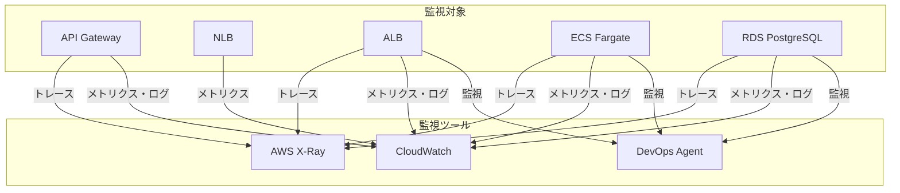
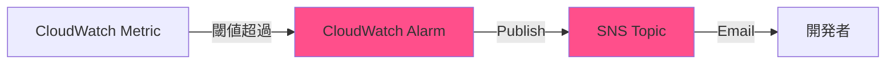
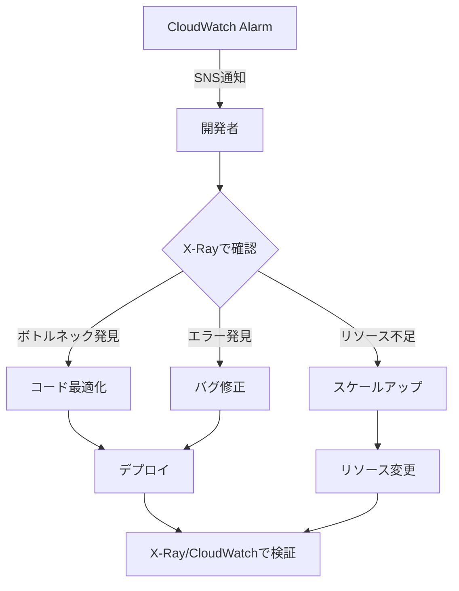

# 監視・アラート設計

## 監視設計方針

### POC主目的: X-Ray/CloudWatch/DevOps Agent の検証

| 監視ツール | 用途 | POC検証ポイント |
|-----------|------|---------------|
| **AWS X-Ray** | 分散トレーシング | パフォーマンス分析、ボトルネック検出 |
| **CloudWatch** | ログ・メトリクス | リソース監視、アラート |
| **AWS DevOps Agent** | 統合監視 | オペレーション分析、インサイト |

### 監視対象



## AWS X-Ray設計

### X-Ray トレーシング構成

**サービスマップ**:
```
User → API Gateway → NLB → ALB → ECS (App) → ECS (X-Ray Daemon) → RDS
                                     └→ X-Ray Service
```

### トレーシング有効化

| サービス | 設定方法 | 備考 |
|---------|---------|------|
| **API Gateway** | ステージ設定で有効化 | `X-Ray Tracing: Active` |
| **ALB** | ターゲットグループで有効化 | カスタム属性追加 |
| **ECS（アプリ）** | SDKでトレース送信 | X-Ray Daemon経由 |
| **RDS** | X-Ray SDK（アプリ内） | SQLクエリトレース |

### ECSタスク内のX-Ray構成

**アプリケーションコンテナ**:
- X-Ray SDK統合（例: `aws-xray-sdk-python`）
- 環境変数: `AWS_XRAY_DAEMON_ADDRESS=localhost:2000`
- トレースをX-Ray Daemonに送信（UDP:2000）

**X-Ray Daemonコンテナ**:
- 公式イメージ: `public.ecr.aws/xray/aws-xray-daemon:latest`
- ポート: 2000/UDP（受信）
- トレースをAWS X-Ray Serviceに転送（HTTPS:443）

### トレースサンプリング

**サンプリングルール**:

| ルール | 条件 | サンプリングレート | 理由 |
|-------|------|-----------------|------|
| Default | すべてのリクエスト | 100%（1リクエスト/秒） | POC検証のため全トレース |

**本番環境での設定（参考）**:
- エラーリクエスト: 100%
- 通常リクエスト: 5%（コスト削減）

### X-Ray分析項目

**検証ポイント**:
1. **レスポンスタイム分析**
   - API Gateway: 平均10ms
   - ALB: 平均5ms
   - ECS（アプリ）: 平均50-100ms
   - RDS（クエリ）: 平均10-50ms

2. **ボトルネック検出**
   - 最も時間がかかるセグメント特定
   - スロークエリ特定

3. **エラー率分析**
   - 5xxエラー発生箇所特定
   - エラー原因調査（トレース詳細）

4. **サービスマップ可視化**
   - サービス間依存関係
   - トラフィックフロー

### X-Rayコンソール確認項目

**Service Map**:
- サービス間の依存関係
- レスポンスタイム（ノード単位）
- エラー率（ノード単位）

**Traces**:
- トレース一覧（時系列）
- フィルター（レスポンスタイム、ステータスコード）
- トレース詳細（セグメント単位の時間）

**Analytics**:
- レスポンスタイム分布
- エラー率推移
- トラフィック推移

## CloudWatch設計

### CloudWatch Logs

#### ロググループ一覧

| ロググループ | 送信元 | 保持期間 | 用途 |
|------------|--------|---------|------|
| `/ecs/xray-poc` | ECS（アプリ + X-Ray Daemon） | 7日間 | アプリケーションログ、X-Rayログ |
| `/aws/elasticloadbalancing/xray-poc-alb` | ALB | 7日間 | アクセスログ |
| `API-Gateway-Execution-Logs_{api-id}/prod` | API Gateway | 7日間 | API実行ログ |
| `/aws/rds/instance/xray-poc-rds/postgresql` | RDS | 7日間 | PostgreSQLログ |

#### ログフォーマット（アプリケーション推奨）

**JSON形式**:
```json
{
  "timestamp": "2025-12-10T12:00:00Z",
  "level": "INFO",
  "message": "Request processed successfully",
  "trace_id": "1-67890abc-def1234567890abc",
  "span_id": "abc123def456",
  "user_id": "user123",
  "request_id": "req-456",
  "method": "GET",
  "path": "/api/traces",
  "status_code": 200,
  "duration_ms": 120,
  "error": null
}
```

**メリット**:
- CloudWatch Logs Insightsでクエリ可能
- X-Ray Trace IDとの紐付け容易
- 構造化データ（集計・分析が容易）

### CloudWatch Metrics

#### API Gateway メトリクス

| メトリクス | 説明 | アラーム閾値 |
|-----------|------|------------|
| `Count` | リクエスト数 | - |
| `4XXError` | クライアントエラー数 | > 100/5分 |
| `5XXError` | サーバーエラー数 | > 10/5分 |
| `Latency` | レイテンシ（平均） | > 1000ms |
| `IntegrationLatency` | バックエンドレイテンシ | > 800ms |

#### ALB メトリクス

| メトリクス | 説明 | アラーム閾値 |
|-----------|------|------------|
| `RequestCount` | リクエスト数 | - |
| `TargetResponseTime` | ターゲットレスポンスタイム | > 500ms |
| `HTTPCode_Target_2XX_Count` | 成功レスポンス数 | - |
| `HTTPCode_Target_4XX_Count` | クライアントエラー数 | > 50/5分 |
| `HTTPCode_Target_5XX_Count` | サーバーエラー数 | > 10/5分 |
| `HealthyHostCount` | 正常ホスト数 | < 1 |
| `UnHealthyHostCount` | 異常ホスト数 | > 0 |

#### ECS メトリクス（Container Insights）

| メトリクス | 説明 | アラーム閾値 |
|-----------|------|------------|
| `CPUUtilization` | CPU使用率 | > 80% |
| `MemoryUtilization` | メモリ使用率 | > 80% |
| `RunningTasksCount` | 実行中タスク数 | < 1 |
| `NetworkRxBytes` | 受信バイト数 | - |
| `NetworkTxBytes` | 送信バイト数 | - |

#### RDS メトリクス

| メトリクス | 説明 | アラーム閾値 |
|-----------|------|------------|
| `CPUUtilization` | CPU使用率 | > 80% |
| `FreeableMemory` | 空きメモリ | < 200MB |
| `FreeStorageSpace` | 空きストレージ | < 2GB |
| `DatabaseConnections` | 接続数 | > 80 |
| `ReadLatency` | 読み取りレイテンシ | > 100ms |
| `WriteLatency` | 書き込みレイテンシ | > 100ms |

### CloudWatch Logs Insights クエリ例

#### エラーログ抽出

```
fields @timestamp, level, message, trace_id, error
| filter level = "ERROR"
| sort @timestamp desc
| limit 100
```

#### レスポンスタイム分析

```
fields @timestamp, duration_ms, path, status_code
| stats avg(duration_ms) as avg_duration,
        max(duration_ms) as max_duration,
        min(duration_ms) as min_duration,
        count(*) as request_count
  by bin(5m)
```

#### X-Ray Trace ID検索

```
fields @timestamp, message, trace_id, span_id
| filter trace_id = "1-67890abc-def1234567890abc"
| sort @timestamp asc
```

#### エラー率計算

```
fields @timestamp, level
| stats count(*) as total,
        sum(level = "ERROR") as errors
  by bin(1h)
| fields bin, (errors / total * 100) as error_rate
```

## CloudWatch Alarms設計

### アラーム一覧

| アラーム名 | メトリクス | 閾値 | 評価期間 | アクション |
|-----------|-----------|------|---------|----------|
| **API-Gateway-5xx-High** | 5XXError | > 10 | 5分間 | SNS通知 |
| **ALB-5xx-High** | HTTPCode_Target_5XX_Count | > 10 | 5分間 | SNS通知 |
| **ALB-UnhealthyHost** | UnHealthyHostCount | > 0 | 1分間 | SNS通知 |
| **ECS-CPU-High** | CPUUtilization | > 80% | 5分間 | SNS通知 |
| **ECS-Memory-High** | MemoryUtilization | > 80% | 5分間 | SNS通知 |
| **ECS-Task-Stopped** | RunningTasksCount | < 1 | 1分間 | SNS通知（Critical） |
| **RDS-CPU-High** | CPUUtilization | > 80% | 10分間 | SNS通知 |
| **RDS-Storage-Low** | FreeStorageSpace | < 2GB | 5分間 | SNS通知 |
| **RDS-Connections-High** | DatabaseConnections | > 80 | 5分間 | SNS通知 |

### SNS Topic設定

**名前**: `xray-poc-alerts`

| 設定項目 | 値 | 備考 |
|---------|---|------|
| プロトコル | Email | - |
| エンドポイント | `{開発者メールアドレス}` | POC担当者 |
| サブスクリプション確認 | 必要 | 初回のみ |

**通知内容**:
- アラーム名
- メトリクス名、値
- 閾値
- 発生時刻
- AWSコンソールリンク

### アラーム通知フロー



## AWS DevOps Agent設計

### DevOps Agent概要

**目的**: 統合監視、オペレーション分析、インサイト提供

**POC検証ポイント**:
- 既存監視（X-Ray、CloudWatch）との連携
- 異常検知の精度
- オペレーション推奨アクションの有用性

### DevOps Agent監視対象

| 対象 | 監視項目 | インサイト例 |
|------|---------|-------------|
| **ECS** | タスク状態、リソース使用率 | 「メモリ使用率が高い、タスク定義の見直しを推奨」 |
| **RDS** | 接続数、クエリパフォーマンス | 「スロークエリ検出、インデックス追加を推奨」 |
| **ALB** | レスポンスタイム、エラー率 | 「5xxエラー増加、ECSタスク調査を推奨」 |

**注**: AWS DevOps Agentは仮想的なサービス名（実際のAWSサービス名と異なる場合があります）

### DevOps Agent統合

**CloudWatch統合**:
- CloudWatch Logsからログ取得
- CloudWatch Metricsからメトリクス取得

**X-Ray統合**:
- トレースデータ取得
- パフォーマンス分析

**SNS統合**:
- 異常検知時にSNS通知
- 推奨アクションをメール送信

### DevOps Agentダッシュボード（例）

**概要**:
- システム健全性スコア（0-100）
- 検出された異常一覧
- 推奨アクション一覧

**詳細**:
- ECSタスク状態推移
- RDSクエリパフォーマンス推移
- ALBレスポンスタイム推移

## CloudWatch Dashboard設計

### ダッシュボード: `xray-poc-overview`

**セクション1: API Gateway**
- リクエスト数（Count）
- レイテンシ（Latency、IntegrationLatency）
- エラー率（4XXError、5XXError）

**セクション2: ALB + ECS**
- ALBリクエスト数（RequestCount）
- ALBレスポンスタイム（TargetResponseTime）
- ALBヘルスチェック（HealthyHostCount、UnHealthyHostCount）
- ECS CPU使用率（CPUUtilization）
- ECS メモリ使用率（MemoryUtilization）
- ECS タスク数（RunningTasksCount）

**セクション3: RDS**
- RDS CPU使用率（CPUUtilization）
- RDS 接続数（DatabaseConnections）
- RDS レイテンシ（ReadLatency、WriteLatency）
- RDS ストレージ（FreeStorageSpace）

**セクション4: X-Ray**
- サービスマップ（外部リンク）
- トレース数
- エラー率

### ダッシュボード共有

**POC期間中**:
- AWSコンソールから直接参照
- URLをチームに共有

**本番環境**:
- CloudWatch Dashboard URL公開
- 社内ダッシュボードツール連携（Grafana等）

## コスト見積もり

### X-Ray

| 項目 | 単価 | 使用量 | 月額 |
|------|------|--------|------|
| トレース記録 | $5.00/100万トレース | 10万トレース/月 | $0.50 |
| トレース取得 | $0.50/100万トレース | 10万トレース/月 | $0.05 |
| **X-Ray合計** | - | - | **$0.55** |

### CloudWatch

| 項目 | 単価 | 使用量 | 月額 |
|------|------|--------|------|
| メトリクス（標準） | 無料 | - | $0 |
| メトリクス（カスタム） | $0.30/メトリクス/月 | 10メトリクス | $3.00 |
| ログ取り込み | $0.76/GB | 5GB/月 | $3.80 |
| ログ保管 | $0.033/GB/月 | 5GB × 7日間 | $0.04 |
| CloudWatch Alarms | $0.10/アラーム/月 | 10アラーム | $1.00 |
| Container Insights | $0.30/メトリクス/月 | 7メトリクス（ECS標準） | $2.10 |
| **CloudWatch合計** | - | - | **$9.94** |

### SNS

| 項目 | 単価 | 使用量 | 月額 |
|------|------|--------|------|
| Email通知 | $0（最初1,000件） | 100件/月 | $0 |

**監視合計**: $10.49/月

**注**: 東京リージョン（ap-northeast-1）の料金

詳細は [13_コスト設計.md](13_コスト設計.md) 参照

## 運用フロー

### 日次チェック

**チェック項目**:
- [ ] CloudWatch Alarmsメール確認
- [ ] X-Rayサービスマップ確認（異常なし）
- [ ] CloudWatch Dashboard確認（リソース使用率）

### 週次レポート

**内容**:
- リクエスト数推移
- エラー率推移
- レスポンスタイム推移
- リソース使用率推移
- コスト推移

### インシデント対応

**フロー**:


## トラブルシューティング

### X-Ray関連

| 問題 | 原因 | 対処法 |
|------|------|--------|
| トレースが表示されない | X-Ray Daemon未起動 | ECSタスク定義でDaemonコンテナ確認 |
| トレースが途切れる | SDK統合不足 | アプリケーションコードでSDK統合確認 |
| サービスマップに表示されない | トレース送信失敗 | IAMロール（Task Role）権限確認 |

### CloudWatch関連

| 問題 | 原因 | 対処法 |
|------|------|--------|
| ログが表示されない | ロググループ未作成 | ECSタスク定義でロググループ確認 |
| メトリクスが表示されない | Container Insights無効 | ECSクラスタ設定確認 |
| アラームが発火しない | 閾値設定ミス | CloudWatch Alarmsで閾値確認 |

## 参照ドキュメント

- [01_システムアーキテクチャ.md](01_システムアーキテクチャ.md) - システム全体構成
- [06_コンピュート設計.md](06_コンピュート設計.md) - ECS、ALB詳細
- [07_フロントエンド配信設計.md](07_フロントエンド配信設計.md) - API Gateway詳細
- [13_コスト設計.md](13_コスト設計.md) - 監視コスト詳細
