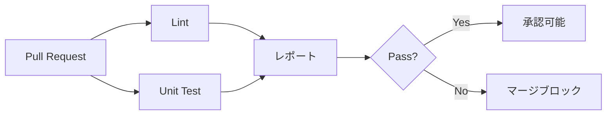
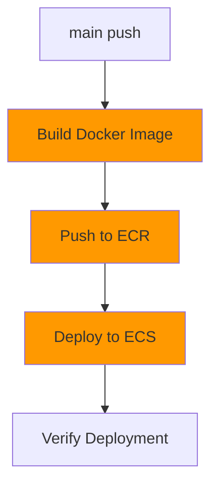
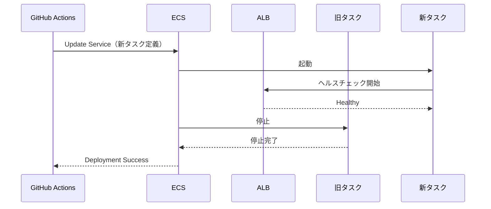

# CI/CD設計

## CI/CD設計方針

### POC向け構成

| 項目 | POC方針 | 本番環境での追加 |
|------|---------|----------------|
| CI/CDツール | GitHub Actions | - |
| AWS認証 | OIDC（OpenID Connect） | - |
| デプロイ先 | 単一環境（prod） | 複数環境（dev/stg/prod） |
| デプロイ戦略 | Rolling Update | Blue/Green、Canary |
| テスト | Linter、Unit Test | Integration Test、E2E Test |
| 承認フロー | なし | Pull Request承認必須 |

## GitHub Actions構成

### リポジトリ構成

```
.
├── .github/
│   └── workflows/
│       ├── ci.yml              # CI（Lint、Test）
│       └── deploy.yml          # CD（Build、Deploy）
├── src/                        # アプリケーションコード
├── infra/                      # CloudFormationテンプレート
│   └── cloudformation/
│       ├── stacks/
│       ├── templates/
│       └── parameters/
├── tests/                      # テストコード
├── Dockerfile                  # コンテナイメージ定義
└── README.md
```

## CI ワークフロー設計

### ワークフロー: `ci.yml`

**トリガー**:
- Pull Request作成・更新時（すべてのブランチ）
- mainブランチへのpush時

**ジョブ**:



### ジョブ1: Lint

**用途**: コード品質チェック

**ステップ**:
1. リポジトリチェックアウト
2. 依存関係インストール
3. Linter実行（例: flake8、eslint）
4. 結果をGitHub Checksに反映

**例（Python）**:
```yaml
name: CI - Lint

on:
  pull_request:
  push:
    branches: [main]

jobs:
  lint:
    runs-on: ubuntu-latest
    steps:
      - uses: actions/checkout@v4

      - name: Set up Python
        uses: actions/setup-python@v5
        with:
          python-version: '3.11'

      - name: Install dependencies
        run: |
          pip install flake8

      - name: Run Lint
        run: |
          flake8 src/ --count --select=E9,F63,F7,F82 --show-source --statistics
```

### ジョブ2: Unit Test

**用途**: 単体テスト実行

**ステップ**:
1. リポジトリチェックアウト
2. 依存関係インストール
3. テスト実行（例: pytest）
4. カバレッジレポート生成
5. カバレッジをGitHub Artifactsにアップロード

**例（Python）**:
```yaml
  test:
    runs-on: ubuntu-latest
    steps:
      - uses: actions/checkout@v4

      - name: Set up Python
        uses: actions/setup-python@v5
        with:
          python-version: '3.11'

      - name: Install dependencies
        run: |
          pip install -r requirements.txt
          pip install pytest pytest-cov

      - name: Run Tests
        run: |
          pytest tests/ --cov=src --cov-report=xml

      - name: Upload coverage
        uses: codecov/codecov-action@v3
        with:
          files: ./coverage.xml
```

## CD ワークフロー設計

### ワークフロー: `deploy.yml`

**トリガー**:
- mainブランチへのpush時（PRマージ後）

**ジョブ**:



### ジョブ1: Build & Push Docker Image

**ステップ**:

```yaml
name: CD - Deploy

on:
  push:
    branches: [main]

jobs:
  deploy:
    runs-on: ubuntu-latest
    permissions:
      id-token: write  # OIDC用
      contents: read

    steps:
      - name: Checkout
        uses: actions/checkout@v4

      - name: Configure AWS credentials (OIDC)
        uses: aws-actions/configure-aws-credentials@v4
        with:
          role-to-assume: arn:aws:iam::${{ secrets.AWS_ACCOUNT_ID }}:role/xray-poc-github-actions-role
          aws-region: ap-northeast-1

      - name: Login to Amazon ECR
        id: login-ecr
        uses: aws-actions/amazon-ecr-login@v2

      - name: Build, tag, and push image to Amazon ECR
        env:
          ECR_REGISTRY: ${{ steps.login-ecr.outputs.registry }}
          ECR_REPOSITORY: xray-poc-app
          IMAGE_TAG: ${{ github.sha }}
        run: |
          docker build -t $ECR_REGISTRY/$ECR_REPOSITORY:$IMAGE_TAG .
          docker tag $ECR_REGISTRY/$ECR_REPOSITORY:$IMAGE_TAG $ECR_REGISTRY/$ECR_REPOSITORY:latest
          docker push $ECR_REGISTRY/$ECR_REPOSITORY:$IMAGE_TAG
          docker push $ECR_REGISTRY/$ECR_REPOSITORY:latest
```

### ジョブ2: Deploy to ECS

**ステップ**:

```yaml
      - name: Download task definition
        run: |
          aws ecs describe-task-definition \
            --task-definition xray-poc-task \
            --query taskDefinition > task-definition.json

      - name: Fill in the new image ID in the Amazon ECS task definition
        id: task-def
        uses: aws-actions/amazon-ecs-render-task-definition@v1
        with:
          task-definition: task-definition.json
          container-name: app
          image: ${{ steps.login-ecr.outputs.registry }}/xray-poc-app:${{ github.sha }}

      - name: Deploy Amazon ECS task definition
        uses: aws-actions/amazon-ecs-deploy-task-definition@v1
        with:
          task-definition: ${{ steps.task-def.outputs.task-definition }}
          service: xray-poc-service
          cluster: xray-poc-cluster
          wait-for-service-stability: true
```

**デプロイ検証**:
- `wait-for-service-stability: true`: デプロイ完了まで待機
- タイムアウト: 10分（デフォルト）

## AWS認証（OIDC）設計

### OIDC設定

**メリット**:
- アクセスキー不要（セキュリティ向上）
- 一時的な認証情報（有効期限1時間）
- GitHubリポジトリ単位で権限制御

### OIDC Identity Provider設定

**AWSコンソール → IAM → Identity providers**:

| 設定項目 | 値 |
|---------|---|
| プロバイダーのタイプ | OpenID Connect |
| プロバイダーURL | `https://token.actions.githubusercontent.com` |
| Audience | `sts.amazonaws.com` |

### IAMロール設定

**ロール名**: `xray-poc-github-actions-role`

**信頼ポリシー**:
```json
{
  "Version": "2012-10-17",
  "Statement": [
    {
      "Effect": "Allow",
      "Principal": {
        "Federated": "arn:aws:iam::{ACCOUNT_ID}:oidc-provider/token.actions.githubusercontent.com"
      },
      "Action": "sts:AssumeRoleWithWebIdentity",
      "Condition": {
        "StringEquals": {
          "token.actions.githubusercontent.com:aud": "sts.amazonaws.com"
        },
        "StringLike": {
          "token.actions.githubusercontent.com:sub": "repo:{GITHUB_ORG}/{REPO_NAME}:*"
        }
      }
    }
  ]
}
```

**権限ポリシー**: [03_セキュリティ設計.md](03_セキュリティ設計.md) 参照

## デプロイ戦略

### POC: Rolling Update

**特徴**:
- 新タスク起動 → ヘルスチェック合格 → 旧タスク停止
- ダウンタイムなし
- ロールバック容易

**フロー**:



**設定**:
- 最小ヘルシーパーセント: 0%（単一タスク）
- 最大パーセント: 200%（新旧タスク同時起動）

### 本番環境: Blue/Green Deployment（参考）

**特徴**:
- 新環境（Green）をデプロイ → 検証 → トラフィック切り替え
- 即座にロールバック可能（Blue環境保持）
- ダウンタイムゼロ

**実装**: AWS CodeDeploy（ECS Blue/Green）

### 本番環境: Canary Deployment（参考）

**特徴**:
- トラフィックを段階的に新バージョンに移行（例: 10% → 50% → 100%）
- リスク最小化

**実装**: AWS CodeDeploy（ECS Canary）

## ロールバック設計

### 手動ロールバック

**方法1: ECS Service更新（前バージョンのタスク定義）**

```bash
# AWS CLI
aws ecs update-service \
  --cluster xray-poc-cluster \
  --service xray-poc-service \
  --task-definition xray-poc-task:PREVIOUS_REVISION
```

**方法2: ECRイメージタグ変更**

```bash
# 前バージョンのイメージを latest にタグ付け
docker pull {ECR_REGISTRY}/xray-poc-app:{PREVIOUS_SHA}
docker tag {ECR_REGISTRY}/xray-poc-app:{PREVIOUS_SHA} {ECR_REGISTRY}/xray-poc-app:latest
docker push {ECR_REGISTRY}/xray-poc-app:latest

# ECS Serviceを強制的に新デプロイ
aws ecs update-service \
  --cluster xray-poc-cluster \
  --service xray-poc-service \
  --force-new-deployment
```

### 自動ロールバック（本番環境、参考）

**トリガー**:
- CloudWatch Alarmが発火（5xxエラー率 > 10%）
- デプロイ後5分以内

**実装**: AWS CodeDeploy（Alarm-based rollback）

## シークレット管理

### GitHub Secrets

| Secret名 | 値 | 用途 |
|---------|---|------|
| `AWS_ACCOUNT_ID` | AWSアカウントID | OIDC Roleの特定 |

**注**: OIDC使用のため、アクセスキーは不要

### AWS Secrets Manager（アプリケーション用）

| Secret名 | 内容 | 参照元 |
|---------|------|--------|
| `xray-poc/db/password` | RDSパスワード | ECSタスク定義 |

**環境変数への注入**（ECSタスク定義）:
```json
{
  "secrets": [
    {
      "name": "DB_PASSWORD",
      "valueFrom": "arn:aws:secretsmanager:ap-northeast-1:{ACCOUNT_ID}:secret:xray-poc/db/password"
    }
  ]
}
```

## 環境変数管理

### GitHub Actions環境変数

**リポジトリ設定 → Environments → Production**:

| 変数名 | 値 | 用途 |
|-------|---|------|
| `AWS_REGION` | `ap-northeast-1` | AWSリージョン |
| `ECR_REPOSITORY` | `xray-poc-app` | ECRリポジトリ名 |
| `ECS_CLUSTER` | `xray-poc-cluster` | ECSクラスタ名 |
| `ECS_SERVICE` | `xray-poc-service` | ECSサービス名 |
| `ECS_TASK_DEFINITION` | `xray-poc-task` | タスク定義名 |

### ECS環境変数

**タスク定義内**:

| 変数名 | 値 | 備考 |
|-------|---|------|
| `AWS_REGION` | `ap-northeast-1` | - |
| `AWS_XRAY_DAEMON_ADDRESS` | `localhost:2000` | - |
| `DB_HOST` | CloudFormationから注入 | - |
| `DB_PORT` | `5432` | - |
| `DB_NAME` | `xray_poc_db` | - |
| `DB_USER` | `app_user` | - |
| `LOG_LEVEL` | `INFO` | - |

## 通知設計

### GitHub Actions通知

**Slack通知（オプション）**:

```yaml
      - name: Notify deployment result
        if: always()
        uses: 8398a7/action-slack@v3
        with:
          status: ${{ job.status }}
          text: 'Deployment to ECS: ${{ job.status }}'
          webhook_url: ${{ secrets.SLACK_WEBHOOK }}
```

### デプロイ成功時のメール通知

**CloudWatch Events → SNS**:
- ECS Service更新イベント
- タスク定義更新イベント

## モニタリング

### GitHub Actions実行履歴

**確認項目**:
- ワークフロー実行時間
- 成功/失敗率
- デプロイ頻度

### デプロイメトリクス

**CloudWatch（カスタムメトリクス）**:
- デプロイ回数
- デプロイ成功率
- デプロイ所要時間

**取得方法**:
```bash
# GitHub Actions内で送信
aws cloudwatch put-metric-data \
  --namespace "XRay-POC/Deployment" \
  --metric-name DeploymentDuration \
  --value ${DURATION_SECONDS} \
  --unit Seconds
```

## コスト見積もり

### GitHub Actions

**無料枠**:
- Public Repository: 無料
- Private Repository: 2,000分/月（無料）

**POC使用量**: 100分/月（デプロイ20回 × 5分）

**コスト**: $0

### AWS

**追加コストなし**:
- OIDC: 無料
- ECS デプロイ: 無料
- ECR データ転送（AWS内部）: 無料

## トラブルシューティング

### よくある問題と対処法

| 問題 | 原因 | 対処法 |
|------|------|--------|
| OIDC認証失敗 | IAMロール信頼ポリシーミス | リポジトリ名、条件を確認 |
| ECRプッシュ失敗 | IAMロール権限不足 | ECR権限追加 |
| ECSデプロイ失敗 | タスク定義エラー | CloudWatch Logsで確認 |
| ヘルスチェック失敗 | `/health` エンドポイントなし | アプリケーション実装確認 |
| デプロイタイムアウト | タスク起動時間超過 | タスク定義、イメージサイズ確認 |

### デバッグ方法

**GitHub Actionsログ確認**:
- Actions → ワークフロー実行 → ジョブ選択
- ステップごとのログ確認

**ECS イベント確認**:
```bash
# AWS CLI
aws ecs describe-services \
  --cluster xray-poc-cluster \
  --services xray-poc-service \
  --query 'services[0].events[:10]'
```

## 本番環境への拡張（参考）

### 複数環境（dev/stg/prod）

**ブランチ戦略**:
- `develop` → dev環境
- `staging` → stg環境
- `main` → prod環境

**ワークフロー例**:
```yaml
on:
  push:
    branches:
      - develop
      - staging
      - main

jobs:
  deploy:
    runs-on: ubuntu-latest
    steps:
      - name: Set environment
        id: set-env
        run: |
          if [[ ${{ github.ref }} == 'refs/heads/main' ]]; then
            echo "ENV=prod" >> $GITHUB_OUTPUT
          elif [[ ${{ github.ref }} == 'refs/heads/staging' ]]; then
            echo "ENV=stg" >> $GITHUB_OUTPUT
          else
            echo "ENV=dev" >> $GITHUB_OUTPUT
          fi

      - name: Deploy to ${{ steps.set-env.outputs.ENV }}
        run: |
          # 環境別デプロイ処理
```

### 承認フロー

**GitHub Environments**:
- Production環境にデプロイ前に承認必須
- 承認者: チームリーダー、SRE

**設定**:
- リポジトリ → Settings → Environments → Production
- Required reviewers: 承認者を指定

## 参照ドキュメント

- [03_セキュリティ設計.md](03_セキュリティ設計.md) - IAMロール詳細
- [06_コンピュート設計.md](06_コンピュート設計.md) - ECS、ECR詳細
- [10_IaC構成方針.md](10_IaC構成方針.md) - CloudFormationデプロイ
