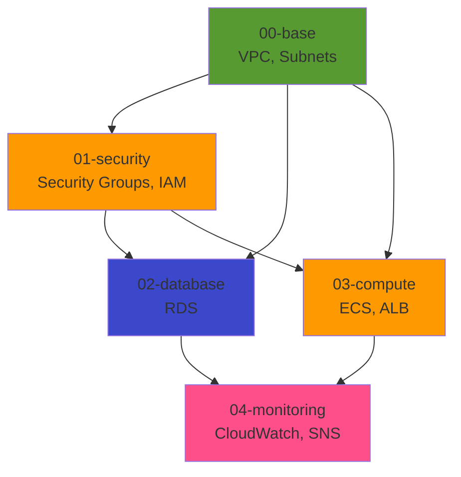

# IaC構成方針

## IaC設計方針

### CloudFormation採用理由

**ADR-002**: IaCツールにCloudFormationを採用

| 観点 | CloudFormation | Terraform | 決定 |
|------|---------------|-----------|------|
| **コスト** | 無料 | 無料 | △ |
| **AWS統合** | ネイティブ | サードパーティ | ✅ CF有利 |
| **新機能対応** | 即座 | 遅延あり | ✅ CF有利 |
| **学習コスト** | 低（YAML） | 中（HCL） | ✅ CF有利 |
| **ドリフト検出** | あり | あり | △ |
| **マルチクラウド** | 不可 | 可能 | ⚠️ TF有利（POCでは不要） |

**結論**: AWS専用POCのため、CloudFormationを採用

## ディレクトリ構成（シンプル版）

### 推奨構成（技術標準準拠、POC簡素化）

```
infra/cloudformation/
├── stacks/                    # デプロイ単位（スタック数削減）
│   ├── 00-base.yaml          # VPC、サブネット、Internet Gateway
│   ├── 01-security.yaml      # Security Groups、IAMロール
│   ├── 02-database.yaml      # RDS、Secrets Manager
│   ├── 03-compute.yaml       # ECS、ALB
│   └── 04-monitoring.yaml    # CloudWatch、SNS、X-Ray
│
├── templates/                 # 再利用可能なテンプレート（環境共通）⭐
│   ├── vpc.yaml              # VPC、サブネット定義
│   ├── security-groups.yaml  # Security Groups定義
│   ├── iam-roles.yaml        # IAMロール定義
│   ├── rds.yaml              # RDSインスタンス定義
│   ├── ecs.yaml              # ECS、タスク定義
│   ├── alb.yaml              # ALB、ターゲットグループ
│   └── monitoring.yaml       # CloudWatch、SNS定義
│
└── parameters/                # 環境差分を集約 ⭐
    └── production.json       # 本番環境パラメータ（POCで使用）
```

**重要な変更点**:
- **スタック数削減**: 6スタック → 5スタック（NLB、API Gateway削除）
- **テンプレート削減**: nlb.yaml、api-gateway.yaml 削除

### 重要原則

**✅ Good Practice**:
- テンプレートは環境共通（`templates/`）
- 環境差分はパラメーターで管理（`parameters/`）
- スタックは論理単位で分割（`stacks/`）

**❌ Bad Practice**:
- 環境別にテンプレートを複製（例: `vpc-prod.yaml`, `vpc-dev.yaml`）
- パラメータをテンプレート内にハードコード
- 巨大な1ファイル（全リソース定義）

## スタック分割戦略（シンプル版）

### スタック分割理由

| 理由 | 説明 |
|------|------|
| **変更範囲の明確化** | VPC変更時にECSを再デプロイしない |
| **デプロイ時間の短縮** | 小さいスタック = 速いデプロイ |
| **ロールバック容易性** | 問題のあるスタックのみロールバック |
| **依存関係の明確化** | スタック間の依存関係を可視化 |

### スタック依存関係（シンプル版）



**削除したスタック**:
- **04-api**: API Gateway + NLB削除により不要
- **05-monitoring** → **04-monitoring**: スタック番号繰り上げ

### スタック間の値の受け渡し

**方法1: Outputs + ImportValue（推奨）**

**スタック00-base.yaml**:
```yaml
Outputs:
  VpcId:
    Description: VPC ID
    Value: !Ref VPC
    Export:
      Name: !Sub ${AWS::StackName}-VpcId

  PublicSubnet1a:
    Description: Public Subnet 1a
    Value: !Ref PublicSubnet1a
    Export:
      Name: !Sub ${AWS::StackName}-PublicSubnet1a
```

**スタック03-compute.yaml**:
```yaml
Parameters:
  BaseStackName:
    Type: String
    Default: xray-poc-base

Resources:
  ECSService:
    Type: AWS::ECS::Service
    Properties:
      NetworkConfiguration:
        AwsvpcConfiguration:
          Subnets:
            - !ImportValue
              Fn::Sub: ${BaseStackName}-PublicSubnet1a
          AssignPublicIp: ENABLED
```

**方法2: Parameter Store（代替案）**

**スタック00-base.yaml**:
```yaml
Resources:
  VpcIdParameter:
    Type: AWS::SSM::Parameter
    Properties:
      Name: /xray-poc/vpc-id
      Type: String
      Value: !Ref VPC
```

**スタック03-compute.yaml**:
```yaml
Parameters:
  VpcId:
    Type: AWS::SSM::Parameter::Value<String>
    Default: /xray-poc/vpc-id
```

## 環境差分管理

### パラメータファイル構成

**production.json（POC環境）**:
```json
[
  {
    "ParameterKey": "Environment",
    "ParameterValue": "production"
  },
  {
    "ParameterKey": "VpcCidr",
    "ParameterValue": "10.0.0.0/16"
  },
  {
    "ParameterKey": "DBInstanceClass",
    "ParameterValue": "db.t4g.micro"
  },
  {
    "ParameterKey": "DBAllocatedStorage",
    "ParameterValue": "20"
  },
  {
    "ParameterKey": "ECSTaskCpu",
    "ParameterValue": "256"
  },
  {
    "ParameterKey": "ECSTaskMemory",
    "ParameterValue": "512"
  },
  {
    "ParameterKey": "ECSDesiredCount",
    "ParameterValue": "1"
  },
  {
    "ParameterKey": "ECSAssignPublicIp",
    "ParameterValue": "ENABLED"
  }
]
```

**注**: `ECSAssignPublicIp: ENABLED` を追加（パブリックサブネット配置のため）

### テンプレート内のパラメータ定義

**templates/ecs.yaml**:
```yaml
Parameters:
  ECSAssignPublicIp:
    Type: String
    Default: ENABLED
    AllowedValues:
      - ENABLED
      - DISABLED
    Description: Assign public IP to ECS tasks

Resources:
  ECSService:
    Type: AWS::ECS::Service
    Properties:
      NetworkConfiguration:
        AwsvpcConfiguration:
          AssignPublicIp: !Ref ECSAssignPublicIp
          Subnets:
            - !ImportValue
              Fn::Sub: ${BaseStackName}-PublicSubnet1a
      # ... その他の設定
```

## デプロイ方法

### 初回デプロイ（スタック作成）

**手順（シンプル版）**:
1. 00-base スタックをデプロイ
2. 01-security スタックをデプロイ
3. 02-database スタックをデプロイ
4. 03-compute スタックをデプロイ
5. 04-monitoring スタックをデプロイ

**コマンド例（00-base）**:
```bash
aws cloudformation create-stack \
  --stack-name xray-poc-base \
  --template-body file://stacks/00-base.yaml \
  --parameters file://parameters/production.json \
  --capabilities CAPABILITY_NAMED_IAM \
  --region ap-northeast-1

# 完了待ち
aws cloudformation wait stack-create-complete \
  --stack-name xray-poc-base \
  --region ap-northeast-1
```

### 更新デプロイ（スタック更新）

**変更セット方式（推奨）**:
```bash
# 変更セット作成
aws cloudformation create-change-set \
  --stack-name xray-poc-base \
  --change-set-name update-$(date +%Y%m%d-%H%M%S) \
  --template-body file://stacks/00-base.yaml \
  --parameters file://parameters/production.json \
  --capabilities CAPABILITY_NAMED_IAM \
  --region ap-northeast-1

# 変更内容確認
aws cloudformation describe-change-set \
  --stack-name xray-poc-base \
  --change-set-name update-20251210-120000 \
  --region ap-northeast-1

# 変更セット実行
aws cloudformation execute-change-set \
  --stack-name xray-poc-base \
  --change-set-name update-20251210-120000 \
  --region ap-northeast-1
```

### 削除（スタック削除）

**逆順で削除**:
```bash
# 04-monitoring削除
aws cloudformation delete-stack \
  --stack-name xray-poc-monitoring \
  --region ap-northeast-1

aws cloudformation wait stack-delete-complete \
  --stack-name xray-poc-monitoring \
  --region ap-northeast-1

# 03-compute削除
aws cloudformation delete-stack \
  --stack-name xray-poc-compute \
  --region ap-northeast-1

# ... 順に削除（02, 01, 00）
```

## デプロイ自動化（GitHub Actions）

### ワークフロー: `deploy-infra.yml`

**トリガー**:
- `infra/cloudformation/` 配下のファイル変更時

**ジョブ（シンプル版）**:
```yaml
name: Deploy Infrastructure

on:
  push:
    branches: [main]
    paths:
      - 'infra/cloudformation/**'

jobs:
  deploy:
    runs-on: ubuntu-latest
    permissions:
      id-token: write
      contents: read

    steps:
      - uses: actions/checkout@v4

      - name: Configure AWS credentials
        uses: aws-actions/configure-aws-credentials@v4
        with:
          role-to-assume: arn:aws:iam::${{ secrets.AWS_ACCOUNT_ID }}:role/xray-poc-github-actions-role
          aws-region: ap-northeast-1

      - name: Deploy 00-base stack
        run: |
          aws cloudformation deploy \
            --stack-name xray-poc-base \
            --template-file infra/cloudformation/stacks/00-base.yaml \
            --parameter-overrides file://infra/cloudformation/parameters/production.json \
            --capabilities CAPABILITY_NAMED_IAM \
            --no-fail-on-empty-changeset

      - name: Deploy 01-security stack
        run: |
          aws cloudformation deploy \
            --stack-name xray-poc-security \
            --template-file infra/cloudformation/stacks/01-security.yaml \
            --parameter-overrides file://infra/cloudformation/parameters/production.json \
            --capabilities CAPABILITY_NAMED_IAM \
            --no-fail-on-empty-changeset

      - name: Deploy 02-database stack
        run: |
          aws cloudformation deploy \
            --stack-name xray-poc-database \
            --template-file infra/cloudformation/stacks/02-database.yaml \
            --parameter-overrides file://infra/cloudformation/parameters/production.json \
            --capabilities CAPABILITY_NAMED_IAM \
            --no-fail-on-empty-changeset

      - name: Deploy 03-compute stack
        run: |
          aws cloudformation deploy \
            --stack-name xray-poc-compute \
            --template-file infra/cloudformation/stacks/03-compute.yaml \
            --parameter-overrides file://infra/cloudformation/parameters/production.json \
            --capabilities CAPABILITY_NAMED_IAM \
            --no-fail-on-empty-changeset

      - name: Deploy 04-monitoring stack
        run: |
          aws cloudformation deploy \
            --stack-name xray-poc-monitoring \
            --template-file infra/cloudformation/stacks/04-monitoring.yaml \
            --parameter-overrides file://infra/cloudformation/parameters/production.json \
            --capabilities CAPABILITY_NAMED_IAM \
            --no-fail-on-empty-changeset
```

## ドリフト検出

### ドリフトとは

**定義**: CloudFormationスタック外でリソースが変更された状態

**例**:
- AWSコンソールからSecurity Groupのルールを手動追加
- AWS CLIでRDSインスタンスクラスを変更

### ドリフト検出方法

**AWS CLI**:
```bash
# ドリフト検出開始
aws cloudformation detect-stack-drift \
  --stack-name xray-poc-base \
  --region ap-northeast-1

# ドリフト検出結果確認
aws cloudformation describe-stack-drift-detection-status \
  --stack-drift-detection-id {DRIFT_DETECTION_ID} \
  --region ap-northeast-1

# ドリフト詳細確認
aws cloudformation describe-stack-resource-drifts \
  --stack-name xray-poc-base \
  --region ap-northeast-1
```

**AWSコンソール**:
- CloudFormation → スタック選択 → Stack actions → Detect drift

### ドリフト対応

**方針**:
1. **ドリフト検出時**: CloudFormationテンプレートを更新して再デプロイ
2. **緊急時のみ**: 手動変更を許容（その後、テンプレート更新）

## テンプレート検証

### Linter（cfn-lint）

**インストール**:
```bash
pip install cfn-lint
```

**実行**:
```bash
# 単一ファイル検証
cfn-lint infra/cloudformation/templates/vpc.yaml

# ディレクトリ全体検証
cfn-lint infra/cloudformation/templates/*.yaml
```

**GitHub Actions統合**:
```yaml
- name: Lint CloudFormation Templates
  run: |
    pip install cfn-lint
    cfn-lint infra/cloudformation/templates/*.yaml
```

### CloudFormation Validate

**実行**:
```bash
aws cloudformation validate-template \
  --template-body file://infra/cloudformation/templates/vpc.yaml \
  --region ap-northeast-1
```

## 推定実装規模（シンプル版）

### テンプレート別の推定行数

| ファイル | 推定行数 | 備考 |
|---------|---------|------|
| **templates/vpc.yaml** | 100行 | VPC、パブリックサブネット、DBサブネット、IGW（NAT Gateway削除） |
| **templates/security-groups.yaml** | 150行 | ALB、ECS、RDS用SG（NLB削除） |
| **templates/iam-roles.yaml** | 250行 | ECS Task Execution Role、Task Role、GitHub Actions Role |
| **templates/rds.yaml** | 120行 | RDSインスタンス、サブネットグループ、パラメータグループ |
| **templates/ecs.yaml** | 300行 | クラスタ、タスク定義（2コンテナ）、サービス |
| **templates/alb.yaml** | 150行 | ALB、ターゲットグループ、リスナー |
| **templates/monitoring.yaml** | 180行 | CloudWatch Alarms、SNS Topic、X-Ray設定 |
| **stacks/00-base.yaml** | 50行 | テンプレート参照、パラメータ定義 |
| **stacks/01-security.yaml** | 50行 | テンプレート参照、パラメータ定義 |
| **stacks/02-database.yaml** | 50行 | テンプレート参照、パラメータ定義 |
| **stacks/03-compute.yaml** | 50行 | テンプレート参照、パラメータ定義 |
| **stacks/04-monitoring.yaml** | 50行 | テンプレート参照、パラメータ定義 |
| **parameters/production.json** | 30行 | パラメータ定義 |
| **合計** | **約1,530行** | NLB、API Gateway削除により約470行削減 |

**削減内訳**:
- nlb.yaml削除: -100行
- api-gateway.yaml削除: -200行
- stacks/04-api.yaml削除: -50行
- vpc.yaml簡素化（Privateサブネット削除）: -50行
- security-groups.yaml簡素化（NLB SG削除）: -50行
- parameters簡素化: -20行

### 実装期間の目安（シンプル版）

**SRE（1名想定）**:
- テンプレート作成: 3日間（旧: 5日間）
- テスト・デバッグ: 2日間（旧: 3日間）
- ドキュメント作成: 1日間
- **合計**: 約6営業日（旧: 9営業日）

**削減効果**: 約3営業日短縮

## バージョン管理

### Gitタグ運用

**タグ命名規則**:
- `infra-v1.0.0`: 初期リリース
- `infra-v1.1.0`: 機能追加
- `infra-v1.1.1`: バグ修正

**タグ作成**:
```bash
git tag -a infra-v1.0.0 -m "Initial infrastructure release (Simple architecture)"
git push origin infra-v1.0.0
```

### テンプレートバージョン管理

**テンプレート内**:
```yaml
AWSTemplateFormatVersion: '2010-09-09'
Description: |
  X-Ray Watch POC - VPC Configuration (Simple architecture)
  Version: 1.0.0
  Last Updated: 2025-12-10

Metadata:
  Version: 1.0.0
  Author: SRE Team
  ChangeLog:
    - 2025-12-10: Initial release (NAT Gateway, NLB, API Gateway削除)
```

## トラブルシューティング

### よくある問題と対処法

| 問題 | 原因 | 対処法 |
|------|------|--------|
| スタック作成失敗 | パラメータ不足 | CloudFormationイベント確認 |
| スタック更新失敗 | リソース削除時の依存関係 | 依存スタックを先に更新 |
| ロールバック失敗 | リソース削除失敗 | 手動削除後、再度ロールバック |
| ImportValue エラー | Export未定義 | 依存スタックのデプロイ確認 |
| ドリフト検出 | 手動変更 | テンプレート更新して再デプロイ |

### デバッグ方法

**CloudFormation Events確認**:
```bash
aws cloudformation describe-stack-events \
  --stack-name xray-poc-base \
  --region ap-northeast-1 \
  --max-items 20
```

**リソース詳細確認**:
```bash
aws cloudformation describe-stack-resources \
  --stack-name xray-poc-base \
  --region ap-northeast-1
```

## 参照ドキュメント

- [01_システムアーキテクチャ.md](01_システムアーキテクチャ.md) - システム全体構成
- [02_ネットワーク設計.md](02_ネットワーク設計.md) - VPC、サブネット詳細（シンプル構成）
- [09_CI_CD設計.md](09_CI_CD設計.md) - GitHub Actionsデプロイ
- `.claude/docs/40_standards/42_infra/iac/cloudformation.md` - CloudFormation技術標準
