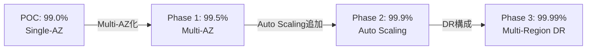
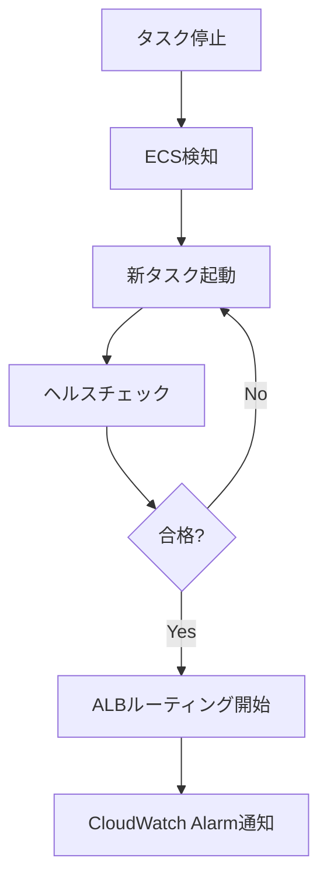
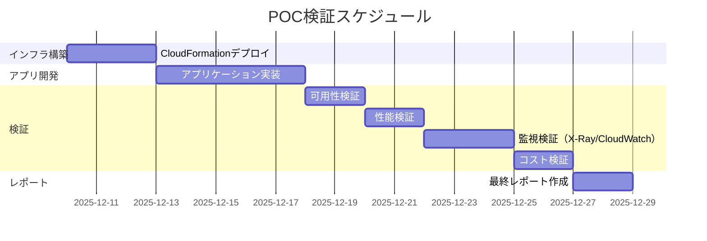
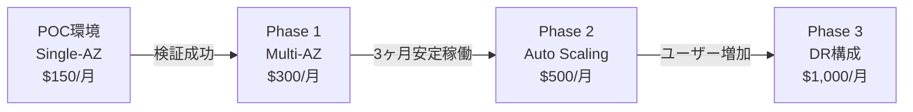

# 非機能要件実現方針

## 非機能要件概要

### POC向け非機能要件の優先順位

| 要件 | POC優先度 | 本番優先度 | POC方針 |
|------|---------|----------|---------|
| **可用性** | 低 | 高 | Single-AZ、最小限の冗長化 |
| **性能** | 低 | 高 | 最小構成、負荷試験なし |
| **セキュリティ** | 中 | 高 | 基本的な保護、認証なし |
| **拡張性** | 低 | 高 | Auto Scalingなし |
| **保守性** | 中 | 高 | IaC、ログ監視 |
| **コスト** | **最高** | 中 | 月額1,000円目標 |
| **監視性** | **最高** | 高 | X-Ray/CloudWatch/DevOps Agent検証 |

## 可用性（Availability）

### 目標

| 項目 | POC目標 | 本番目標 | 備考 |
|------|--------|---------|------|
| 稼働率 | 99.0%（月間ダウンタイム: 7.2時間許容） | 99.9%（月間ダウンタイム: 43分） | POCはベストエフォート |
| RTO（目標復旧時間） | 1時間 | 5分 | POCは手動復旧 |
| RPO（目標復旧時点） | 24時間 | 1時間 | POCはバックアップ7日間 |

### 実現方式

#### POC構成

| コンポーネント | 冗長化 | 自動復旧 | 備考 |
|--------------|--------|---------|------|
| **API Gateway** | マルチAZ（デフォルト） | あり | AWSマネージド |
| **NLB** | 単一AZ | なし | コスト削減 |
| **ALB** | 単一AZ | あり | ヘルスチェック |
| **ECS Fargate** | 単一タスク | あり | ECS自動再起動 |
| **RDS** | Single-AZ | なし | Multi-AZは本番時 |
| **X-Ray** | マルチAZ（デフォルト） | あり | AWSマネージド |
| **CloudWatch** | マルチAZ（デフォルト） | あり | AWSマネージド |

#### 本番環境での改善（参考）



### ヘルスチェック設計

#### ALB ヘルスチェック

| 設定項目 | 値 | 理由 |
|---------|---|------|
| プロトコル | HTTP | - |
| パス | `/health` | アプリケーション実装必須 |
| 間隔 | 30秒 | デフォルト |
| タイムアウト | 5秒 | - |
| 正常しきい値 | 2回 | 早期復帰 |
| 異常しきい値 | 2回 | 早期検出 |

#### ECS ヘルスチェック

**アプリケーション実装例（`/health` エンドポイント）**:
```python
@app.route('/health')
def health():
    # DB接続確認
    try:
        db.session.execute('SELECT 1')
        db_status = 'ok'
    except Exception as e:
        db_status = 'error'
        return jsonify({'status': 'unhealthy', 'db': db_status}), 503

    return jsonify({
        'status': 'healthy',
        'db': db_status,
        'timestamp': datetime.utcnow().isoformat()
    }), 200
```

### 障害時の復旧フロー

#### ECSタスク停止時



**所要時間**: 約2-3分（ECS自動復旧）

#### RDS障害時（POC）

**手動復旧手順**:
1. CloudWatch Alarmで検知
2. RDSコンソールで状態確認
3. 自動バックアップから復旧（PITR）
4. ECS接続先変更（環境変数更新、再デプロイ）

**所要時間**: 約30-60分（手動復旧）

## 性能（Performance）

### 目標

| 項目 | POC目標 | 本番目標 | 備考 |
|------|--------|---------|------|
| APIレスポンスタイム（P95） | < 1秒 | < 500ms | POCは未検証 |
| 同時接続数 | 10 | 1,000 | POCは負荷試験なし |
| スループット | 10リクエスト/秒 | 1,000リクエスト/秒 | POCは検証のみ |

### リソース構成

#### ECS Fargate

| リソース | POC構成 | 本番構成（参考） |
|---------|---------|-----------------|
| CPU | 0.25 vCPU | 0.5-1.0 vCPU |
| メモリ | 0.5 GB | 1-2 GB |
| タスク数 | 1（固定） | 2-10（Auto Scaling） |

#### RDS PostgreSQL

| リソース | POC構成 | 本番構成（参考） |
|---------|---------|-----------------|
| インスタンスクラス | db.t4g.micro（2vCPU、1GB） | db.t4g.small以上 |
| ストレージ | 20GB（gp3） | 100GB（Provisioned IOPS） |
| 接続数 | 最大100 | 最大200+ |

### パフォーマンスチューニング

#### POC期間中

**方針**: パフォーマンスチューニングは最小限

**理由**:
- 負荷試験なし
- 検証目的のみ
- コスト削減優先

#### 本番環境での改善（参考）

| 領域 | 改善方法 |
|------|---------|
| **アプリケーション** | N+1クエリ解消、キャッシング（Redis） |
| **データベース** | インデックス最適化、クエリチューニング |
| **インフラ** | Auto Scaling、ALB Connection Draining |
| **CDN** | CloudFront追加、静的コンテンツキャッシング |

## セキュリティ（Security）

### 目標

| 項目 | POC目標 | 本番目標 | 備考 |
|------|--------|---------|------|
| 認証 | なし | あり（Cognito、API Key） | POC簡略化 |
| 暗号化（転送中） | TLS 1.2+ | TLS 1.3 | - |
| 暗号化（保管時） | AWS管理キー | CMK（Customer Managed Key） | - |
| 脆弱性診断 | なし | あり（四半期ごと） | POCは不要 |

### 実現方式

詳細は [03_セキュリティ設計.md](03_セキュリティ設計.md) 参照

#### POC構成

- Security Groups: 最小権限
- IAMロール: タスク単位で分離
- RDS暗号化: AWS管理キー
- TLS通信: Internet → API Gateway、ECS → RDS

#### 本番環境での改善（参考）

- WAF追加（DDoS対策、SQLインジェクション対策）
- Cognito User Pool（ユーザー認証）
- API Key（API呼び出し制限）
- KMS CMK（暗号化キー管理）
- GuardDuty（脅威検知）

## 拡張性（Scalability）

### 目標

| 項目 | POC目標 | 本番目標 | 備考 |
|------|--------|---------|------|
| スケールアウト | なし | Auto Scaling | POCは固定 |
| データ増加対応 | RDS自動拡張（20GB→100GB） | 容量計画 | - |

### 実現方式

#### POC構成

**スケーリングなし**:
- ECS: タスク数1固定
- RDS: Single-AZ、手動スケールアップ

**理由**:
- コスト削減
- 負荷試験なし
- 検証目的のみ

#### 本番環境での改善（参考）

**ECS Auto Scaling**:

| メトリクス | スケールアウト閾値 | スケールイン閾値 |
|-----------|-----------------|----------------|
| CPU使用率 | > 70% | < 30% |
| メモリ使用率 | > 70% | < 30% |
| ALBリクエスト数/ターゲット | > 1000 | < 300 |

**タスク数範囲**: 2-10

**RDS Read Replica**:
- Primary: 書き込み専用
- Read Replica: 読み取り専用（負荷分散）

## 保守性（Maintainability）

### 目標

| 項目 | POC目標 | 本番目標 | 備考 |
|------|--------|---------|------|
| IaC化率 | 100% | 100% | CloudFormation |
| ログ保管 | 7日間 | 30-90日間 | - |
| デプロイ頻度 | 週1回 | 1日複数回 | POCは手動も可 |
| ロールバック時間 | 10分 | 5分 | - |

### 実現方式

#### IaC化

**CloudFormation**:
- すべてのインフラリソースをコード化
- ディレクトリ構成: `stacks/`, `templates/`, `parameters/`
- 詳細: [10_IaC構成方針.md](10_IaC構成方針.md)

#### ログ管理

**CloudWatch Logs**:
- アプリケーションログ: 7日間
- ALBログ: 7日間
- RDS PostgreSQLログ: 7日間

**X-Rayトレース**:
- 保管期間: 30日間（デフォルト）

#### CI/CD

**GitHub Actions**:
- CI: Lint、Unit Test
- CD: Build、Push to ECR、Deploy to ECS
- 詳細: [09_CI_CD設計.md](09_CI_CD設計.md)

## 監視性（Observability）

### 目標（POC主目的）

| 項目 | POC目標 | 本番目標 | 備考 |
|------|--------|---------|------|
| ログ可視化 | CloudWatch Logs Insights | Elasticsearch、Grafana | - |
| メトリクス可視化 | CloudWatch Dashboard | Grafana | - |
| トレーシング | X-Ray | X-Ray + Jaeger | **POC検証ポイント** |
| アラート | CloudWatch Alarms + SNS | PagerDuty統合 | - |

### 実現方式

詳細は [08_監視・アラート設計.md](08_監視・アラート設計.md) 参照

#### 3本柱（POC検証対象）

**1. ログ（CloudWatch Logs）**:
- 構造化ログ（JSON）
- Logs Insightsでクエリ
- X-Ray Trace IDとの紐付け

**2. メトリクス（CloudWatch Metrics）**:
- Container Insights（ECS）
- RDSメトリクス
- カスタムメトリクス（アプリケーション）

**3. トレース（AWS X-Ray）**:
- サービスマップ
- レスポンスタイム分析
- ボトルネック検出

#### AWS DevOps Agent

**検証ポイント**:
- 既存監視（X-Ray、CloudWatch）との統合
- 異常検知の精度
- オペレーション推奨アクションの有用性

## 運用性（Operability）

### 目標

| 項目 | POC目標 | 本番目標 | 備考 |
|------|--------|---------|------|
| 運用自動化率 | 50% | 90% | POCは手動も許容 |
| 障害検知時間 | 5分 | 1分 | CloudWatch Alarms |
| 障害復旧時間 | 1時間 | 5分 | POCは手動復旧 |

### 運用タスク

#### 日次タスク

- [ ] CloudWatch Alarms確認（メール通知）
- [ ] X-Rayサービスマップ確認
- [ ] コスト確認（予算超過チェック）

#### 週次タスク

- [ ] CloudWatch Logsエラーログ確認
- [ ] RDSバックアップ確認
- [ ] セキュリティパッチ確認

#### 月次タスク

- [ ] コストレポート作成
- [ ] パフォーマンスレポート作成
- [ ] POC検証結果まとめ

## データ管理（Data Management）

### バックアップ

| 対象 | バックアップ方法 | 保持期間 | RPO |
|------|---------------|---------|-----|
| **RDS** | 自動バックアップ（日次） | 7日間 | 24時間 |
| **ECR** | イメージバージョン管理 | 最新10個 | - |

### リストア

**RDS PITR（Point-in-Time Recovery）**:
```bash
aws rds restore-db-instance-to-point-in-time \
  --source-db-instance-identifier xray-poc-rds \
  --target-db-instance-identifier xray-poc-rds-restored \
  --restore-time 2025-12-10T12:00:00Z
```

**所要時間**: 約30-60分

## コスト効率（Cost Efficiency）

### 目標

| 項目 | POC目標 | 本番目標 | 備考 |
|------|--------|---------|------|
| 月額コスト | $100-150（12,000-18,000円） | 要件次第 | **POC最重要** |
| コスト可視化 | AWS Cost Explorer | Cost Anomaly Detection | - |

### コスト最適化ポイント

詳細は [13_コスト設計.md](13_コスト設計.md) 参照

#### POC期間中の削減ポイント

1. **Single-AZ構成**: Multi-AZの約半額
2. **最小インスタンスサイズ**: db.t4g.micro、0.25vCPU
3. **短期ログ保管**: 7日間（本番は30-90日間）
4. **Auto Scalingなし**: タスク数固定
5. **VPC Flow Logs無効**: 月額約$5-10削減

#### 本番環境でのコスト増加要因

- Multi-AZ構成: 約2倍
- インスタンスサイズアップ: 2-4倍
- Auto Scaling: 平均タスク数2-3倍
- CloudFront追加: +$20-50/月
- WAF追加: +$10-30/月

## 国際化（Internationalization）

### POC方針

**対応なし**:
- 日本語のみ
- タイムゾーン: JST固定

### 本番環境での対応（参考）

- 多言語対応（日本語、英語）
- タイムゾーン対応（UTC保存、表示時に変換）
- 通貨対応（JPY、USD）

## アクセシビリティ（Accessibility）

### POC方針

**対応なし**: POCはAPI検証のみ（UI未実装）

### 本番環境での対応（参考）

- WCAG 2.1 AAレベル準拠
- スクリーンリーダー対応
- キーボード操作対応

## 非機能要件の検証方法

### POC期間中の検証項目

| 要件 | 検証方法 | 合格基準 |
|------|---------|---------|
| **可用性** | ECSタスク手動停止 → 自動復旧確認 | 5分以内に復旧 |
| **性能** | 手動でAPIリクエスト送信 | レスポンスタイム < 1秒 |
| **セキュリティ** | Security Groups設定確認 | 最小権限設定 |
| **監視性** | X-Rayトレース確認、CloudWatch確認 | サービスマップ表示 |
| **保守性** | CloudFormation更新デプロイ | エラーなし |
| **コスト** | 月次コスト確認 | $150以下 |

### 検証スケジュール



## 本格導入への移行計画

### 移行フェーズ



### 移行時の追加検討事項

- Multi-AZ構成への移行手順
- バックアップ戦略の見直し（保持期間延長）
- 認証機能の追加（Cognito）
- WAF導入
- 運用体制の構築

## 参照ドキュメント

- [03_セキュリティ設計.md](03_セキュリティ設計.md) - セキュリティ詳細
- [08_監視・アラート設計.md](08_監視・アラート設計.md) - 監視詳細
- [12_災害対策・BCP.md](12_災害対策・BCP.md) - 可用性、バックアップ詳細
- [13_コスト設計.md](13_コスト設計.md) - コスト詳細
