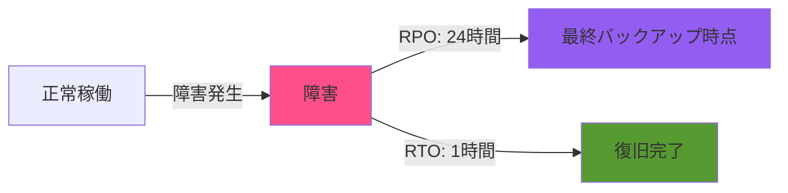
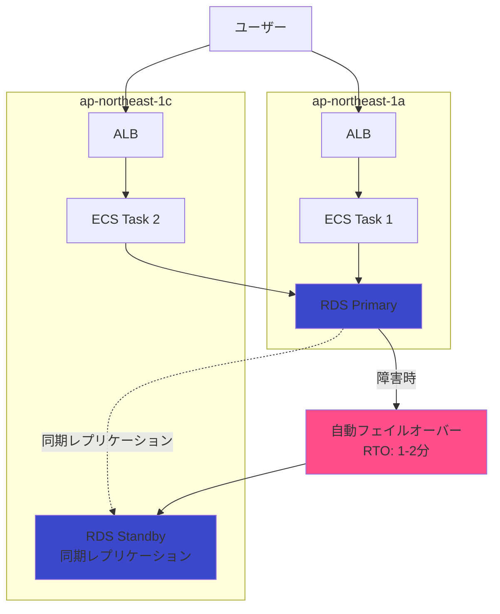

# 災害対策・BCP（Business Continuity Plan）

## 災害対策方針

### POC向け簡素化

| 項目 | POC方針 | 本番環境での追加 |
|------|---------|----------------|
| **DR（Disaster Recovery）** | なし | Multi-Region DR |
| **バックアップ** | RDS自動バックアップ（7日間） | 長期保管（30日間）、S3バックアップ |
| **RTO（目標復旧時間）** | 1時間（手動復旧） | 5分（自動フェイルオーバー） |
| **RPO（目標復旧時点）** | 24時間（日次バックアップ） | 1時間（PITR） |
| **Multi-AZ** | なし（コスト削減） | あり（可用性向上） |

### POC期間中の災害対策レベル

**許容リスク**:
- POCデータは非本番データ（個人情報・機密情報なし）
- データ消失許容（検証目的のみ）
- ダウンタイム許容（スクラップ&ビルド運用）

**基本方針**:
- 最小限のバックアップ（RDS自動バックアップ）
- 災害時はスクラップ&ビルド（CloudFormation再デプロイ）

## RTO/RPO設定

### 目標設定

| 目標 | POC | 本番環境（参考） | 備考 |
|------|-----|-----------------|------|
| **RTO** | 1時間 | 5分 | POCは手動復旧 |
| **RPO** | 24時間 | 1時間 | POCは日次バックアップ |

### RTO/RPO図解



### RPO（Recovery Point Objective）

**POC: 24時間**

**実現方法**:
- RDS自動バックアップ（日次）
- バックアップウィンドウ: 18:00-19:00 JST

**データ消失リスク**:
- 最悪ケース: 過去24時間のデータ消失
- 許容理由: POCデータは非本番データ

### RTO（Recovery Time Objective）

**POC: 1時間**

**実現方法**:
- RDS PITR（Point-in-Time Recovery）から手動復旧
- CloudFormation再デプロイ

**復旧手順**: 後述

## バックアップ設計

### RDSバックアップ

#### 自動バックアップ

| 設定項目 | 値 | 備考 |
|---------|---|------|
| バックアップ保持期間 | 7日間 | POC最小設定 |
| バックアップウィンドウ | 18:00-19:00 JST (09:00-10:00 UTC) | アクセス少ない時間帯 |
| スナップショット | 自動（毎日） | S3に自動保存 |
| PITR | 有効 | 最大7日間前まで復元可能 |

#### 手動スナップショット（オプション）

**用途**: 重要なマイルストーン時のバックアップ

**作成タイミング**:
- POC開始時（初期データ投入後）
- 重要な機能追加後
- 本番移行前

**作成方法**:
```bash
aws rds create-db-snapshot \
  --db-instance-identifier xray-poc-rds \
  --db-snapshot-identifier xray-poc-milestone-20251210 \
  --region ap-northeast-1
```

### バックアップ保管場所

**RDS自動バックアップ**:
- 保管場所: S3（AWS管理、非公開）
- 暗号化: AES-256（AWS管理キー）
- リージョン: ap-northeast-1（東京）

**クロスリージョンバックアップ（本番環境、参考）**:
- 保管場所: S3（別リージョン: ap-southeast-1等）
- 用途: リージョン障害時の復旧

### その他のバックアップ

| 対象 | バックアップ方法 | 保持期間 | 備考 |
|------|---------------|---------|------|
| **ECRイメージ** | イメージバージョン管理 | 最新10個 | ライフサイクルポリシー |
| **CloudFormationテンプレート** | Git管理 | 無期限 | GitHub |
| **アプリケーションコード** | Git管理 | 無期限 | GitHub |
| **CloudWatch Logs** | CloudWatch Logs | 7日間 | 自動削除 |

## 災害シナリオと復旧手順

### シナリオ1: RDS障害（データ消失なし）

**想定**: RDSインスタンス障害、データは無事

**復旧手順**:
1. RDSコンソールで障害確認
2. RDSインスタンス再起動
3. ECS接続確認（自動再接続）
4. ヘルスチェック確認

**所要時間**: 約5-10分

### シナリオ2: RDS障害（データ消失あり）

**想定**: RDSインスタンス障害、データ破損

**復旧手順**:

**1. PITR（Point-in-Time Recovery）実行**:
```bash
# 障害発生直前の時刻を指定
aws rds restore-db-instance-to-point-in-time \
  --source-db-instance-identifier xray-poc-rds \
  --target-db-instance-identifier xray-poc-rds-restored \
  --restore-time 2025-12-10T12:00:00Z \
  --region ap-northeast-1
```

**2. 復元したRDSインスタンスを確認**:
```bash
aws rds describe-db-instances \
  --db-instance-identifier xray-poc-rds-restored \
  --region ap-northeast-1
```

**3. ECS環境変数更新（新RDSエンドポイント）**:
- CloudFormationテンプレート更新
- または、ECSタスク定義の環境変数を手動更新

**4. ECS再デプロイ**:
```bash
aws ecs update-service \
  --cluster xray-poc-cluster \
  --service xray-poc-service \
  --force-new-deployment \
  --region ap-northeast-1
```

**5. 動作確認**:
- `/health` エンドポイント確認
- X-Rayトレース確認

**所要時間**: 約30-60分

### シナリオ3: ECSタスク障害

**想定**: ECSタスク異常終了

**復旧手順**:
1. **自動復旧**: ECSが自動的に新タスクを起動
2. CloudWatch Logsでエラー確認
3. 必要に応じてアプリケーション修正、再デプロイ

**所要時間**: 約2-3分（自動復旧）

### シナリオ4: AZ障害（ap-northeast-1a）

**想定**: ap-northeast-1a全体障害

**POC構成**: Single-AZのため、**全サービス停止**

**復旧手順**:
1. **障害復旧待ち**（AWS側）
2. または、**別AZで再構築**:
   - CloudFormationパラメータ変更（AZ: 1a → 1c）
   - CloudFormation再デプロイ
   - RDS復旧（PITR）

**所要時間**: 数時間-数日（AWS復旧待ち）、または 1-2時間（再構築）

**本番環境**: Multi-AZ構成で自動フェイルオーバー（RTO: 5分）

### シナリオ5: リージョン障害（ap-northeast-1全体）

**想定**: 東京リージョン全体障害（極めて稀）

**POC構成**: **復旧不可**（データ消失）

**本番環境での対策（参考）**:
- Multi-Region DR構成
- クロスリージョンバックアップ
- Route 53フェイルオーバー

## 復旧手順書

### RDS PITR復旧手順書

**目的**: RDSデータ破損時の復旧

**前提条件**:
- 自動バックアップ有効
- 復元時刻がバックアップ保持期間内（7日間）

**手順**:

```bash
# 1. 復元時刻を決定（障害発生直前）
RESTORE_TIME="2025-12-10T12:00:00Z"

# 2. PITR実行
aws rds restore-db-instance-to-point-in-time \
  --source-db-instance-identifier xray-poc-rds \
  --target-db-instance-identifier xray-poc-rds-restored \
  --restore-time $RESTORE_TIME \
  --db-instance-class db.t4g.micro \
  --db-subnet-group-name xray-poc-db-subnet-group \
  --vpc-security-group-ids sg-xxxxx \
  --no-multi-az \
  --publicly-accessible false \
  --region ap-northeast-1

# 3. 復元完了待ち（約20-30分）
aws rds wait db-instance-available \
  --db-instance-identifier xray-poc-rds-restored \
  --region ap-northeast-1

# 4. エンドポイント取得
aws rds describe-db-instances \
  --db-instance-identifier xray-poc-rds-restored \
  --query 'DBInstances[0].Endpoint.Address' \
  --output text \
  --region ap-northeast-1

# 5. ECS環境変数更新（CloudFormationパラメータ更新）
# parameters/production.json を編集:
# "DBEndpoint": "xray-poc-rds-restored.xxxxx.ap-northeast-1.rds.amazonaws.com"

# 6. CloudFormation更新デプロイ
aws cloudformation update-stack \
  --stack-name xray-poc-database \
  --template-body file://stacks/02-database.yaml \
  --parameters file://parameters/production.json \
  --region ap-northeast-1

# 7. ECS再デプロイ（環境変数反映）
aws ecs update-service \
  --cluster xray-poc-cluster \
  --service xray-poc-service \
  --force-new-deployment \
  --region ap-northeast-1

# 8. 動作確認
curl https://{api-id}.execute-api.ap-northeast-1.amazonaws.com/prod/health

# 9. X-Rayトレース確認
# AWSコンソール → X-Ray → Service Map

# 10. 旧RDSインスタンス削除（動作確認後）
aws rds delete-db-instance \
  --db-instance-identifier xray-poc-rds \
  --skip-final-snapshot \
  --region ap-northeast-1
```

### CloudFormation再デプロイ手順書

**目的**: 全インフラ削除後の再構築

**前提条件**:
- CloudFormationテンプレートがGitHub管理されている
- RDSバックアップが存在する

**手順**:

```bash
# 1. GitHubから最新テンプレート取得
git clone https://github.com/{ORG}/{REPO}.git
cd {REPO}/infra/cloudformation

# 2. スタックを順次デプロイ
# 00-base
aws cloudformation create-stack \
  --stack-name xray-poc-base \
  --template-body file://stacks/00-base.yaml \
  --parameters file://parameters/production.json \
  --capabilities CAPABILITY_NAMED_IAM \
  --region ap-northeast-1

aws cloudformation wait stack-create-complete \
  --stack-name xray-poc-base \
  --region ap-northeast-1

# 01-security
aws cloudformation create-stack \
  --stack-name xray-poc-security \
  --template-body file://stacks/01-security.yaml \
  --parameters file://parameters/production.json \
  --capabilities CAPABILITY_NAMED_IAM \
  --region ap-northeast-1

aws cloudformation wait stack-create-complete \
  --stack-name xray-poc-security \
  --region ap-northeast-1

# 02-database（RDSスナップショットから復元）
# スナップショットID取得
aws rds describe-db-snapshots \
  --db-instance-identifier xray-poc-rds \
  --query 'DBSnapshots[0].DBSnapshotIdentifier' \
  --output text \
  --region ap-northeast-1

# CloudFormationパラメータに追加
# "DBSnapshotIdentifier": "rds:xray-poc-rds-2025-12-10-09-00"

aws cloudformation create-stack \
  --stack-name xray-poc-database \
  --template-body file://stacks/02-database.yaml \
  --parameters file://parameters/production.json \
  --capabilities CAPABILITY_NAMED_IAM \
  --region ap-northeast-1

# ... 03, 04, 05も同様にデプロイ

# 3. 動作確認
curl https://{api-id}.execute-api.ap-northeast-1.amazonaws.com/prod/health
```

**所要時間**: 約60-90分

## BCP（Business Continuity Plan）

### 事業継続の優先順位

**POC期間中**:
1. データ保護（RDSバックアップ）
2. インフラ再構築可能性（IaC化）
3. 復旧手順書整備

**本番環境**:
1. サービス継続（Multi-AZ、Auto Scaling）
2. データ保護（Multi-Region バックアップ）
3. 顧客への影響最小化（DR構成）

### 連絡体制

**POC期間中**:
- CloudWatch Alarms → SNS → 開発者メール
- 重大障害時: Slack通知（オプション）

**本番環境（参考）**:
- PagerDuty統合
- エスカレーションルール
- オンコール体制

### 訓練計画

**POC期間中**:
- RDS PITR復旧訓練（1回）
- CloudFormation再デプロイ訓練（1回）

**本番環境**:
- 四半期ごとのDR訓練
- 年次のフルスケール訓練

## Multi-AZ構成への移行（本番環境、参考）

### Multi-AZ構成のメリット

| 項目 | Single-AZ（POC） | Multi-AZ（本番） | 改善 |
|------|----------------|----------------|------|
| **RTO** | 1時間（手動復旧） | 5分（自動フェイルオーバー） | **大幅改善** |
| **RPO** | 24時間 | 0秒（同期レプリケーション） | **大幅改善** |
| **可用性** | 99.0% | 99.95% | **改善** |
| **コスト** | $15.90/月 | $31.80/月 | 2倍 |

### Multi-AZ構成図（参考）



## ログ・監査証跡の保管

### POC期間中のログ保管

| ログ種別 | 保管期間 | 保管先 | 用途 |
|---------|---------|--------|------|
| CloudTrail | 90日間 | AWS管理 | 操作履歴 |
| CloudWatch Logs（アプリ） | 7日間 | CloudWatch Logs | デバッグ |
| CloudWatch Logs（ALB） | 7日間 | CloudWatch Logs | アクセスログ |
| X-Rayトレース | 30日間 | AWS X-Ray | パフォーマンス分析 |

### 本番環境での改善（参考）

- CloudTrailログをS3に長期保管（1年間）
- CloudWatch LogsをS3にエクスポート（90日間）
- S3ライフサイクルポリシー（Glacier移行、削除）

## コスト見積もり（災害対策関連）

### POC構成

| 項目 | 月額 | 備考 |
|------|------|------|
| RDS自動バックアップ | $0 | 1x無料（RDS容量と同じ） |
| CloudTrail | $0 | デフォルト有効 |
| **合計** | **$0** | 追加コストなし |

### 本番環境（参考）

| 項目 | 月額 | 備考 |
|------|------|------|
| RDS Multi-AZ | +$15.90 | 2倍のコスト |
| クロスリージョンバックアップ | +$5 | S3転送費用 |
| CloudTrail S3保管 | +$1 | 長期保管 |
| **合計** | **+$21.90** | - |

## 参照ドキュメント

- [05_データベース設計.md](05_データベース設計.md) - RDSバックアップ詳細
- [10_IaC構成方針.md](10_IaC構成方針.md) - CloudFormation再デプロイ
- [11_非機能要件実現方針.md](11_非機能要件実現方針.md) - 可用性要件
- [13_コスト設計.md](13_コスト設計.md) - バックアップコスト
