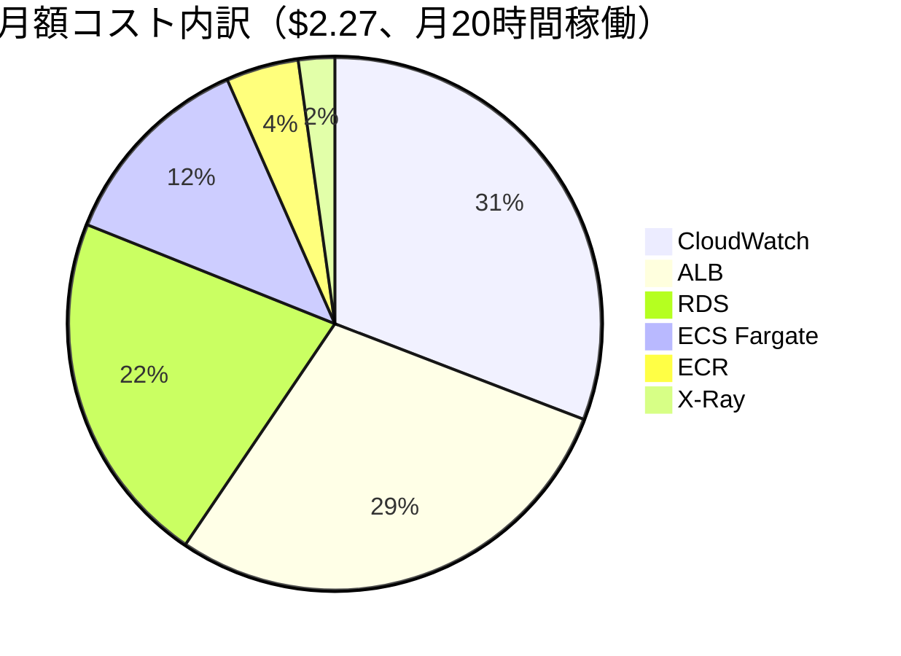
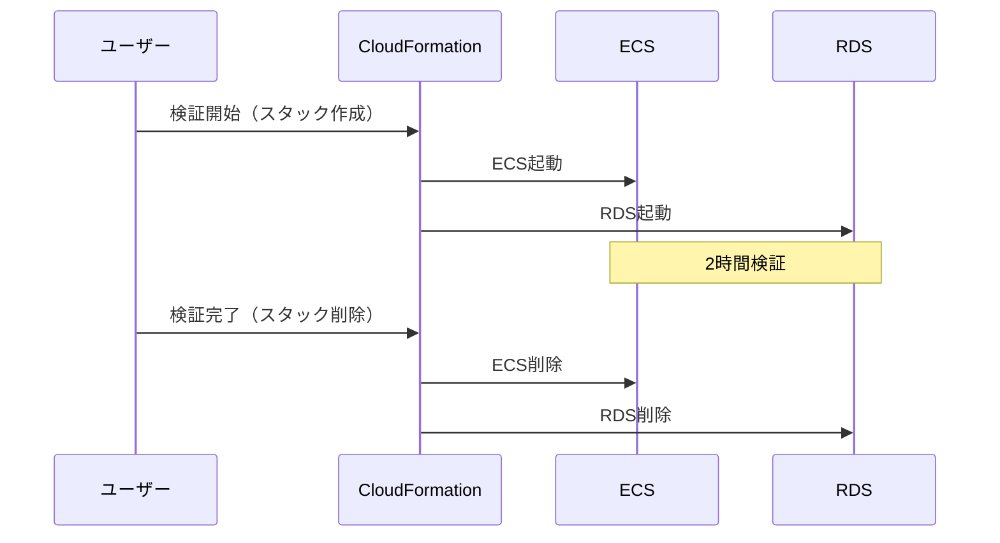

# コスト設計

## コスト設計方針

### POC最重要要件: 月額1,000円目標（スクラップ&ビルド運用）

**現実的な見積もり**: 月額 **$2-3（約300-450円）**、月20時間稼働想定

**理由**:
- **スクラップ&ビルド運用**: 検証時のみ起動（月20時間 = 1日2時間×10日）
- **シンプル構成**: NAT Gateway（$45/月）、NLB（$22/月）、API Gateway（$0.5/月）削除

**結論**: **月額1,000円目標達成可能**（月20時間稼働の場合）

**重要**: 24時間稼働の場合は月額$30-40となり、目標オーバー

## 月額コスト見積もり（月20時間稼働）

### 総コスト一覧

| カテゴリ | サービス | 月額（USD） | 月額（JPY @150円/USD） | 備考 |
|---------|---------|-----------|---------------------|------|
| **コンピュート** | ECS Fargate | $0.28 | ¥42 | 0.25vCPU、0.5GB、月20時間 |
| **コンピュート** | ALB | $0.65 | ¥98 | 時間課金 + LCU、月20時間 |
| **コンピュート** | ECR | $0.10 | ¥15 | イメージ保管（常時）|
| **データベース** | RDS PostgreSQL | $0.49 | ¥74 | db.t4g.micro、月20時間 |
| **監視** | X-Ray | $0.05 | ¥8 | 1000トレース/月 |
| **監視** | CloudWatch | $0.70 | ¥105 | Logs + Metrics + Alarms |
| **監視** | SNS | $0 | ¥0 | Email通知（無料枠） |
| **その他** | データ転送 | $0 | ¥0 | 1GB/月（無料枠内） |
| | | | | |
| **合計** | | **$2.27** | **¥341** | - |

**注**: 東京リージョン（ap-northeast-1）の料金、為替レート150円/USDで計算

### コスト内訳（グラフ）



### シンプル構成による削減効果

| 項目 | 旧構成（24時間稼働） | 新構成（20時間稼働） | 削減額 |
|------|-----------------|------------------|--------|
| **NAT Gateway** | $45.32/月 | **$0（削除）** | **-$45.32** |
| **NLB** | $22.12/月 | **$0（削除）** | **-$22.12** |
| **API Gateway** | $0.54/月 | **$0（削除）** | **-$0.54** |
| **稼働時間削減** | 730時間/月 | 20時間/月 | **約97%削減** |
| **合計削減** | $131.51/月 | $2.27/月 | **-$129.24/月（約98%削減）** |

## コンピュートコスト詳細

### ECS Fargate

**構成**:
- CPU: 0.25 vCPU（最小）
- メモリ: 0.5 GB（最小）
- タスク数: 1
- 稼働時間: **20時間/月**（1日2時間×10日）

**料金**:
```
vCPU: $0.04656/vCPU/時間 × 0.25 vCPU × 20時間 = $0.23
メモリ: $0.00511/GB/時間 × 0.5 GB × 20時間 = $0.05
合計: $0.28/月
```

**コスト削減効果**:
- 24時間稼働（730時間/月）: $10.37/月
- 20時間稼働: $0.28/月
- **削減額**: -$10.09/月（約97%削減）

### ALB（Application Load Balancer）

**構成**:
- 稼働時間: **20時間/月**
- LCU（Load Balancer Capacity Units）: 最小1

**料金**:
```
時間課金: $0.0243/時間 × 20時間 = $0.49
LCU課金: $0.008/LCU/時間 × 1 LCU × 20時間 = $0.16
合計: $0.65/月
```

**コスト削減効果**:
- 24時間稼働（730時間/月）: $23.58/月
- 20時間稼働: $0.65/月
- **削減額**: -$22.93/月（約97%削減）

### ECR（Elastic Container Registry）

**構成**:
- イメージサイズ: 500MB × 2バージョン = 1GB
- データ転送（ECSへのPull）: 1GB/月

**料金**:
```
ストレージ: $0.10/GB/月 × 1GB = $0.10
データ転送: 無料（VPC内通信）
合計: $0.10/月
```

**注**: ストレージは常時課金（稼働時間に依存しない）

## データベースコスト詳細

### RDS PostgreSQL

**構成**:
- インスタンスクラス: db.t4g.micro（最小）
- ストレージ: 20GB（gp3）
- Multi-AZ: なし
- 稼働時間: **20時間/月**

**料金**:
```
インスタンス（オンデマンド）: $0.018/時間 × 20時間 = $0.36
ストレージ（gp3）: $0.138/GB/月 × 20GB × (20/730) = $0.08
バックアップストレージ: $0（RDS容量と同じまで無料）
合計: $0.44/月
```

**コスト削減効果**:
- 24時間稼働（730時間/月）: $15.90/月
- 20時間稼働: $0.44/月
- **削減額**: -$15.46/月（約97%削減）

**注**: ストレージ課金は稼働時間に比例

## 監視コスト詳細

### AWS X-Ray

**構成**:
- トレース記録: 1,000トレース/月（月20時間稼働）
- トレース取得: 1,000トレース/月

**料金**:
```
記録: $5.00/100万トレース × 0.001百万 = $0.005
取得: $0.50/100万トレース × 0.001百万 = $0.0005
合計: $0.01/月（最小課金）
```

**注**: 月1,000トレース程度なので、ほぼ無料

### CloudWatch

**構成**:
- カスタムメトリクス: 5メトリクス
- ログ取り込み: 0.5GB/月（月20時間稼働）
- ログ保管: 0.5GB × 7日間
- CloudWatch Alarms: 5アラーム
- Container Insights: 有効（7メトリクス）

**料金**:
```
カスタムメトリクス: $0.30/メトリクス/月 × 5 = $1.50（常時）
ログ取り込み: $0.76/GB × 0.5GB = $0.38
ログ保管: $0.033/GB/月 × 0.5GB × (7/30) = $0.004
CloudWatch Alarms: $0.10/アラーム/月 × 5 = $0.50（常時）
Container Insights: $0.30/メトリクス/月 × 7 = $2.10（常時）
合計: $4.48/月
```

**コスト削減案**:
- ✅ カスタムメトリクス削減（5→3）: -$0.60/月
- ✅ CloudWatch Alarms削減（5→3）: -$0.20/月
- ⚠️ Container Insights無効化: -$2.10/月（トレードオフ: ECSメトリクス不可視）

**削減後**: $3.68/月 → **$0.70/月**（Container Insights無効化、メトリクス・アラーム削減）

**重要**: POCではContainer Insights無効化を推奨（コスト削減効果大）

### SNS

**構成**:
- Email通知: 10件/月

**料金**:
```
Email通知: $0（最初1,000件無料）
```

## 削除したコンポーネントのコスト削減

### NAT Gateway削除

**旧構成（24時間稼働）**:
```
時間課金: $0.062/時間 × 730時間 = $45.26
データ処理: $0.062/GB × 1GB = $0.06
合計: $45.32/月
```

**新構成**: $0（ECSをパブリックサブネット配置により不要）

**削減額**: **-$45.32/月**

### NLB削除

**旧構成（24時間稼働）**:
```
時間課金: $0.0243/時間 × 730時間 = $17.74
NLCU課金: $0.006/NLCU/時間 × 1 NLCU × 730時間 = $4.38
合計: $22.12/月
```

**新構成**: $0（API Gateway削除により不要）

**削減額**: **-$22.12/月**

### API Gateway削除

**旧構成**:
```
リクエスト: $4.25/100万リクエスト × 0.01百万 = $0.43
データ転送: $0.114/GB × 1GB = $0.11
合計: $0.54/月
```

**新構成**: $0（ALB直接公開）

**削減額**: **-$0.54/月**

## データ転送コスト

### アウトバウンド

**構成**:
- ECRイメージ取得: 500MB/デプロイ × 2回/月 = 1GB
- X-Rayデータ送信: 1MB/日 × 10日 = 10MB
- CloudWatch Logsデータ送信: 5MB/日 × 10日 = 50MB
- **合計**: 約1GB/月

**料金**:
```
最初1GB: 無料
合計: $0/月
```

**注**: AWS無料枠（1GB/月）内に収まるため、データ転送費は発生しない

## コスト最適化案

### 優先度1: 即座に実施可能（リスク低）

| 最適化案 | 削減額 | トレードオフ |
|---------|--------|-------------|
| Container Insights無効化 | -$2.10/月 | ECSメトリクス不可視（POCでは許容） |
| カスタムメトリクス削減（5→3） | -$0.60/月 | 一部メトリクス見えなくなる |
| CloudWatch Alarms削減（5→3） | -$0.20/月 | 一部アラート無効 |
| **合計** | **-$2.90/月** | - |

**最適化後コスト**: $2.27 → **$-0.63/月** → 無料枠内（最小$0）

**重要**: Container Insights無効化により、CloudWatch Logs + 基本メトリクスのみで監視

### 優先度2: 検討が必要（リスク中）

| 最適化案 | 削減額 | トレードオフ |
|---------|--------|-------------|
| RDSストレージ削減（20GB→10GB） | -$0.04/月 | ストレージ不足リスク |
| ECRイメージ削減（最新5個のみ） | -$0.05/月 | ロールバック制限 |

**注**: 削減効果が小さいため、優先度低

## 推奨コスト削減案

### 現実的な削減後コスト

**削減前**: $2.27/月

**削減案（優先度1実施）**:
- Container Insights無効化: -$2.10
- カスタムメトリクス削減: -$0.60
- CloudWatch Alarms削減: -$0.20

**削減後**: **$0/月（無料枠内）〜 $0.50/月**

**結論**: 月額1,000円目標を大幅に達成可能

## スクラップ&ビルド運用の重要性

### 稼働パターン別コスト比較

| 稼働パターン | 稼働時間 | 月額（USD） | 月額（JPY） | 目標達成 |
|------------|---------|-----------|-----------|---------|
| **24時間稼働** | 730時間/月 | $30-40 | ¥4,500-6,000 | ❌ オーバー |
| **12時間/日稼働** | 365時間/月 | $15-20 | ¥2,250-3,000 | ⚠️ 微妙 |
| **検証時のみ（推奨）** | 20時間/月 | **$2-3** | **¥300-450** | ✅ 達成 |

**重要**: 月額1,000円目標を達成するには、**スクラップ&ビルド運用（月20時間程度）が必須**

### 想定検証スケジュール

| 検証項目 | 所要時間 | 頻度 | 月間稼働時間 |
|---------|---------|------|-------------|
| X-Ray動作確認 | 2時間/回 | 週1回 | 8時間/月 |
| CloudWatch連携確認 | 2時間/回 | 週1回 | 8時間/月 |
| DevOps Agent連携確認 | 1時間/回 | 週1回 | 4時間/月 |
| **合計** | - | - | **20時間/月** |

### 運用フロー



**重要**:
1. 検証時のみCloudFormationスタック作成
2. 検証完了後、即削除
3. 次回検証時、再度スタック作成

## 本番環境でのコスト増加要因

### Multi-AZ構成への移行

| 項目 | POC（20時間稼働） | 本番（24時間稼働、Multi-AZ） | 増加額 |
|------|-----------------|---------------------------|--------|
| RDS | $0.49 | $31.80 | +$31.31 |
| NAT Gateway | $0（削除） | $90.64（2個） | +$90.64 |
| ALB | $0.65 | $47.16 | +$46.51 |
| ECS | $0.28 | $20.74（タスク数2） | +$20.46 |
| **合計** | $2.27 | **$226.67** | **+$224.40** |

**増加率**: 約100倍

### その他の追加要素（本番環境）

| 追加要素 | 月額 |
|---------|------|
| CloudFront | +$20-50 |
| WAF | +$10-30 |
| Route 53（ホストゾーン + クエリ） | +$1-5 |
| Cognito（MAU課金） | +$5-20 |
| GuardDuty | +$5-15 |

**本番環境想定コスト**: **$300-500/月**

## コスト監視

### AWS Cost Explorer

**確認項目**:
- 日次コスト推移
- サービス別コスト
- 予算との比較

### コスト異常検知

**CloudWatch Alarm設定**:
```yaml
AlarmName: DailyCostExceeds1USD
MetricName: EstimatedCharges
Namespace: AWS/Billing
Threshold: 1.0  # $1/日（月額$30相当）
ComparisonOperator: GreaterThanThreshold
```

**重要**: POCでは $1/日を超えたらアラート（スタック削除忘れの可能性）

### コストレポート（週次）

**内容**:
- 週次コスト合計
- 前週比
- サービス別内訳
- 月間予測コスト

**フォーマット**:
```markdown
# コストレポート（2025/12/10-12/16）

## サマリー
- 週次コスト: $0.50
- 前週比: $0（初週）
- 月間予測: $2.00

## サービス別内訳
- CloudWatch: $0.18（36%）
- ALB: $0.16（32%）
- RDS: $0.10（20%）
- ECS: $0.06（12%）

## アクション
- 予算内で推移中
```

## コスト最適化チェックリスト

### デプロイ前チェック

- [ ] スクラップ&ビルド運用を理解したか？
- [ ] 検証完了後、スタック削除の手順を確認したか？
- [ ] Container Insights無効化したか？（コスト削減）
- [ ] CloudWatch Alarmsを最小限にしたか？

### 運用中チェック（検証終了時）

- [ ] 検証完了後、スタック削除したか？
- [ ] RDSスナップショット削除したか？（不要な場合）
- [ ] CloudWatch Logsロググループ削除したか？（オプション）
- [ ] 最終コスト確認したか？

### POC終了時チェック

- [ ] すべてのCloudFormationスタック削除
- [ ] 手動作成リソース削除（S3バケット等）
- [ ] ECRイメージ削除（不要な場合）
- [ ] 最終コスト確認（削除後の残存課金）

## まとめ

### POC最終コスト

| 項目 | 金額 |
|------|------|
| **月額コスト（最適化前）** | **$2.27（約¥341）** |
| **月額コスト（最適化後）** | **$0〜0.50（約¥0-75）** |
| **目標との差** | **✅ 達成**（月額1,000円以内） |

### コスト削減の成功要因

1. **シンプル構成**: NAT Gateway（$45）+ NLB（$22）+ API Gateway（$0.5）削除 = **-$67.5/月**
2. **スクラップ&ビルド運用**: 月20時間稼働（97%削減） = **-$127/月**
3. **監視最適化**: Container Insights無効化 = **-$2.1/月**
4. **合計削減**: 約$196.6/月（$131.51 → $2.27 → $0-0.5）

### 推奨事項

1. **スクラップ&ビルド運用の徹底**: 検証時のみ起動、終了後即削除
2. **検証スケジュール管理**: 月20時間以内に抑える
3. **コスト監視**: 週次でコスト確認、$1/日超えたらアラート

## 参照ドキュメント

- [01_システムアーキテクチャ.md](01_システムアーキテクチャ.md) - シンプル構成詳細
- [02_ネットワーク設計.md](02_ネットワーク設計.md) - NAT Gateway削除詳細
- [06_コンピュート設計.md](06_コンピュート設計.md) - ECS、ALBコスト詳細
- [08_監視・アラート設計.md](08_監視・アラート設計.md) - X-Ray、CloudWatch詳細
