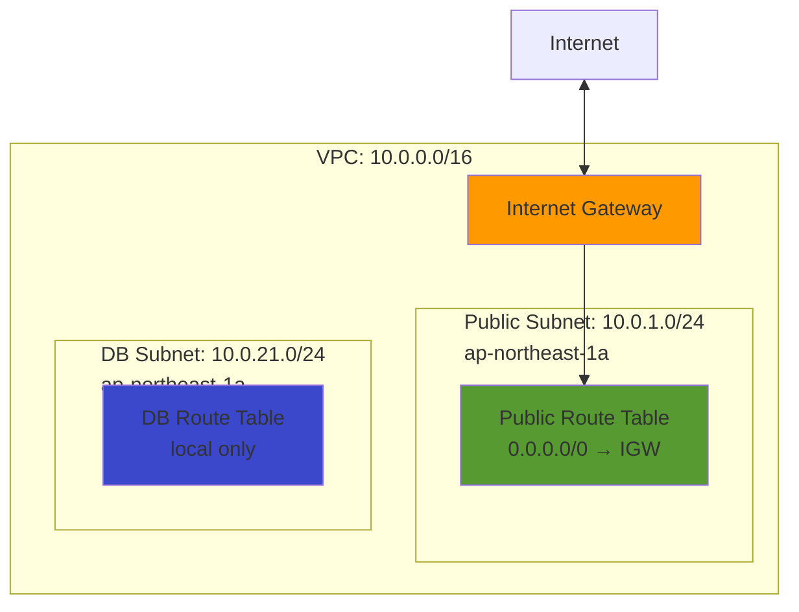

# Network Stack 詳細設計（00-base）

## 概要

### スタックの目的

VPC、サブネット、Internet Gatewayなど、ネットワークインフラの基盤を構築する。

### 依存スタック

- なし（最初にデプロイするスタック）

### このスタックがExportする値

| Export名 | 値 | 用途 |
|---------|---|------|
| `${AWS::StackName}-VpcId` | VPC ID | 他スタックでVPC参照 |
| `${AWS::StackName}-PublicSubnet1a` | パブリックサブネットID | ALB、ECS配置 |
| `${AWS::StackName}-DbSubnet1a` | DBサブネットID | RDS配置 |
| `${AWS::StackName}-PublicRouteTable` | パブリックルートテーブルID | ルーティング確認用 |
| `${AWS::StackName}-DbRouteTable` | DBルートテーブルID | ルーティング確認用 |

## パラメータ一覧

| パラメータ名 | 型 | デフォルト値 | 説明 |
|------------|---|------------|------|
| `Environment` | String | `production` | 環境名（タグ付けに使用） |
| `VpcCidr` | String | `10.0.0.0/16` | VPC CIDR |
| `PublicSubnetCidr` | String | `10.0.1.0/24` | パブリックサブネット CIDR |
| `DbSubnetCidr` | String | `10.0.21.0/24` | DBサブネット CIDR |
| `AvailabilityZone` | String | `ap-northeast-1a` | AZ（POCは単一AZ） |

## リソース一覧

| リソース論理名 | リソースタイプ | 説明 |
|--------------|--------------|------|
| `VPC` | `AWS::EC2::VPC` | VPC（10.0.0.0/16） |
| `InternetGateway` | `AWS::EC2::InternetGateway` | インターネットゲートウェイ |
| `AttachGateway` | `AWS::EC2::VPCGatewayAttachment` | IGWをVPCにアタッチ |
| `PublicSubnet` | `AWS::EC2::Subnet` | パブリックサブネット（10.0.1.0/24） |
| `DbSubnet` | `AWS::EC2::Subnet` | DBサブネット（10.0.21.0/24） |
| `PublicRouteTable` | `AWS::EC2::RouteTable` | パブリックサブネット用ルートテーブル |
| `PublicRoute` | `AWS::EC2::Route` | デフォルトルート（0.0.0.0/0 → IGW） |
| `PublicSubnetRouteTableAssociation` | `AWS::EC2::SubnetRouteTableAssociation` | パブリックサブネットをルートテーブルに関連付け |
| `DbRouteTable` | `AWS::EC2::RouteTable` | DBサブネット用ルートテーブル |
| `DbSubnetRouteTableAssociation` | `AWS::EC2::SubnetRouteTableAssociation` | DBサブネットをルートテーブルに関連付け |

## リソース詳細

### 1. VPC

**目的**: ネットワーク分離、セキュリティ境界の確立

**プロパティ**:

| プロパティ | 値 | 理由 |
|-----------|---|------|
| `CidrBlock` | `!Ref VpcCidr`（10.0.0.0/16） | 65536個のIPアドレス（POCに十分） |
| `EnableDnsHostnames` | `true` | RDSエンドポイントのDNS名解決に必要 |
| `EnableDnsSupport` | `true` | VPC内DNS解決に必要 |
| `Tags` | `Name: xray-poc-vpc` | 識別用 |

**CloudFormation YAML**:
```yaml
VPC:
  Type: AWS::EC2::VPC
  Properties:
    CidrBlock: !Ref VpcCidr
    EnableDnsHostnames: true
    EnableDnsSupport: true
    Tags:
      - Key: Name
        Value: !Sub ${AWS::StackName}-vpc
      - Key: Environment
        Value: !Ref Environment
```

### 2. Internet Gateway

**目的**: VPCとインターネット間の通信を可能にする

**プロパティ**:

| プロパティ | 値 | 理由 |
|-----------|---|------|
| `Tags` | `Name: xray-poc-igw` | 識別用 |

**CloudFormation YAML**:
```yaml
InternetGateway:
  Type: AWS::EC2::InternetGateway
  Properties:
    Tags:
      - Key: Name
        Value: !Sub ${AWS::StackName}-igw
      - Key: Environment
        Value: !Ref Environment

AttachGateway:
  Type: AWS::EC2::VPCGatewayAttachment
  Properties:
    VpcId: !Ref VPC
    InternetGatewayId: !Ref InternetGateway
```

### 3. パブリックサブネット

**目的**: ALB、ECSを配置（パブリックIP有効）

**プロパティ**:

| プロパティ | 値 | 理由 |
|-----------|---|------|
| `VpcId` | `!Ref VPC` | 親VPC参照 |
| `CidrBlock` | `!Ref PublicSubnetCidr`（10.0.1.0/24） | 251個のIPアドレス（POCに十分） |
| `AvailabilityZone` | `!Ref AvailabilityZone`（ap-northeast-1a） | 単一AZ配置 |
| `MapPublicIpOnLaunch` | `true` | ECSタスクにパブリックIP自動割り当て |
| `Tags` | `Name: xray-poc-public-1a` | 識別用 |

**CloudFormation YAML**:
```yaml
PublicSubnet:
  Type: AWS::EC2::Subnet
  Properties:
    VpcId: !Ref VPC
    CidrBlock: !Ref PublicSubnetCidr
    AvailabilityZone: !Ref AvailabilityZone
    MapPublicIpOnLaunch: true
    Tags:
      - Key: Name
        Value: !Sub ${AWS::StackName}-public-1a
      - Key: Environment
        Value: !Ref Environment
      - Key: Type
        Value: Public
```

### 4. DBサブネット

**目的**: RDSを配置（プライベート）

**プロパティ**:

| プロパティ | 値 | 理由 |
|-----------|---|------|
| `VpcId` | `!Ref VPC` | 親VPC参照 |
| `CidrBlock` | `!Ref DbSubnetCidr`（10.0.21.0/24） | 251個のIPアドレス（POCに十分） |
| `AvailabilityZone` | `!Ref AvailabilityZone`（ap-northeast-1a） | 単一AZ配置 |
| `MapPublicIpOnLaunch` | `false` | パブリックIP不要（プライベート） |
| `Tags` | `Name: xray-poc-db-1a` | 識別用 |

**CloudFormation YAML**:
```yaml
DbSubnet:
  Type: AWS::EC2::Subnet
  Properties:
    VpcId: !Ref VPC
    CidrBlock: !Ref DbSubnetCidr
    AvailabilityZone: !Ref AvailabilityZone
    MapPublicIpOnLaunch: false
    Tags:
      - Key: Name
        Value: !Sub ${AWS::StackName}-db-1a
      - Key: Environment
        Value: !Ref Environment
      - Key: Type
        Value: Database
```

### 5. パブリックサブネット ルートテーブル

**目的**: パブリックサブネットのルーティング定義

**プロパティ**:

| プロパティ | 値 | 理由 |
|-----------|---|------|
| `VpcId` | `!Ref VPC` | 親VPC参照 |
| `Tags` | `Name: xray-poc-public-rt` | 識別用 |

**ルート定義**:

| 宛先 | ターゲット | 用途 |
|------|-----------|------|
| `10.0.0.0/16` | local（暗黙的） | VPC内通信 |
| `0.0.0.0/0` | Internet Gateway | インターネット通信 |

**CloudFormation YAML**:
```yaml
PublicRouteTable:
  Type: AWS::EC2::RouteTable
  Properties:
    VpcId: !Ref VPC
    Tags:
      - Key: Name
        Value: !Sub ${AWS::StackName}-public-rt
      - Key: Environment
        Value: !Ref Environment

PublicRoute:
  Type: AWS::EC2::Route
  DependsOn: AttachGateway
  Properties:
    RouteTableId: !Ref PublicRouteTable
    DestinationCidrBlock: 0.0.0.0/0
    GatewayId: !Ref InternetGateway

PublicSubnetRouteTableAssociation:
  Type: AWS::EC2::SubnetRouteTableAssociation
  Properties:
    SubnetId: !Ref PublicSubnet
    RouteTableId: !Ref PublicRouteTable
```

### 6. DBサブネット ルートテーブル

**目的**: DBサブネットのルーティング定義（VPC内通信のみ）

**プロパティ**:

| プロパティ | 値 | 理由 |
|-----------|---|------|
| `VpcId` | `!Ref VPC` | 親VPC参照 |
| `Tags` | `Name: xray-poc-db-rt` | 識別用 |

**ルート定義**:

| 宛先 | ターゲット | 用途 |
|------|-----------|------|
| `10.0.0.0/16` | local（暗黙的） | VPC内通信のみ |

**注**: インターネットへのルートなし（完全プライベート）

**CloudFormation YAML**:
```yaml
DbRouteTable:
  Type: AWS::EC2::RouteTable
  Properties:
    VpcId: !Ref VPC
    Tags:
      - Key: Name
        Value: !Sub ${AWS::StackName}-db-rt
      - Key: Environment
        Value: !Ref Environment

DbSubnetRouteTableAssociation:
  Type: AWS::EC2::SubnetRouteTableAssociation
  Properties:
    SubnetId: !Ref DbSubnet
    RouteTableId: !Ref DbRouteTable
```

## Outputs

```yaml
Outputs:
  VpcId:
    Description: VPC ID
    Value: !Ref VPC
    Export:
      Name: !Sub ${AWS::StackName}-VpcId

  PublicSubnet1a:
    Description: Public Subnet ID (ap-northeast-1a)
    Value: !Ref PublicSubnet
    Export:
      Name: !Sub ${AWS::StackName}-PublicSubnet1a

  DbSubnet1a:
    Description: Database Subnet ID (ap-northeast-1a)
    Value: !Ref DbSubnet
    Export:
      Name: !Sub ${AWS::StackName}-DbSubnet1a

  PublicRouteTable:
    Description: Public Route Table ID
    Value: !Ref PublicRouteTable
    Export:
      Name: !Sub ${AWS::StackName}-PublicRouteTable

  DbRouteTable:
    Description: Database Route Table ID
    Value: !Ref DbRouteTable
    Export:
      Name: !Sub ${AWS::StackName}-DbRouteTable
```

## 実装方針

### 推定行数

**約100行**（YAML）

### 実装順序

1. VPC
2. Internet Gateway
3. IGWアタッチ
4. サブネット（Public、DB）
5. ルートテーブル（Public、DB）
6. ルート定義
7. サブネット関連付け
8. Outputs

### 注意点

1. **DependsOn属性**: `PublicRoute`は`AttachGateway`に依存（IGWアタッチ後にルート作成）
2. **DNS設定**: `EnableDnsHostnames`、`EnableDnsSupport`を必ず有効化（RDS接続に必須）
3. **MapPublicIpOnLaunch**: パブリックサブネットのみ有効化

### テスト方法

#### 1. スタック作成後の確認

```bash
# VPC ID取得
aws cloudformation describe-stacks \
  --stack-name xray-poc-base \
  --query 'Stacks[0].Outputs[?OutputKey==`VpcId`].OutputValue' \
  --output text

# サブネット確認
aws ec2 describe-subnets \
  --filters "Name=vpc-id,Values=<VPC_ID>" \
  --query 'Subnets[*].[SubnetId,CidrBlock,AvailabilityZone,Tags[?Key==`Name`].Value|[0]]' \
  --output table
```

#### 2. ルーティング確認

```bash
# パブリックルートテーブル確認
aws ec2 describe-route-tables \
  --filters "Name=tag:Name,Values=xray-poc-base-public-rt" \
  --query 'RouteTables[0].Routes' \
  --output table

# 期待値:
# - 10.0.0.0/16 → local
# - 0.0.0.0/0 → igw-xxxxx
```

#### 3. DNS設定確認

```bash
# VPC DNS設定確認
aws ec2 describe-vpcs \
  --vpc-ids <VPC_ID> \
  --query 'Vpcs[0].[EnableDnsHostnames,EnableDnsSupport]' \
  --output table

# 期待値: [true, true]
```

## スタック図



## トラブルシューティング

| 問題 | 原因 | 対処法 |
|------|------|--------|
| スタック作成失敗（VPC） | CIDR重複 | 既存VPCのCIDRと重複していないか確認 |
| ルート作成失敗 | IGW未アタッチ | `DependsOn: AttachGateway`の記述確認 |
| DNS解決失敗 | DNS設定無効 | `EnableDnsHostnames`、`EnableDnsSupport`が`true`か確認 |
| サブネットIP枯渇 | CIDR不足 | パラメータで大きいCIDR（/22等）に変更 |

## 参照ドキュメント

- [基本設計: 02_ネットワーク設計.md](../03_基本設計/02_ネットワーク設計.md)
- [CloudFormation技術標準](../../.claude/docs/40_standards/42_infra/iac/cloudformation.md)

---

**作成者**: infra-architect (via PM)
**作成日**: 2025-12-10
**バージョン**: 1.0
