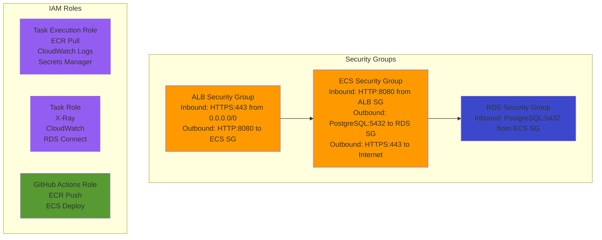

# Security Stack 詳細設計（01-security）

## 概要

### スタックの目的

Security Groups、IAMロールなど、セキュリティリソースを構築する。

### 依存スタック

- `00-base`（Network Stack）: VPC IDを参照

### このスタックがExportする値

| Export名 | 値 | 用途 |
|---------|---|------|
| `${AWS::StackName}-AlbSecurityGroup` | ALB Security Group ID | Compute Stackで参照 |
| `${AWS::StackName}-EcsSecurityGroup` | ECS Security Group ID | Compute Stackで参照 |
| `${AWS::StackName}-RdsSecurityGroup` | RDS Security Group ID | Database Stackで参照 |
| `${AWS::StackName}-EcsTaskExecutionRoleArn` | Task Execution Role ARN | Compute Stackで参照 |
| `${AWS::StackName}-EcsTaskRoleArn` | Task Role ARN | Compute Stackで参照 |
| `${AWS::StackName}-GitHubActionsRoleArn` | GitHub Actions Role ARN | CI/CDで使用 |

## パラメータ一覧

| パラメータ名 | 型 | デフォルト値 | 説明 |
|------------|---|------------|------|
| `Environment` | String | `production` | 環境名（タグ付けに使用） |
| `BaseStackName` | String | `xray-poc-base` | Network Stackのスタック名 |
| `GitHubOrg` | String | `k-tanaka-522` | GitHub組織名 |
| `GitHubRepo` | String | `AWSDevOpsAgentSample` | GitHubリポジトリ名 |

## リソース一覧

| リソース論理名 | リソースタイプ | 説明 |
|--------------|--------------|------|
| `AlbSecurityGroup` | `AWS::EC2::SecurityGroup` | ALB用Security Group |
| `EcsSecurityGroup` | `AWS::EC2::SecurityGroup` | ECS用Security Group |
| `RdsSecurityGroup` | `AWS::EC2::SecurityGroup` | RDS用Security Group |
| `EcsTaskExecutionRole` | `AWS::IAM::Role` | ECS Task Execution Role |
| `EcsTaskExecutionPolicy` | `AWS::IAM::Policy` | Task Execution Policy |
| `EcsTaskRole` | `AWS::IAM::Role` | ECS Task Role |
| `EcsTaskPolicy` | `AWS::IAM::Policy` | Task Policy（X-Ray、CloudWatch） |
| `GitHubOIDCProvider` | `AWS::IAM::OIDCProvider` | GitHub Actions OIDC Provider |
| `GitHubActionsRole` | `AWS::IAM::Role` | GitHub Actions Role |
| `GitHubActionsPolicy` | `AWS::IAM::Policy` | GitHub Actions Policy |

## リソース詳細

### 1. ALB Security Group

**目的**: ALBへのHTTPSトラフィックを許可

**プロパティ**:

| プロパティ | 値 | 理由 |
|-----------|---|------|
| `GroupName` | `xray-poc-alb-sg` | 識別用 |
| `GroupDescription` | `Security group for ALB` | 説明 |
| `VpcId` | `!ImportValue ${BaseStackName}-VpcId` | Network StackのVPC参照 |

**Inbound Rules**:

| プロトコル | ポート | 送信元 | 説明 |
|-----------|--------|--------|------|
| TCP | 443 | 0.0.0.0/0 | インターネットからのHTTPS |

**Outbound Rules**:

| プロトコル | ポート | 送信先 | 説明 |
|-----------|--------|--------|------|
| TCP | 8080 | ECS Security Group | ECSへのHTTP転送 |

**CloudFormation YAML**:
```yaml
AlbSecurityGroup:
  Type: AWS::EC2::SecurityGroup
  Properties:
    GroupName: !Sub ${AWS::StackName}-alb-sg
    GroupDescription: Security group for ALB
    VpcId: !ImportValue
      Fn::Sub: ${BaseStackName}-VpcId
    SecurityGroupIngress:
      - IpProtocol: tcp
        FromPort: 443
        ToPort: 443
        CidrIp: 0.0.0.0/0
        Description: HTTPS from Internet
    Tags:
      - Key: Name
        Value: !Sub ${AWS::StackName}-alb-sg
      - Key: Environment
        Value: !Ref Environment

AlbToEcsEgress:
  Type: AWS::EC2::SecurityGroupEgress
  Properties:
    GroupId: !Ref AlbSecurityGroup
    IpProtocol: tcp
    FromPort: 8080
    ToPort: 8080
    DestinationSecurityGroupId: !Ref EcsSecurityGroup
    Description: HTTP to ECS
```

### 2. ECS Security Group

**目的**: ECSタスクへのALBからのトラフィックを許可

**Inbound Rules**:

| プロトコル | ポート | 送信元 | 説明 |
|-----------|--------|--------|------|
| TCP | 8080 | ALB Security Group | ALBからのHTTP |

**Outbound Rules**:

| プロトコル | ポート | 送信先 | 説明 |
|-----------|--------|--------|------|
| TCP | 5432 | RDS Security Group | RDSへのPostgreSQL |
| TCP | 443 | 0.0.0.0/0 | ECR、X-Ray、CloudWatch、DevOps Agent API |

**CloudFormation YAML**:
```yaml
EcsSecurityGroup:
  Type: AWS::EC2::SecurityGroup
  Properties:
    GroupName: !Sub ${AWS::StackName}-ecs-sg
    GroupDescription: Security group for ECS
    VpcId: !ImportValue
      Fn::Sub: ${BaseStackName}-VpcId
    Tags:
      - Key: Name
        Value: !Sub ${AWS::StackName}-ecs-sg
      - Key: Environment
        Value: !Ref Environment

EcsFromAlbIngress:
  Type: AWS::EC2::SecurityGroupIngress
  Properties:
    GroupId: !Ref EcsSecurityGroup
    IpProtocol: tcp
    FromPort: 8080
    ToPort: 8080
    SourceSecurityGroupId: !Ref AlbSecurityGroup
    Description: HTTP from ALB

EcsToRdsEgress:
  Type: AWS::EC2::SecurityGroupEgress
  Properties:
    GroupId: !Ref EcsSecurityGroup
    IpProtocol: tcp
    FromPort: 5432
    ToPort: 5432
    DestinationSecurityGroupId: !Ref RdsSecurityGroup
    Description: PostgreSQL to RDS

EcsToInternetEgress:
  Type: AWS::EC2::SecurityGroupEgress
  Properties:
    GroupId: !Ref EcsSecurityGroup
    IpProtocol: tcp
    FromPort: 443
    ToPort: 443
    CidrIp: 0.0.0.0/0
    Description: HTTPS to AWS APIs (ECR, X-Ray, CloudWatch, DevOps Agent)
```

### 3. RDS Security Group

**目的**: RDSへのECSからのPostgreSQL接続を許可

**Inbound Rules**:

| プロトコル | ポート | 送信元 | 説明 |
|-----------|--------|--------|------|
| TCP | 5432 | ECS Security Group | ECSからのPostgreSQL |

**Outbound Rules**: なし（RDSは受信のみ）

**CloudFormation YAML**:
```yaml
RdsSecurityGroup:
  Type: AWS::EC2::SecurityGroup
  Properties:
    GroupName: !Sub ${AWS::StackName}-rds-sg
    GroupDescription: Security group for RDS
    VpcId: !ImportValue
      Fn::Sub: ${BaseStackName}-VpcId
    Tags:
      - Key: Name
        Value: !Sub ${AWS::StackName}-rds-sg
      - Key: Environment
        Value: !Ref Environment

RdsFromEcsIngress:
  Type: AWS::EC2::SecurityGroupIngress
  Properties:
    GroupId: !Ref RdsSecurityGroup
    IpProtocol: tcp
    FromPort: 5432
    ToPort: 5432
    SourceSecurityGroupId: !Ref EcsSecurityGroup
    Description: PostgreSQL from ECS
```

### 4. ECS Task Execution Role

**目的**: Fargateがタスク起動時に使用（ECRイメージ取得、CloudWatch Logs送信）

**信頼ポリシー**:
```json
{
  "Version": "2012-10-17",
  "Statement": [
    {
      "Effect": "Allow",
      "Principal": {
        "Service": "ecs-tasks.amazonaws.com"
      },
      "Action": "sts:AssumeRole"
    }
  ]
}
```

**アタッチポリシー**:
- AWS管理ポリシー: `arn:aws:iam::aws:policy/service-role/AmazonECSTaskExecutionRolePolicy`

**CloudFormation YAML**:
```yaml
EcsTaskExecutionRole:
  Type: AWS::IAM::Role
  Properties:
    RoleName: !Sub ${AWS::StackName}-ecs-task-execution-role
    AssumeRolePolicyDocument:
      Version: '2012-10-17'
      Statement:
        - Effect: Allow
          Principal:
            Service: ecs-tasks.amazonaws.com
          Action: sts:AssumeRole
    ManagedPolicyArns:
      - arn:aws:iam::aws:policy/service-role/AmazonECSTaskExecutionRolePolicy
    Tags:
      - Key: Name
        Value: !Sub ${AWS::StackName}-ecs-task-execution-role
      - Key: Environment
        Value: !Ref Environment

EcsTaskExecutionPolicy:
  Type: AWS::IAM::Policy
  Properties:
    PolicyName: !Sub ${AWS::StackName}-ecs-task-execution-policy
    Roles:
      - !Ref EcsTaskExecutionRole
    PolicyDocument:
      Version: '2012-10-17'
      Statement:
        - Sid: SecretsManagerAccess
          Effect: Allow
          Action:
            - secretsmanager:GetSecretValue
          Resource: !Sub arn:aws:secretsmanager:${AWS::Region}:${AWS::AccountId}:secret:xray-poc/*
```

### 5. ECS Task Role

**目的**: ECSタスク内のアプリケーションが使用（X-Ray、CloudWatch、RDS接続）

**信頼ポリシー**: Task Execution Roleと同じ

**カスタムポリシー**:

**CloudFormation YAML**:
```yaml
EcsTaskRole:
  Type: AWS::IAM::Role
  Properties:
    RoleName: !Sub ${AWS::StackName}-ecs-task-role
    AssumeRolePolicyDocument:
      Version: '2012-10-17'
      Statement:
        - Effect: Allow
          Principal:
            Service: ecs-tasks.amazonaws.com
          Action: sts:AssumeRole
    Tags:
      - Key: Name
        Value: !Sub ${AWS::StackName}-ecs-task-role
      - Key: Environment
        Value: !Ref Environment

EcsTaskPolicy:
  Type: AWS::IAM::Policy
  Properties:
    PolicyName: !Sub ${AWS::StackName}-ecs-task-policy
    Roles:
      - !Ref EcsTaskRole
    PolicyDocument:
      Version: '2012-10-17'
      Statement:
        - Sid: XRayAccess
          Effect: Allow
          Action:
            - xray:PutTraceSegments
            - xray:PutTelemetryRecords
          Resource: '*'
        - Sid: CloudWatchAccess
          Effect: Allow
          Action:
            - logs:CreateLogGroup
            - logs:CreateLogStream
            - logs:PutLogEvents
            - cloudwatch:PutMetricData
          Resource: '*'
        - Sid: RDSAccess
          Effect: Allow
          Action:
            - rds-db:connect
          Resource: !Sub arn:aws:rds-db:${AWS::Region}:${AWS::AccountId}:dbuser:*/app_user
```

### 6. GitHub OIDC Provider

**目的**: GitHub Actionsからパスワードレス認証

**プロパティ**:

| プロパティ | 値 | 理由 |
|-----------|---|------|
| `Url` | `https://token.actions.githubusercontent.com` | GitHub OIDC Endpoint |
| `ClientIdList` | `["sts.amazonaws.com"]` | AWS STS |
| `ThumbprintList` | `["6938fd4d98bab03faadb97b34396831e3780aea1"]` | GitHub OIDC証明書（2023年時点） |

**CloudFormation YAML**:
```yaml
GitHubOIDCProvider:
  Type: AWS::IAM::OIDCProvider
  Properties:
    Url: https://token.actions.githubusercontent.com
    ClientIdList:
      - sts.amazonaws.com
    ThumbprintList:
      - 6938fd4d98bab03faadb97b34396831e3780aea1
    Tags:
      - Key: Name
        Value: !Sub ${AWS::StackName}-github-oidc
      - Key: Environment
        Value: !Ref Environment
```

### 7. GitHub Actions Role

**目的**: GitHub ActionsからECRプッシュ、ECSデプロイ

**信頼ポリシー**（OIDC）:
```json
{
  "Version": "2012-10-17",
  "Statement": [
    {
      "Effect": "Allow",
      "Principal": {
        "Federated": "arn:aws:iam::{ACCOUNT_ID}:oidc-provider/token.actions.githubusercontent.com"
      },
      "Action": "sts:AssumeRoleWithWebIdentity",
      "Condition": {
        "StringEquals": {
          "token.actions.githubusercontent.com:aud": "sts.amazonaws.com"
        },
        "StringLike": {
          "token.actions.githubusercontent.com:sub": "repo:{GITHUB_ORG}/{REPO_NAME}:*"
        }
      }
    }
  ]
}
```

**CloudFormation YAML**:
```yaml
GitHubActionsRole:
  Type: AWS::IAM::Role
  Properties:
    RoleName: !Sub ${AWS::StackName}-github-actions-role
    AssumeRolePolicyDocument:
      Version: '2012-10-17'
      Statement:
        - Effect: Allow
          Principal:
            Federated: !GetAtt GitHubOIDCProvider.Arn
          Action: sts:AssumeRoleWithWebIdentity
          Condition:
            StringEquals:
              token.actions.githubusercontent.com:aud: sts.amazonaws.com
            StringLike:
              token.actions.githubusercontent.com:sub: !Sub repo:${GitHubOrg}/${GitHubRepo}:*
    Tags:
      - Key: Name
        Value: !Sub ${AWS::StackName}-github-actions-role
      - Key: Environment
        Value: !Ref Environment

GitHubActionsPolicy:
  Type: AWS::IAM::Policy
  Properties:
    PolicyName: !Sub ${AWS::StackName}-github-actions-policy
    Roles:
      - !Ref GitHubActionsRole
    PolicyDocument:
      Version: '2012-10-17'
      Statement:
        - Sid: ECRPushAccess
          Effect: Allow
          Action:
            - ecr:GetAuthorizationToken
            - ecr:BatchCheckLayerAvailability
            - ecr:GetDownloadUrlForLayer
            - ecr:BatchGetImage
            - ecr:PutImage
            - ecr:InitiateLayerUpload
            - ecr:UploadLayerPart
            - ecr:CompleteLayerUpload
          Resource: '*'
        - Sid: ECSDeployAccess
          Effect: Allow
          Action:
            - ecs:UpdateService
            - ecs:DescribeServices
            - ecs:DescribeTaskDefinition
            - ecs:RegisterTaskDefinition
          Resource: '*'
        - Sid: PassRoleToECS
          Effect: Allow
          Action:
            - iam:PassRole
          Resource:
            - !GetAtt EcsTaskExecutionRole.Arn
            - !GetAtt EcsTaskRole.Arn
```

## Outputs

```yaml
Outputs:
  AlbSecurityGroup:
    Description: ALB Security Group ID
    Value: !Ref AlbSecurityGroup
    Export:
      Name: !Sub ${AWS::StackName}-AlbSecurityGroup

  EcsSecurityGroup:
    Description: ECS Security Group ID
    Value: !Ref EcsSecurityGroup
    Export:
      Name: !Sub ${AWS::StackName}-EcsSecurityGroup

  RdsSecurityGroup:
    Description: RDS Security Group ID
    Value: !Ref RdsSecurityGroup
    Export:
      Name: !Sub ${AWS::StackName}-RdsSecurityGroup

  EcsTaskExecutionRoleArn:
    Description: ECS Task Execution Role ARN
    Value: !GetAtt EcsTaskExecutionRole.Arn
    Export:
      Name: !Sub ${AWS::StackName}-EcsTaskExecutionRoleArn

  EcsTaskRoleArn:
    Description: ECS Task Role ARN
    Value: !GetAtt EcsTaskRole.Arn
    Export:
      Name: !Sub ${AWS::StackName}-EcsTaskRoleArn

  GitHubActionsRoleArn:
    Description: GitHub Actions Role ARN
    Value: !GetAtt GitHubActionsRole.Arn
    Export:
      Name: !Sub ${AWS::StackName}-GitHubActionsRoleArn
```

## 実装方針

### 推定行数

**約250行**（YAML）

### 実装順序

1. Security Groups（ALB、ECS、RDS）
2. Security Group Rules（Ingress、Egress）
3. IAMロール（Task Execution、Task、GitHub Actions）
4. IAMポリシー
5. GitHub OIDC Provider
6. Outputs

### 注意点

1. **Security Group相互参照**: ECS → RDS、ALB → ECS の参照は`DestinationSecurityGroupId`を使用
2. **IAMロール作成権限**: `--capabilities CAPABILITY_NAMED_IAM`が必要
3. **GitHub OIDC Thumbprint**: 証明書更新時に変更が必要（2023年時点: `6938fd...`）
4. **PassRole権限**: GitHub ActionsがECSタスクロールをPassできるよう設定

### テスト方法

#### 1. Security Groups確認

```bash
# ALB Security Group確認
aws ec2 describe-security-groups \
  --filters "Name=tag:Name,Values=xray-poc-security-alb-sg" \
  --query 'SecurityGroups[0].[GroupId,IpPermissions,IpPermissionsEgress]' \
  --output json
```

#### 2. IAMロール確認

```bash
# Task Execution Role確認
aws iam get-role \
  --role-name xray-poc-security-ecs-task-execution-role

# Task Roleポリシー確認
aws iam get-policy-version \
  --policy-arn $(aws iam list-policies --query 'Policies[?PolicyName==`xray-poc-security-ecs-task-policy`].Arn' --output text) \
  --version-id v1
```

#### 3. GitHub OIDC Provider確認

```bash
# OIDC Provider確認
aws iam list-open-id-connect-providers

# 詳細確認
aws iam get-open-id-connect-provider \
  --open-id-connect-provider-arn arn:aws:iam::{ACCOUNT_ID}:oidc-provider/token.actions.githubusercontent.com
```

## スタック図



## トラブルシューティング

| 問題 | 原因 | 対処法 |
|------|------|--------|
| スタック作成失敗（IAM） | CAPABILITY_NAMED_IAM未指定 | `--capabilities CAPABILITY_NAMED_IAM`オプション追加 |
| ECS起動失敗（ECR Pull） | Task Execution Role権限不足 | `AmazonECSTaskExecutionRolePolicy`アタッチ確認 |
| X-Rayトレース送信失敗 | Task Role権限不足 | `xray:PutTraceSegments`権限確認 |
| GitHub Actions認証失敗 | OIDC Provider未作成 | OIDC Providerリソース確認 |
| RDS接続失敗 | Security Group設定ミス | ECS SG → RDS SG の5432許可確認 |

## 参照ドキュメント

- [基本設計: 03_セキュリティ設計.md](../03_基本設計/03_セキュリティ設計.md)
- [CloudFormation技術標準](../../.claude/docs/40_standards/42_infra/iac/cloudformation.md)

---

**作成者**: infra-architect (via PM)
**作成日**: 2025-12-10
**バージョン**: 1.0
