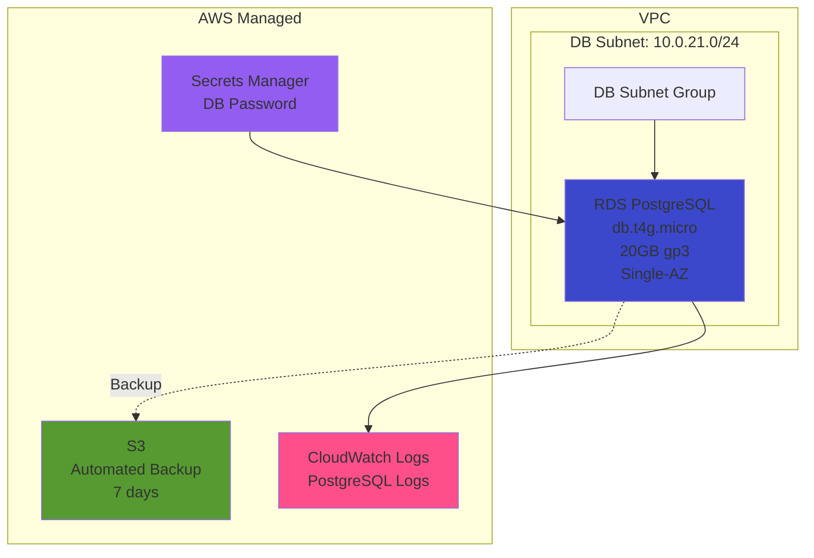

# Database Stack 詳細設計（02-database）

## 概要

### スタックの目的

RDS PostgreSQL、Secrets Manager、DBサブネットグループを構築する。

### 依存スタック

- `00-base`（Network Stack）: DBサブネットIDを参照
- `01-security`（Security Stack）: RDS Security Group IDを参照

### このスタックがExportする値

| Export名 | 値 | 用途 |
|---------|---|------|
| `${AWS::StackName}-RdsEndpoint` | RDSエンドポイント | ECSタスクでDB接続 |
| `${AWS::StackName}-RdsPort` | RDSポート（5432） | ECSタスクでDB接続 |
| `${AWS::StackName}-DbSecretArn` | Secrets Manager ARN | ECSタスクでDB認証情報取得 |

## パラメータ一覧

| パラメータ名 | 型 | デフォルト値 | 説明 |
|------------|---|------------|------|
| `Environment` | String | `production` | 環境名（タグ付けに使用） |
| `BaseStackName` | String | `xray-poc-base` | Network Stackのスタック名 |
| `SecurityStackName` | String | `xray-poc-security` | Security Stackのスタック名 |
| `DBInstanceClass` | String | `db.t4g.micro` | RDSインスタンスクラス |
| `DBAllocatedStorage` | Number | `20` | ストレージ容量（GB） |
| `DBEngine` | String | `postgres` | DBエンジン |
| `DBEngineVersion` | String | `15.4` | PostgreSQLバージョン |
| `DBName` | String | `xray_poc_db` | データベース名 |
| `DBMasterUsername` | String | `postgres` | マスターユーザー名 |
| `DBBackupRetentionPeriod` | Number | `7` | バックアップ保持期間（日） |

## リソース一覧

| リソース論理名 | リソースタイプ | 説明 |
|--------------|--------------|------|
| `DBSubnetGroup` | `AWS::RDS::DBSubnetGroup` | RDS配置用サブネットグループ |
| `DBSecret` | `AWS::SecretsManager::Secret` | DBパスワード管理 |
| `DBInstance` | `AWS::RDS::DBInstance` | RDS PostgreSQL |
| `DBParameterGroup` | `AWS::RDS::DBParameterGroup` | PostgreSQLパラメータグループ |

## リソース詳細

### 1. DBサブネットグループ

**目的**: RDSを配置するサブネットを定義

**プロパティ**:

| プロパティ | 値 | 理由 |
|-----------|---|------|
| `DBSubnetGroupName` | `xray-poc-db-subnet-group` | 識別用 |
| `DBSubnetGroupDescription` | `Subnet group for RDS` | 説明 |
| `SubnetIds` | `[DbSubnet1a]` | DBサブネット（ap-northeast-1a） |

**CloudFormation YAML**:
```yaml
DBSubnetGroup:
  Type: AWS::RDS::DBSubnetGroup
  Properties:
    DBSubnetGroupName: !Sub ${AWS::StackName}-db-subnet-group
    DBSubnetGroupDescription: Subnet group for RDS PostgreSQL
    SubnetIds:
      - !ImportValue
          Fn::Sub: ${BaseStackName}-DbSubnet1a
    Tags:
      - Key: Name
        Value: !Sub ${AWS::StackName}-db-subnet-group
      - Key: Environment
        Value: !Ref Environment
```

### 2. Secrets Manager（DBパスワード）

**目的**: DBパスワードを安全に管理

**プロパティ**:

| プロパティ | 値 | 理由 |
|-----------|---|------|
| `Name` | `xray-poc/db/password` | Secrets Managerキー |
| `GenerateSecretString` | ランダム生成 | 強固なパスワード |

**CloudFormation YAML**:
```yaml
DBSecret:
  Type: AWS::SecretsManager::Secret
  Properties:
    Name: !Sub ${AWS::StackName}/db/password
    Description: RDS PostgreSQL master password
    GenerateSecretString:
      SecretStringTemplate: !Sub '{"username": "${DBMasterUsername}"}'
      GenerateStringKey: password
      PasswordLength: 32
      ExcludePunctuation: true
      ExcludeCharacters: '"@/\'
    Tags:
      - Key: Name
        Value: !Sub ${AWS::StackName}-db-secret
      - Key: Environment
        Value: !Ref Environment
```

**注**: `ExcludeCharacters`で特殊文字を除外（PostgreSQL接続文字列でエスケープ不要）

### 3. DBパラメータグループ

**目的**: PostgreSQL設定のカスタマイズ

**プロパティ**:

| パラメータ名 | 値 | 理由 |
|------------|---|------|
| `rds.force_ssl` | `1` | TLS接続強制（セキュリティ強化） |
| `log_statement` | `ddl` | DDL文のみログ出力（コスト削減） |
| `log_min_duration_statement` | `1000` | 1秒以上のクエリをログ出力 |
| `shared_preload_libraries` | `pg_stat_statements` | クエリ統計取得 |

**CloudFormation YAML**:
```yaml
DBParameterGroup:
  Type: AWS::RDS::DBParameterGroup
  Properties:
    DBParameterGroupName: !Sub ${AWS::StackName}-postgres15-params
    Description: Custom parameter group for PostgreSQL 15
    Family: postgres15
    Parameters:
      rds.force_ssl: '1'
      log_statement: ddl
      log_min_duration_statement: '1000'
      shared_preload_libraries: pg_stat_statements
    Tags:
      - Key: Name
        Value: !Sub ${AWS::StackName}-postgres15-params
      - Key: Environment
        Value: !Ref Environment
```

### 4. RDS PostgreSQL

**目的**: データベース本体

**プロパティ**:

| プロパティ | 値 | 理由 |
|-----------|---|------|
| `DBInstanceIdentifier` | `xray-poc-rds` | 識別用 |
| `Engine` | `postgres` | PostgreSQL |
| `EngineVersion` | `15.4` | PostgreSQL 15.x |
| `DBInstanceClass` | `db.t4g.micro` | POC最小構成 |
| `AllocatedStorage` | `20` | 20GB（最小設定） |
| `StorageType` | `gp3` | 汎用SSD |
| `StorageEncrypted` | `true` | 保管時暗号化 |
| `MultiAZ` | `false` | POC向け単一AZ |
| `PubliclyAccessible` | `false` | プライベート（VPC内のみ） |
| `MasterUsername` | `postgres` | マスターユーザー |
| `MasterUserPassword` | Secrets Managerから取得 | パスワード管理 |
| `DBName` | `xray_poc_db` | データベース名 |
| `VPCSecurityGroups` | RDS Security Group | Security Stack参照 |
| `DBSubnetGroupName` | DBサブネットグループ | 上記で定義 |
| `DBParameterGroupName` | DBパラメータグループ | 上記で定義 |
| `BackupRetentionPeriod` | `7` | 7日間自動バックアップ |
| `PreferredBackupWindow` | `18:00-19:00` | JST 03:00-04:00（アクセス少） |
| `PreferredMaintenanceWindow` | `sun:19:00-sun:20:00` | 日曜 JST 04:00-05:00 |
| `EnableCloudwatchLogsExports` | `[postgresql]` | CloudWatch Logs送信 |
| `AutoMinorVersionUpgrade` | `true` | セキュリティパッチ自動適用 |
| `DeletionProtection` | `false` | POCでは無効（削除容易） |

**CloudFormation YAML**:
```yaml
DBInstance:
  Type: AWS::RDS::DBInstance
  DeletionPolicy: Snapshot
  Properties:
    DBInstanceIdentifier: !Sub ${AWS::StackName}-rds
    Engine: !Ref DBEngine
    EngineVersion: !Ref DBEngineVersion
    DBInstanceClass: !Ref DBInstanceClass
    AllocatedStorage: !Ref DBAllocatedStorage
    StorageType: gp3
    StorageEncrypted: true
    MultiAZ: false
    PubliclyAccessible: false
    MasterUsername: !Ref DBMasterUsername
    MasterUserPassword: !Sub '{{resolve:secretsmanager:${DBSecret}:SecretString:password}}'
    DBName: !Ref DBName
    VPCSecurityGroups:
      - !ImportValue
          Fn::Sub: ${SecurityStackName}-RdsSecurityGroup
    DBSubnetGroupName: !Ref DBSubnetGroup
    DBParameterGroupName: !Ref DBParameterGroup
    BackupRetentionPeriod: !Ref DBBackupRetentionPeriod
    PreferredBackupWindow: 18:00-19:00
    PreferredMaintenanceWindow: sun:19:00-sun:20:00
    EnableCloudwatchLogsExports:
      - postgresql
    AutoMinorVersionUpgrade: true
    DeletionProtection: false
    CopyTagsToSnapshot: true
    Tags:
      - Key: Name
        Value: !Sub ${AWS::StackName}-rds
      - Key: Environment
        Value: !Ref Environment
```

**注**: `DeletionPolicy: Snapshot`により、スタック削除時に自動スナップショット作成

## Outputs

```yaml
Outputs:
  RdsEndpoint:
    Description: RDS Endpoint Address
    Value: !GetAtt DBInstance.Endpoint.Address
    Export:
      Name: !Sub ${AWS::StackName}-RdsEndpoint

  RdsPort:
    Description: RDS Endpoint Port
    Value: !GetAtt DBInstance.Endpoint.Port
    Export:
      Name: !Sub ${AWS::StackName}-RdsPort

  DbSecretArn:
    Description: Secrets Manager ARN for DB Password
    Value: !Ref DBSecret
    Export:
      Name: !Sub ${AWS::StackName}-DbSecretArn
```

## 実装方針

### 推定行数

**約120行**（YAML）

### 実装順序

1. DBサブネットグループ
2. Secrets Manager（DBパスワード）
3. DBパラメータグループ
4. RDSインスタンス
5. Outputs

### 注意点

1. **パスワード参照**: `{{resolve:secretsmanager:...}}`でSecrets Managerから動的に取得
2. **DeletionPolicy**: `Snapshot`を設定（誤削除時の保険）
3. **バックアップウィンドウ**: UTCで指定（JST = UTC+9）
4. **スタック削除**: RDS削除に5-10分かかる

### テスト方法

#### 1. RDSインスタンス確認

```bash
# RDSインスタンス一覧
aws rds describe-db-instances \
  --db-instance-identifier xray-poc-database-rds \
  --query 'DBInstances[0].[DBInstanceIdentifier,DBInstanceStatus,Endpoint.Address,EngineVersion]' \
  --output table
```

#### 2. Secrets Manager確認

```bash
# Secretsリスト
aws secretsmanager list-secrets \
  --filters Key=name,Values=xray-poc-database

# パスワード取得（テスト）
aws secretsmanager get-secret-value \
  --secret-id xray-poc-database/db/password \
  --query 'SecretString' \
  --output text | jq -r '.password'
```

#### 3. DB接続テスト

```bash
# ECSタスク内から実行
export DB_ENDPOINT=$(aws cloudformation describe-stacks --stack-name xray-poc-database --query 'Stacks[0].Outputs[?OutputKey==`RdsEndpoint`].OutputValue' --output text)
export DB_PASSWORD=$(aws secretsmanager get-secret-value --secret-id xray-poc-database/db/password --query 'SecretString' --output text | jq -r '.password')

psql "postgresql://postgres:${DB_PASSWORD}@${DB_ENDPOINT}:5432/xray_poc_db?sslmode=require"
```

#### 4. バックアップ確認

```bash
# 自動バックアップ確認
aws rds describe-db-snapshots \
  --db-instance-identifier xray-poc-database-rds \
  --snapshot-type automated \
  --query 'DBSnapshots[*].[DBSnapshotIdentifier,SnapshotCreateTime,Status]' \
  --output table
```

## スタック図



## トラブルシューティング

| 問題 | 原因 | 対処法 |
|------|------|--------|
| RDS作成失敗（サブネット） | DBサブネットグループエラー | Network Stackのサブネット確認 |
| RDS起動失敗（パスワード） | Secrets Manager取得失敗 | `{{resolve:...}}`構文確認 |
| RDS接続失敗（TLS） | `rds.force_ssl=1`設定 | 接続文字列に`?sslmode=require`追加 |
| バックアップ失敗 | ストレージ容量不足 | ストレージ自動拡張設定確認 |
| スタック削除失敗 | DeletionProtection有効 | `DeletionProtection: false`確認 |

## 初期セットアップ（アプリケーション用ユーザー作成）

RDS作成後、以下のSQLを実行してアプリケーション用ユーザーを作成：

```sql
-- マスターユーザーで接続後
CREATE USER app_user WITH PASSWORD 'secure_password_from_secrets_manager';
GRANT ALL PRIVILEGES ON DATABASE xray_poc_db TO app_user;

-- app_userで再接続後
-- マイグレーションツール（Flyway等）でスキーマ作成
```

## 参照ドキュメント

- [基本設計: 05_データベース設計.md](../03_基本設計/05_データベース設計.md)
- [CloudFormation技術標準](../../.claude/docs/40_standards/42_infra/iac/cloudformation.md)

---

**作成者**: infra-architect (via PM)
**作成日**: 2025-12-10
**バージョン**: 1.0
