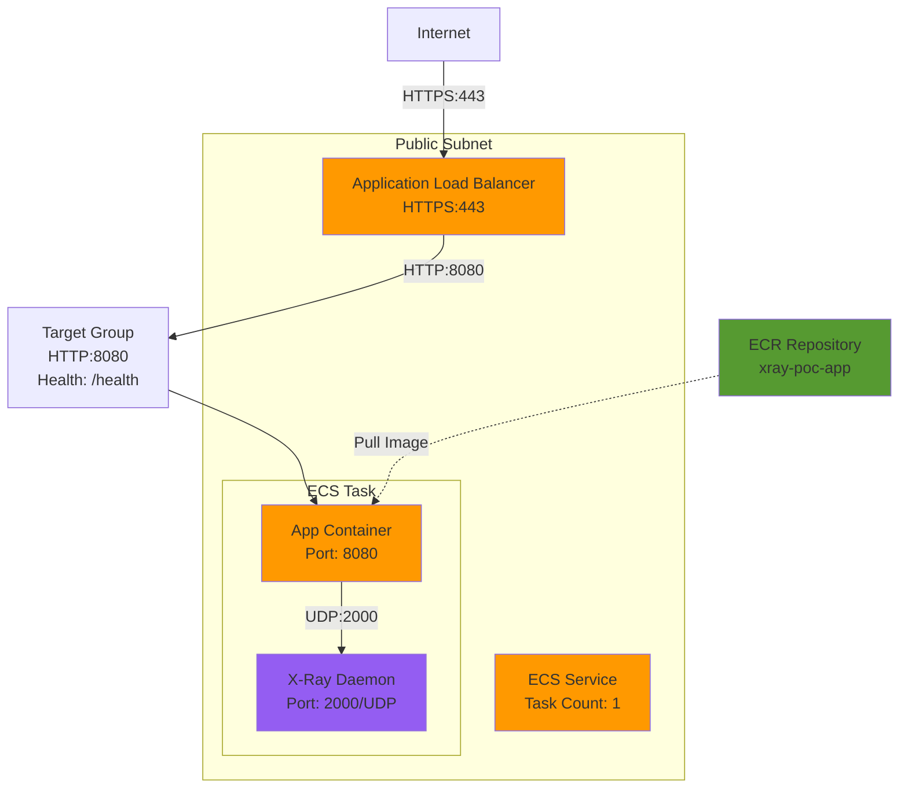

# Compute Stack 詳細設計（03-compute）

## 概要

### スタックの目的

ECR、ECS Cluster/Service、ALB、Target Groupなど、コンピュートリソースを構築する。

### 依存スタック

- `00-base`（Network Stack）: VPC ID、パブリックサブネットIDを参照
- `01-security`（Security Stack）: Security Groups、IAMロールを参照
- `02-database`（Database Stack）: RDSエンドポイントを参照

### このスタックがExportする値

| Export名 | 値 | 用途 |
|---------|---|------|
| `${AWS::StackName}-EcsClusterName` | ECSクラスター名 | Monitoring Stackで参照 |
| `${AWS::StackName}-EcsServiceName` | ECSサービス名 | Monitoring Stackで参照 |
| `${AWS::StackName}-AlbArn` | ALB ARN | Monitoring Stackで参照 |
| `${AWS::StackName}-AlbDnsName` | ALB DNS名 | ユーザーアクセス用 |
| `${AWS::StackName}-TargetGroupArn` | Target Group ARN | Monitoring Stackで参照 |

## パラメータ一覧

| パラメータ名 | 型 | デフォルト値 | 説明 |
|------------|---|------------|------|
| `Environment` | String | `production` | 環境名（タグ付けに使用） |
| `BaseStackName` | String | `xray-poc-base` | Network Stackのスタック名 |
| `SecurityStackName` | String | `xray-poc-security` | Security Stackのスタック名 |
| `DatabaseStackName` | String | `xray-poc-database` | Database Stackのスタック名 |
| `ECSTaskCpu` | Number | `256` | ECSタスクCPU（256 = 0.25vCPU） |
| `ECSTaskMemory` | Number | `512` | ECSタスクメモリ（512 = 0.5GB） |
| `ECSDesiredCount` | Number | `1` | ECSタスク数 |
| `ECSAssignPublicIp` | String | `ENABLED` | パブリックIP割り当て |
| `ContainerImage` | String | `public.ecr.aws/nginx/nginx:latest` | 初期イメージ（後でECRに置き換え） |

## リソース一覧

| リソース論理名 | リソースタイプ | 説明 |
|--------------|--------------|------|
| `EcrRepository` | `AWS::ECR::Repository` | コンテナイメージリポジトリ |
| `EcsCluster` | `AWS::ECS::Cluster` | ECSクラスター |
| `EcsLogGroup` | `AWS::Logs::LogGroup` | CloudWatch Logsロググループ |
| `EcsTaskDefinition` | `AWS::ECS::TaskDefinition` | タスク定義（アプリ + X-Ray Daemon） |
| `Alb` | `AWS::ElasticLoadBalancingV2::LoadBalancer` | Application Load Balancer |
| `AlbTargetGroup` | `AWS::ElasticLoadBalancingV2::TargetGroup` | ターゲットグループ |
| `AlbListener` | `AWS::ElasticLoadBalancingV2::Listener` | HTTPSリスナー |
| `AlbCertificate` | `AWS::CertificateManager::Certificate` | ACM証明書（オプション） |
| `EcsService` | `AWS::ECS::Service` | ECSサービス |

## リソース詳細

### 1. ECR Repository

**目的**: コンテナイメージ保管

**プロパティ**:

| プロパティ | 値 | 理由 |
|-----------|---|------|
| `RepositoryName` | `xray-poc-app` | 識別用 |
| `ImageScanningConfiguration` | `ScanOnPush: true` | 脆弱性スキャン |
| `ImageTagMutability` | `MUTABLE` | `latest`タグ上書き許可 |
| `EncryptionConfiguration` | `AES256` | 保管時暗号化 |
| `LifecyclePolicy` | 最新10イメージ保持 | コスト削減 |

**CloudFormation YAML**:
```yaml
EcrRepository:
  Type: AWS::ECR::Repository
  Properties:
    RepositoryName: !Sub ${AWS::StackName}-app
    ImageScanningConfiguration:
      ScanOnPush: true
    ImageTagMutability: MUTABLE
    EncryptionConfiguration:
      EncryptionType: AES256
    LifecyclePolicy:
      LifecyclePolicyText: |
        {
          "rules": [
            {
              "rulePriority": 1,
              "description": "Keep last 10 images",
              "selection": {
                "tagStatus": "any",
                "countType": "imageCountMoreThan",
                "countNumber": 10
              },
              "action": {
                "type": "expire"
              }
            }
          ]
        }
    Tags:
      - Key: Name
        Value: !Sub ${AWS::StackName}-ecr-repo
      - Key: Environment
        Value: !Ref Environment
```

### 2. ECS Cluster

**目的**: ECSタスクのグループ化

**CloudFormation YAML**:
```yaml
EcsCluster:
  Type: AWS::ECS::Cluster
  Properties:
    ClusterName: !Sub ${AWS::StackName}-cluster
    ClusterSettings:
      - Name: containerInsights
        Value: enabled
    Tags:
      - Key: Name
        Value: !Sub ${AWS::StackName}-cluster
      - Key: Environment
        Value: !Ref Environment
```

### 3. CloudWatch Logs Group

**目的**: ECSタスクのログ保管

**CloudFormation YAML**:
```yaml
EcsLogGroup:
  Type: AWS::Logs::LogGroup
  Properties:
    LogGroupName: !Sub /ecs/${AWS::StackName}
    RetentionInDays: 7
    Tags:
      - Key: Name
        Value: !Sub ${AWS::StackName}-ecs-logs
      - Key: Environment
        Value: !Ref Environment
```

### 4. ECS Task Definition

**目的**: アプリケーション + X-Ray Daemonのコンテナ定義

**タスクレベル設定**:

| プロパティ | 値 | 理由 |
|-----------|---|------|
| `Family` | `xray-poc-task` | タスク定義名 |
| `NetworkMode` | `awsvpc` | Fargate必須 |
| `RequiresCompatibilities` | `[FARGATE]` | Fargate起動 |
| `Cpu` | `256` | 0.25vCPU（最小構成） |
| `Memory` | `512` | 0.5GB（最小構成） |
| `TaskRoleArn` | Task Role（Security Stack） | X-Ray、CloudWatch権限 |
| `ExecutionRoleArn` | Task Execution Role（Security Stack） | ECR Pull、Logs送信 |

**コンテナ定義**:

**コンテナ1: アプリケーション**

| プロパティ | 値 | 理由 |
|-----------|---|------|
| `Name` | `app` | 識別用 |
| `Image` | ECRイメージ | `{ACCOUNT_ID}.dkr.ecr.ap-northeast-1.amazonaws.com/xray-poc-app:latest` |
| `Cpu` | `200` | タスクCPUの78% |
| `Memory` | `384` | タスクメモリの75% |
| `MemoryReservation` | `384` | ソフトリミット |
| `Essential` | `true` | 停止時にタスク終了 |
| `PortMappings` | `8080/tcp` | ALBからのトラフィック |
| `Environment` | `AWS_XRAY_DAEMON_ADDRESS`, `DB_HOST`等 | 環境変数 |
| `LogConfiguration` | CloudWatch Logs | `/ecs/xray-poc`ロググループ |

**コンテナ2: X-Ray Daemon**

| プロパティ | 値 | 理由 |
|-----------|---|------|
| `Name` | `xray-daemon` | 識別用 |
| `Image` | `public.ecr.aws/xray/aws-xray-daemon:latest` | AWS公式イメージ |
| `Cpu` | `56` | タスクCPUの22% |
| `Memory` | `64` | タスクメモリの12.5% |
| `MemoryReservation` | `64` | ソフトリミット |
| `Essential` | `false` | 停止してもタスク継続 |
| `PortMappings` | `2000/udp` | トレース受信 |
| `LogConfiguration` | CloudWatch Logs | `/ecs/xray-poc`ロググループ |

**CloudFormation YAML**:
```yaml
EcsTaskDefinition:
  Type: AWS::ECS::TaskDefinition
  Properties:
    Family: !Sub ${AWS::StackName}-task
    NetworkMode: awsvpc
    RequiresCompatibilities:
      - FARGATE
    Cpu: !Ref ECSTaskCpu
    Memory: !Ref ECSTaskMemory
    TaskRoleArn: !ImportValue
      Fn::Sub: ${SecurityStackName}-EcsTaskRoleArn
    ExecutionRoleArn: !ImportValue
      Fn::Sub: ${SecurityStackName}-EcsTaskExecutionRoleArn
    ContainerDefinitions:
      # Container 1: Application
      - Name: app
        Image: !Sub ${AWS::AccountId}.dkr.ecr.${AWS::Region}.amazonaws.com/${EcrRepository}:latest
        Cpu: 200
        Memory: 384
        MemoryReservation: 384
        Essential: true
        PortMappings:
          - ContainerPort: 8080
            Protocol: tcp
        Environment:
          - Name: AWS_XRAY_DAEMON_ADDRESS
            Value: localhost:2000
          - Name: AWS_REGION
            Value: !Ref AWS::Region
          - Name: DB_HOST
            Value: !ImportValue
              Fn::Sub: ${DatabaseStackName}-RdsEndpoint
          - Name: DB_PORT
            Value: !ImportValue
              Fn::Sub: ${DatabaseStackName}-RdsPort
          - Name: DB_NAME
            Value: xray_poc_db
          - Name: DB_USER
            Value: app_user
          - Name: LOG_LEVEL
            Value: INFO
        Secrets:
          - Name: DB_PASSWORD
            ValueFrom: !ImportValue
              Fn::Sub: ${DatabaseStackName}-DbSecretArn
        LogConfiguration:
          LogDriver: awslogs
          Options:
            awslogs-group: !Ref EcsLogGroup
            awslogs-region: !Ref AWS::Region
            awslogs-stream-prefix: app
        HealthCheck:
          Command:
            - CMD-SHELL
            - curl -f http://localhost:8080/health || exit 1
          Interval: 30
          Timeout: 5
          Retries: 3
          StartPeriod: 60

      # Container 2: X-Ray Daemon
      - Name: xray-daemon
        Image: public.ecr.aws/xray/aws-xray-daemon:latest
        Cpu: 56
        Memory: 64
        MemoryReservation: 64
        Essential: false
        PortMappings:
          - ContainerPort: 2000
            Protocol: udp
        Environment:
          - Name: AWS_REGION
            Value: !Ref AWS::Region
        LogConfiguration:
          LogDriver: awslogs
          Options:
            awslogs-group: !Ref EcsLogGroup
            awslogs-region: !Ref AWS::Region
            awslogs-stream-prefix: xray-daemon
    Tags:
      - Key: Name
        Value: !Sub ${AWS::StackName}-task
      - Key: Environment
        Value: !Ref Environment
```

### 5. Application Load Balancer

**目的**: インターネットからのトラフィック受付、ECSへ転送

**プロパティ**:

| プロパティ | 値 | 理由 |
|-----------|---|------|
| `Name` | `xray-poc-alb` | 識別用 |
| `Scheme` | `internet-facing` | パブリックアクセス |
| `Type` | `application` | HTTP/HTTPS対応 |
| `IpAddressType` | `ipv4` | IPv4のみ |
| `Subnets` | パブリックサブネット | Network Stack参照 |
| `SecurityGroups` | ALB Security Group | Security Stack参照 |

**CloudFormation YAML**:
```yaml
Alb:
  Type: AWS::ElasticLoadBalancingV2::LoadBalancer
  Properties:
    Name: !Sub ${AWS::StackName}-alb
    Scheme: internet-facing
    Type: application
    IpAddressType: ipv4
    Subnets:
      - !ImportValue
          Fn::Sub: ${BaseStackName}-PublicSubnet1a
    SecurityGroups:
      - !ImportValue
          Fn::Sub: ${SecurityStackName}-AlbSecurityGroup
    Tags:
      - Key: Name
        Value: !Sub ${AWS::StackName}-alb
      - Key: Environment
        Value: !Ref Environment
```

**注**: 単一AZ構成のため、サブネットは1つのみ（本番環境では複数AZ推奨）

### 6. Target Group

**目的**: ECSタスクをALBのターゲットとして登録

**プロパティ**:

| プロパティ | 値 | 理由 |
|-----------|---|------|
| `Name` | `xray-poc-tg` | 識別用 |
| `TargetType` | `ip` | Fargate必須 |
| `Protocol` | `HTTP` | - |
| `Port` | `8080` | アプリケーションポート |
| `VpcId` | VPC ID（Network Stack） | - |
| `HealthCheckPath` | `/health` | ヘルスチェックエンドポイント |
| `HealthCheckIntervalSeconds` | `30` | 30秒間隔 |
| `HealthCheckTimeoutSeconds` | `5` | 5秒タイムアウト |
| `HealthyThresholdCount` | `2` | 2回成功で正常 |
| `UnhealthyThresholdCount` | `2` | 2回失敗で異常 |
| `DeregistrationDelay` | `30` | 登録解除30秒待機 |

**CloudFormation YAML**:
```yaml
AlbTargetGroup:
  Type: AWS::ElasticLoadBalancingV2::TargetGroup
  Properties:
    Name: !Sub ${AWS::StackName}-tg
    TargetType: ip
    Protocol: HTTP
    Port: 8080
    VpcId: !ImportValue
      Fn::Sub: ${BaseStackName}-VpcId
    HealthCheckEnabled: true
    HealthCheckPath: /health
    HealthCheckProtocol: HTTP
    HealthCheckIntervalSeconds: 30
    HealthCheckTimeoutSeconds: 5
    HealthyThresholdCount: 2
    UnhealthyThresholdCount: 2
    TargetGroupAttributes:
      - Key: deregistration_delay.timeout_seconds
        Value: '30'
    Tags:
      - Key: Name
        Value: !Sub ${AWS::StackName}-tg
      - Key: Environment
        Value: !Ref Environment
```

### 7. ALB Listener（HTTPS）

**目的**: HTTPSトラフィックをTarget Groupへ転送

**プロパティ**:

| プロパティ | 値 | 理由 |
|-----------|---|------|
| `LoadBalancerArn` | ALB ARN | 上記ALB参照 |
| `Protocol` | `HTTPS` | TLS暗号化 |
| `Port` | `443` | HTTPS標準ポート |
| `Certificates` | ACM証明書 | TLS証明書（POCでは自己署名証明書または証明書なしHTTPのみ） |
| `DefaultActions` | Forward to Target Group | - |

**CloudFormation YAML（HTTPSの場合）**:
```yaml
AlbListener:
  Type: AWS::ElasticLoadBalancingV2::Listener
  Properties:
    LoadBalancerArn: !Ref Alb
    Protocol: HTTPS
    Port: 443
    Certificates:
      - CertificateArn: !Ref AlbCertificate
    DefaultActions:
      - Type: forward
        TargetGroupArn: !Ref AlbTargetGroup
```

**注**: POCでは証明書なしHTTPのみの場合もあり（後述）

### 8. ECS Service

**目的**: ECSタスクのデプロイ・管理

**プロパティ**:

| プロパティ | 値 | 理由 |
|-----------|---|------|
| `ServiceName` | `xray-poc-service` | 識別用 |
| `Cluster` | ECS Cluster | 上記クラスター参照 |
| `TaskDefinition` | Task Definition | 上記タスク定義参照 |
| `LaunchType` | `FARGATE` | サーバーレス |
| `DesiredCount` | `1` | POCは固定1タスク |
| `DeploymentConfiguration` | MinimumHealthyPercent: 0, MaximumPercent: 200 | ローリングアップデート |
| `NetworkConfiguration` | パブリックサブネット、ECS SG、パブリックIP有効 | - |
| `LoadBalancers` | Target Group | ALBと連携 |
| `HealthCheckGracePeriodSeconds` | `60` | 起動60秒後からヘルスチェック開始 |

**CloudFormation YAML**:
```yaml
EcsService:
  Type: AWS::ECS::Service
  DependsOn: AlbListener
  Properties:
    ServiceName: !Sub ${AWS::StackName}-service
    Cluster: !Ref EcsCluster
    TaskDefinition: !Ref EcsTaskDefinition
    LaunchType: FARGATE
    DesiredCount: !Ref ECSDesiredCount
    DeploymentConfiguration:
      MinimumHealthyPercent: 0
      MaximumPercent: 200
    NetworkConfiguration:
      AwsvpcConfiguration:
        Subnets:
          - !ImportValue
              Fn::Sub: ${BaseStackName}-PublicSubnet1a
        SecurityGroups:
          - !ImportValue
              Fn::Sub: ${SecurityStackName}-EcsSecurityGroup
        AssignPublicIp: !Ref ECSAssignPublicIp
    LoadBalancers:
      - TargetGroupArn: !Ref AlbTargetGroup
        ContainerName: app
        ContainerPort: 8080
    HealthCheckGracePeriodSeconds: 60
    Tags:
      - Key: Name
        Value: !Sub ${AWS::StackName}-service
      - Key: Environment
        Value: !Ref Environment
```

## Outputs

```yaml
Outputs:
  EcsClusterName:
    Description: ECS Cluster Name
    Value: !Ref EcsCluster
    Export:
      Name: !Sub ${AWS::StackName}-EcsClusterName

  EcsServiceName:
    Description: ECS Service Name
    Value: !GetAtt EcsService.Name
    Export:
      Name: !Sub ${AWS::StackName}-EcsServiceName

  AlbArn:
    Description: ALB ARN
    Value: !Ref Alb
    Export:
      Name: !Sub ${AWS::StackName}-AlbArn

  AlbDnsName:
    Description: ALB DNS Name
    Value: !GetAtt Alb.DNSName
    Export:
      Name: !Sub ${AWS::StackName}-AlbDnsName

  TargetGroupArn:
    Description: Target Group ARN
    Value: !Ref AlbTargetGroup
    Export:
      Name: !Sub ${AWS::StackName}-TargetGroupArn

  EcrRepositoryUri:
    Description: ECR Repository URI
    Value: !GetAtt EcrRepository.RepositoryUri
    Export:
      Name: !Sub ${AWS::StackName}-EcrRepositoryUri
```

## 実装方針

### 推定行数

**約300行**（YAML）

### 実装順序

1. ECR Repository
2. ECS Cluster
3. CloudWatch Logs Group
4. ECS Task Definition
5. ALB
6. Target Group
7. ALB Listener
8. ECS Service
9. Outputs

### 注意点

1. **DependsOn**: `EcsService`は`AlbListener`に依存（Listener作成後にService作成）
2. **初期イメージ**: ECRリポジトリ作成直後はイメージなし→初期デプロイ時に`nginx`等の公開イメージを使用、後でGitHub Actionsで上書き
3. **パブリックIP**: `AssignPublicIp: ENABLED`必須（パブリックサブネット配置、NAT Gateway不使用のため）
4. **Secrets参照**: `ValueFrom`でSecrets Managerから環境変数取得

### テスト方法

#### 1. ECRリポジトリ確認

```bash
# ECRリポジトリ一覧
aws ecr describe-repositories \
  --query 'repositories[?repositoryName==`xray-poc-compute-app`].[repositoryName,repositoryUri]' \
  --output table
```

#### 2. ECSタスク起動確認

```bash
# ECSタスク一覧
aws ecs list-tasks \
  --cluster xray-poc-compute-cluster \
  --service-name xray-poc-compute-service

# タスク詳細
aws ecs describe-tasks \
  --cluster xray-poc-compute-cluster \
  --tasks <TASK_ARN>
```

#### 3. ALB動作確認

```bash
# ALB DNS名取得
ALB_DNS=$(aws cloudformation describe-stacks --stack-name xray-poc-compute --query 'Stacks[0].Outputs[?OutputKey==`AlbDnsName`].OutputValue' --output text)

# HTTP接続テスト
curl http://${ALB_DNS}/health
```

#### 4. Target Group ヘルスチェック確認

```bash
# ターゲットの健全性確認
aws elbv2 describe-target-health \
  --target-group-arn <TARGET_GROUP_ARN> \
  --query 'TargetHealthDescriptions[*].[Target.Id,TargetHealth.State]' \
  --output table

# 期待値: healthy
```

## スタック図



## トラブルシューティング

| 問題 | 原因 | 対処法 |
|------|------|--------|
| ECSタスク起動失敗（ECR Pull） | Task Execution Role権限不足 | Security Stackの権限確認 |
| ECSタスクすぐ停止 | アプリケーションエラー | CloudWatch Logsでエラー確認 |
| ヘルスチェック失敗 | `/health`エンドポイントなし | アプリケーション実装確認 |
| ALB接続タイムアウト | Security Group設定ミス | ALB SG → ECS SG の8080許可確認 |
| RDS接続失敗 | 環境変数設定ミス | `DB_HOST`、`DB_PASSWORD`確認 |

## 参照ドキュメント

- [基本設計: 06_コンピュート設計.md](../03_基本設計/06_コンピュート設計.md)
- [CloudFormation技術標準](../../.claude/docs/40_standards/42_infra/iac/cloudformation.md)

---

**作成者**: infra-architect (via PM)
**作成日**: 2025-12-10
**バージョン**: 1.0
