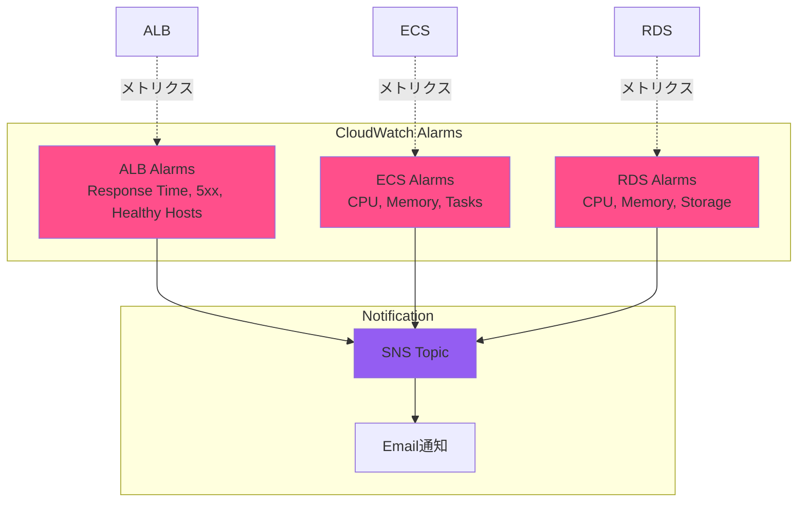

# Monitoring Stack 詳細設計（04-monitoring）

## 概要

### スタックの目的

CloudWatch Alarms、SNS Topic、X-Ray設定など、監視リソースを構築する。

### 依存スタック

- `02-database`（Database Stack）: RDSインスタンスIDを参照
- `03-compute`（Compute Stack）: ECS Cluster、Service、ALB、Target Groupを参照

### このスタックがExportする値

| Export名 | 値 | 用途 |
|---------|---|------|
| `${AWS::StackName}-SnsTopicArn` | SNS Topic ARN | アラート通知先 |

## パラメータ一覧

| パラメータ名 | 型 | デフォルト値 | 説明 |
|------------|---|------------|------|
| `Environment` | String | `production` | 環境名（タグ付けに使用） |
| `DatabaseStackName` | String | `xray-poc-database` | Database Stackのスタック名 |
| `ComputeStackName` | String | `xray-poc-compute` | Compute Stackのスタック名 |
| `AlertEmail` | String | - | アラート通知先メールアドレス |

## リソース一覧

| リソース論理名 | リソースタイプ | 説明 |
|--------------|--------------|------|
| `SnsTopic` | `AWS::SNS::Topic` | アラート通知用SNSトピック |
| `SnsTopicSubscription` | `AWS::SNS::Subscription` | メール通知サブスクリプション |
| `AlbTargetResponseTimeAlarm` | `AWS::CloudWatch::Alarm` | ALBレスポンス時間アラーム |
| `AlbTarget5xxErrorAlarm` | `AWS::CloudWatch::Alarm` | ALB 5xxエラーアラーム |
| `AlbHealthyHostCountAlarm` | `AWS::CloudWatch::Alarm` | ALB正常ホスト数アラーム |
| `EcsCpuUtilizationAlarm` | `AWS::CloudWatch::Alarm` | ECS CPU使用率アラーム |
| `EcsMemoryUtilizationAlarm` | `AWS::CloudWatch::Alarm` | ECS メモリ使用率アラーム |
| `EcsRunningTasksCountAlarm` | `AWS::CloudWatch::Alarm` | ECS実行中タスク数アラーム |
| `RdsCpuUtilizationAlarm` | `AWS::CloudWatch::Alarm` | RDS CPU使用率アラーム |
| `RdsFreeableMemoryAlarm` | `AWS::CloudWatch::Alarm` | RDS空きメモリアラーム |
| `RdsFreeStorageSpaceAlarm` | `AWS::CloudWatch::Alarm` | RDS空きストレージアラーム |

## リソース詳細

### 1. SNS Topic

**目的**: アラート通知の送信先

**プロパティ**:

| プロパティ | 値 | 理由 |
|-----------|---|------|
| `TopicName` | `xray-poc-alerts` | 識別用 |
| `DisplayName` | `X-Ray POC Alerts` | メール表示名 |

**CloudFormation YAML**:
```yaml
SnsTopic:
  Type: AWS::SNS::Topic
  Properties:
    TopicName: !Sub ${AWS::StackName}-alerts
    DisplayName: X-Ray POC Alerts
    Tags:
      - Key: Name
        Value: !Sub ${AWS::StackName}-sns-topic
      - Key: Environment
        Value: !Ref Environment

SnsTopicSubscription:
  Type: AWS::SNS::Subscription
  Properties:
    TopicArn: !Ref SnsTopic
    Protocol: email
    Endpoint: !Ref AlertEmail
```

**注**: サブスクリプション作成後、ユーザーにメール確認が必要

### 2. ALB ターゲットレスポンス時間アラーム

**目的**: APIレスポンス遅延検知

**メトリクス**: `TargetResponseTime`（平均）

**閾値**: 500ms以上

**CloudFormation YAML**:
```yaml
AlbTargetResponseTimeAlarm:
  Type: AWS::CloudWatch::Alarm
  Properties:
    AlarmName: !Sub ${AWS::StackName}-alb-target-response-time
    AlarmDescription: ALB target response time is too high
    MetricName: TargetResponseTime
    Namespace: AWS/ApplicationELB
    Statistic: Average
    Period: 60
    EvaluationPeriods: 2
    Threshold: 0.5
    ComparisonOperator: GreaterThanThreshold
    Dimensions:
      - Name: LoadBalancer
        Value: !Select
          - 1
          - !Split
            - 'loadbalancer/'
            - !ImportValue
                Fn::Sub: ${ComputeStackName}-AlbArn
    ActionsEnabled: true
    AlarmActions:
      - !Ref SnsTopic
    TreatMissingData: notBreaching
```

### 3. ALB 5xxエラーアラーム

**目的**: サーバーエラー検知

**メトリクス**: `HTTPCode_Target_5XX_Count`（合計）

**閾値**: 10回/5分以上

**CloudFormation YAML**:
```yaml
AlbTarget5xxErrorAlarm:
  Type: AWS::CloudWatch::Alarm
  Properties:
    AlarmName: !Sub ${AWS::StackName}-alb-target-5xx-error
    AlarmDescription: ALB target 5xx errors are too high
    MetricName: HTTPCode_Target_5XX_Count
    Namespace: AWS/ApplicationELB
    Statistic: Sum
    Period: 300
    EvaluationPeriods: 1
    Threshold: 10
    ComparisonOperator: GreaterThanThreshold
    Dimensions:
      - Name: LoadBalancer
        Value: !Select
          - 1
          - !Split
            - 'loadbalancer/'
            - !ImportValue
                Fn::Sub: ${ComputeStackName}-AlbArn
      - Name: TargetGroup
        Value: !Select
          - 1
          - !Split
            - 'targetgroup/'
            - !ImportValue
                Fn::Sub: ${ComputeStackName}-TargetGroupArn
    ActionsEnabled: true
    AlarmActions:
      - !Ref SnsTopic
    TreatMissingData: notBreaching
```

### 4. ALB 正常ホスト数アラーム

**目的**: ECSタスクの異常検知

**メトリクス**: `HealthyHostCount`

**閾値**: 1未満（タスクが0になったらアラート）

**CloudFormation YAML**:
```yaml
AlbHealthyHostCountAlarm:
  Type: AWS::CloudWatch::Alarm
  Properties:
    AlarmName: !Sub ${AWS::StackName}-alb-healthy-host-count
    AlarmDescription: No healthy hosts available
    MetricName: HealthyHostCount
    Namespace: AWS/ApplicationELB
    Statistic: Average
    Period: 60
    EvaluationPeriods: 2
    Threshold: 1
    ComparisonOperator: LessThanThreshold
    Dimensions:
      - Name: LoadBalancer
        Value: !Select
          - 1
          - !Split
            - 'loadbalancer/'
            - !ImportValue
                Fn::Sub: ${ComputeStackName}-AlbArn
      - Name: TargetGroup
        Value: !Select
          - 1
          - !Split
            - 'targetgroup/'
            - !ImportValue
                Fn::Sub: ${ComputeStackName}-TargetGroupArn
    ActionsEnabled: true
    AlarmActions:
      - !Ref SnsTopic
    TreatMissingData: breaching
```

### 5. ECS CPU使用率アラーム

**目的**: ECSタスクのCPU高負荷検知

**メトリクス**: `CPUUtilization`（平均）

**閾値**: 80%以上

**CloudFormation YAML**:
```yaml
EcsCpuUtilizationAlarm:
  Type: AWS::CloudWatch::Alarm
  Properties:
    AlarmName: !Sub ${AWS::StackName}-ecs-cpu-utilization
    AlarmDescription: ECS CPU utilization is too high
    MetricName: CPUUtilization
    Namespace: AWS/ECS
    Statistic: Average
    Period: 300
    EvaluationPeriods: 2
    Threshold: 80
    ComparisonOperator: GreaterThanThreshold
    Dimensions:
      - Name: ClusterName
        Value: !ImportValue
          Fn::Sub: ${ComputeStackName}-EcsClusterName
      - Name: ServiceName
        Value: !ImportValue
          Fn::Sub: ${ComputeStackName}-EcsServiceName
    ActionsEnabled: true
    AlarmActions:
      - !Ref SnsTopic
    TreatMissingData: notBreaching
```

### 6. ECS メモリ使用率アラーム

**目的**: ECSタスクのメモリ高負荷検知

**メトリクス**: `MemoryUtilization`（平均）

**閾値**: 80%以上

**CloudFormation YAML**:
```yaml
EcsMemoryUtilizationAlarm:
  Type: AWS::CloudWatch::Alarm
  Properties:
    AlarmName: !Sub ${AWS::StackName}-ecs-memory-utilization
    AlarmDescription: ECS memory utilization is too high
    MetricName: MemoryUtilization
    Namespace: AWS/ECS
    Statistic: Average
    Period: 300
    EvaluationPeriods: 2
    Threshold: 80
    ComparisonOperator: GreaterThanThreshold
    Dimensions:
      - Name: ClusterName
        Value: !ImportValue
          Fn::Sub: ${ComputeStackName}-EcsClusterName
      - Name: ServiceName
        Value: !ImportValue
          Fn::Sub: ${ComputeStackName}-EcsServiceName
    ActionsEnabled: true
    AlarmActions:
      - !Ref SnsTopic
    TreatMissingData: notBreaching
```

### 7. ECS 実行中タスク数アラーム

**目的**: ECSタスク停止検知

**メトリクス**: カスタムメトリクス（CloudWatch Logs Metric Filter）

**閾値**: 1未満

**注**: Container Insightsでは`RunningTasksCount`は取得できないため、CloudWatch Logs Metric Filterで代替

**CloudFormation YAML（簡易版）**:
```yaml
EcsRunningTasksCountAlarm:
  Type: AWS::CloudWatch::Alarm
  Properties:
    AlarmName: !Sub ${AWS::StackName}-ecs-running-tasks-count
    AlarmDescription: ECS running tasks count is less than desired
    MetricName: RunningTaskCount
    Namespace: ECS/ContainerInsights
    Statistic: Average
    Period: 60
    EvaluationPeriods: 2
    Threshold: 1
    ComparisonOperator: LessThanThreshold
    Dimensions:
      - Name: ClusterName
        Value: !ImportValue
          Fn::Sub: ${ComputeStackName}-EcsClusterName
      - Name: ServiceName
        Value: !ImportValue
          Fn::Sub: ${ComputeStackName}-EcsServiceName
    ActionsEnabled: true
    AlarmActions:
      - !Ref SnsTopic
    TreatMissingData: breaching
```

### 8. RDS CPU使用率アラーム

**目的**: RDSのCPU高負荷検知

**メトリクス**: `CPUUtilization`（平均）

**閾値**: 80%以上

**CloudFormation YAML**:
```yaml
RdsCpuUtilizationAlarm:
  Type: AWS::CloudWatch::Alarm
  Properties:
    AlarmName: !Sub ${AWS::StackName}-rds-cpu-utilization
    AlarmDescription: RDS CPU utilization is too high
    MetricName: CPUUtilization
    Namespace: AWS/RDS
    Statistic: Average
    Period: 300
    EvaluationPeriods: 2
    Threshold: 80
    ComparisonOperator: GreaterThanThreshold
    Dimensions:
      - Name: DBInstanceIdentifier
        Value: !Sub ${DatabaseStackName}-rds
    ActionsEnabled: true
    AlarmActions:
      - !Ref SnsTopic
    TreatMissingData: notBreaching
```

### 9. RDS 空きメモリアラーム

**目的**: RDSのメモリ不足検知

**メトリクス**: `FreeableMemory`（平均）

**閾値**: 200MB未満

**CloudFormation YAML**:
```yaml
RdsFreeableMemoryAlarm:
  Type: AWS::CloudWatch::Alarm
  Properties:
    AlarmName: !Sub ${AWS::StackName}-rds-freeable-memory
    AlarmDescription: RDS freeable memory is too low
    MetricName: FreeableMemory
    Namespace: AWS/RDS
    Statistic: Average
    Period: 300
    EvaluationPeriods: 2
    Threshold: 209715200
    ComparisonOperator: LessThanThreshold
    Dimensions:
      - Name: DBInstanceIdentifier
        Value: !Sub ${DatabaseStackName}-rds
    ActionsEnabled: true
    AlarmActions:
      - !Ref SnsTopic
    TreatMissingData: notBreaching
```

**注**: `FreeableMemory`の単位はバイト（200MB = 209715200バイト）

### 10. RDS 空きストレージアラーム

**目的**: RDSのストレージ不足検知

**メトリクス**: `FreeStorageSpace`（平均）

**閾値**: 2GB未満

**CloudFormation YAML**:
```yaml
RdsFreeStorageSpaceAlarm:
  Type: AWS::CloudWatch::Alarm
  Properties:
    AlarmName: !Sub ${AWS::StackName}-rds-free-storage-space
    AlarmDescription: RDS free storage space is too low
    MetricName: FreeStorageSpace
    Namespace: AWS/RDS
    Statistic: Average
    Period: 300
    EvaluationPeriods: 2
    Threshold: 2147483648
    ComparisonOperator: LessThanThreshold
    Dimensions:
      - Name: DBInstanceIdentifier
        Value: !Sub ${DatabaseStackName}-rds
    ActionsEnabled: true
    AlarmActions:
      - !Ref SnsTopic
    TreatMissingData: notBreaching
```

**注**: `FreeStorageSpace`の単位はバイト（2GB = 2147483648バイト）

## Outputs

```yaml
Outputs:
  SnsTopicArn:
    Description: SNS Topic ARN for Alerts
    Value: !Ref SnsTopic
    Export:
      Name: !Sub ${AWS::StackName}-SnsTopicArn
```

## 実装方針

### 推定行数

**約180行**（YAML）

### 実装順序

1. SNS Topic
2. SNS Subscription
3. ALB Alarms（3個）
4. ECS Alarms（3個）
5. RDS Alarms（3個）
6. Outputs

### 注意点

1. **メール確認**: SNS Subscription作成後、ユーザーにメール確認が必要
2. **ARN分割**: `!Split`を使用してALB ARN、Target Group ARNから`LoadBalancer`、`TargetGroup`ディメンションを抽出
3. **TreatMissingData**: `notBreaching`（データ欠損時は正常扱い）または`breaching`（データ欠損時はアラート）
4. **単位変換**: `FreeableMemory`、`FreeStorageSpace`はバイト単位

### テスト方法

#### 1. SNS Subscription確認

```bash
# SNSトピック確認
aws sns list-topics \
  --query 'Topics[?contains(TopicArn, `xray-poc-monitoring`)].TopicArn' \
  --output text

# Subscription確認
aws sns list-subscriptions-by-topic \
  --topic-arn <TOPIC_ARN> \
  --query 'Subscriptions[*].[Protocol,Endpoint,SubscriptionArn]' \
  --output table

# 期待値: Protocol=email, Endpoint=<メールアドレス>, SubscriptionArn確認
```

#### 2. CloudWatch Alarms確認

```bash
# アラーム一覧
aws cloudwatch describe-alarms \
  --alarm-name-prefix xray-poc-monitoring \
  --query 'MetricAlarms[*].[AlarmName,StateValue,Threshold]' \
  --output table
```

#### 3. アラームテスト（手動）

**ECS CPU高負荷シミュレーション**:
```bash
# ECSタスク内でCPU負荷発生
# (アプリケーションで無限ループ実行等)
# → 5分後にアラートメール受信
```

**RDS接続数増加シミュレーション**:
```bash
# 複数のDB接続を同時に開く
# → CloudWatch Alarmsで検知
```

## スタック図



## トラブルシューティング

| 問題 | 原因 | 対処法 |
|------|------|--------|
| メール通知が来ない | SNS Subscription未確認 | メールの「Confirm subscription」リンクをクリック |
| アラームが発火しない | 閾値設定ミス | CloudWatch Alarmsで現在値確認、閾値調整 |
| ALB Alarmが機能しない | Dimension設定ミス | `!Split`でARN分割確認 |
| ECS Alarmが機能しない | Container Insights無効 | Compute StackでcontainerInsights有効化確認 |
| RDS Alarmが機能しない | DBInstanceIdentifier不一致 | Database Stackのインスタンス名確認 |

## X-Ray設定

**注**: X-RayはALB、ECS、RDSで自動的にトレースを収集します。CloudFormation設定は不要です。

**確認方法**:
1. AWS X-Rayコンソールを開く
2. Service Mapでサービス間依存関係を確認
3. Tracesでリクエストトレースを確認

## 参照ドキュメント

- [基本設計: 08_監視・アラート設計.md](../03_基本設計/08_監視・アラート設計.md)
- [CloudFormation技術標準](../../.claude/docs/40_standards/42_infra/iac/cloudformation.md)

---

**作成者**: infra-architect (via PM)
**作成日**: 2025-12-10
**バージョン**: 1.0
