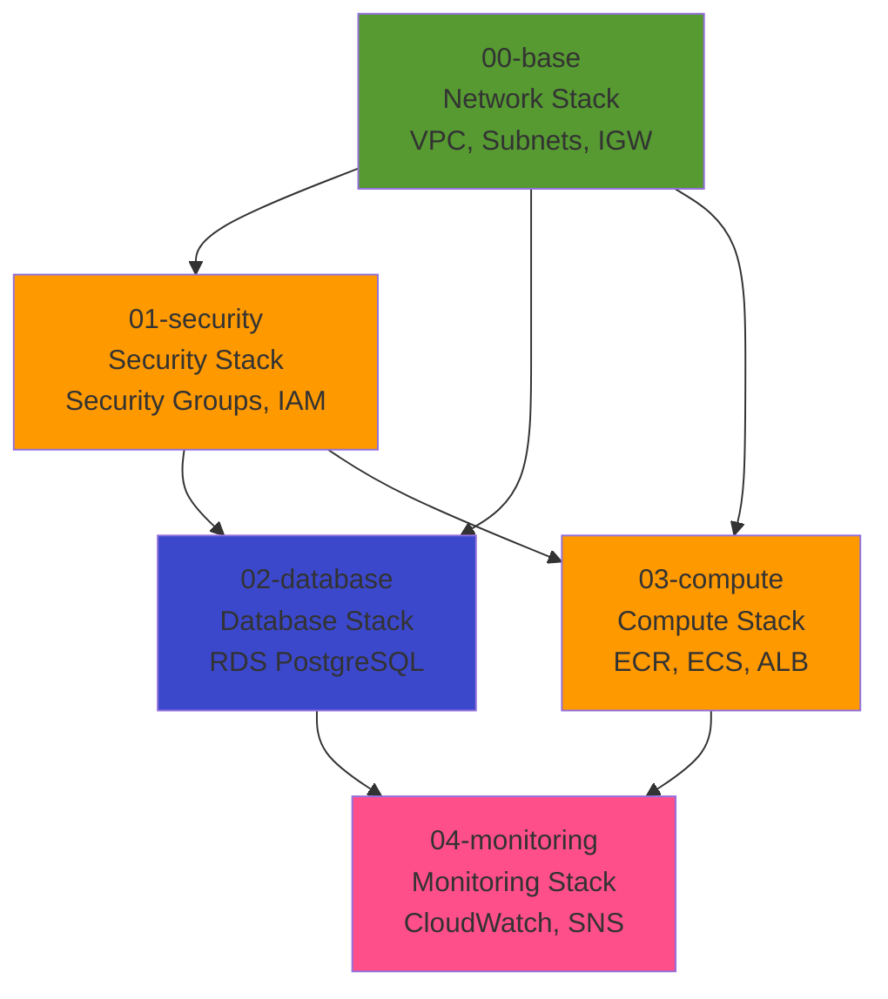

# X-Ray Watch POC - 詳細設計書 INDEX

## プロジェクト概要

| 項目 | 内容 |
|------|------|
| プロジェクト名 | X-Ray Watch POC |
| 目的 | CloudFormationスタック単位での詳細設計（リソース定義） |
| スコープ | 5つのCloudFormationスタックの詳細設計 |
| 予算 | 月額1,000円程度（$7-10）<br/>※検証時のみ起動（月20時間程度） |

## ドキュメント構成

### CloudFormationスタック詳細設計

| # | スタック名 | ドキュメント | 概要 | 推定行数 | レビュー状況 |
|---|----------|------------|------|---------|-------------|
| 00 | Base (Network) | [01_network_stack.md](01_network_stack.md) | VPC、サブネット、IGW、ルートテーブル | 100行 | 🔄 作成中 |
| 01 | Security | [02_security_stack.md](02_security_stack.md) | Security Groups、IAMロール | 250行 | 🔄 作成中 |
| 02 | Database | [03_database_stack.md](03_database_stack.md) | RDS PostgreSQL、Secrets Manager | 120行 | 🔄 作成中 |
| 03 | Compute | [04_compute_stack.md](04_compute_stack.md) | ECR、ECS Cluster/Service、ALB、Target Group | 300行 | 🔄 作成中 |
| 04 | Monitoring | [05_monitoring_stack.md](05_monitoring_stack.md) | CloudWatch Alarms、SNS Topic、X-Ray設定 | 180行 | 🔄 作成中 |

### API仕様書

| # | ドキュメント | 概要 | レビュー状況 |
|---|------------|------|-------------|
| - | [06_api_specification.md](06_api_specification.md) | タスク管理API + 障害シミュレーションAPI | 🔄 作成中 |

**合計推定行数**: 約950行（CloudFormationテンプレート）

## スタック依存関係図



### スタック間の値の受け渡し

| Export元スタック | Export名 | Import先スタック | 用途 |
|----------------|---------|----------------|------|
| 00-base | `${StackName}-VpcId` | 01-security, 02-database, 03-compute | VPC ID参照 |
| 00-base | `${StackName}-PublicSubnet1a` | 03-compute | ALB、ECS配置 |
| 00-base | `${StackName}-DbSubnet1a` | 02-database | RDS配置 |
| 01-security | `${StackName}-AlbSecurityGroup` | 03-compute | ALB Security Group参照 |
| 01-security | `${StackName}-EcsSecurityGroup` | 03-compute | ECS Security Group参照 |
| 01-security | `${StackName}-RdsSecurityGroup` | 02-database | RDS Security Group参照 |
| 01-security | `${StackName}-EcsTaskExecutionRoleArn` | 03-compute | Task Execution Role参照 |
| 01-security | `${StackName}-EcsTaskRoleArn` | 03-compute | Task Role参照 |
| 02-database | `${StackName}-RdsEndpoint` | 03-compute | RDS接続先 |
| 03-compute | `${StackName}-EcsClusterName` | 04-monitoring | CloudWatch Alarms対象 |
| 03-compute | `${StackName}-AlbArn` | 04-monitoring | CloudWatch Alarms対象 |

## パラメータファイル構成

### production.json（POC環境）

```json
[
  {
    "ParameterKey": "Environment",
    "ParameterValue": "production"
  },
  {
    "ParameterKey": "VpcCidr",
    "ParameterValue": "10.0.0.0/16"
  },
  {
    "ParameterKey": "PublicSubnetCidr",
    "ParameterValue": "10.0.1.0/24"
  },
  {
    "ParameterKey": "DbSubnetCidr",
    "ParameterValue": "10.0.21.0/24"
  },
  {
    "ParameterKey": "DBInstanceClass",
    "ParameterValue": "db.t4g.micro"
  },
  {
    "ParameterKey": "DBAllocatedStorage",
    "ParameterValue": "20"
  },
  {
    "ParameterKey": "ECSTaskCpu",
    "ParameterValue": "256"
  },
  {
    "ParameterKey": "ECSTaskMemory",
    "ParameterValue": "512"
  },
  {
    "ParameterKey": "ECSDesiredCount",
    "ParameterValue": "1"
  },
  {
    "ParameterKey": "ECSAssignPublicIp",
    "ParameterValue": "ENABLED"
  },
  {
    "ParameterKey": "AlertEmail",
    "ParameterValue": "your-email@example.com"
  }
]
```

## 詳細設計の読み方

### 各スタック詳細設計の構成

各CloudFormationスタックの詳細設計書は以下の構成になっています：

1. **概要**
   - スタックの目的
   - 依存スタック
   - Outputs（他スタックへのExport）

2. **パラメータ一覧**
   - スタックで使用するパラメータ
   - デフォルト値
   - 制約

3. **リソース一覧**
   - 作成するAWSリソースの概要

4. **リソース詳細**
   - 各リソースのプロパティ
   - 設定値と理由
   - CloudFormation YAMLサンプル

5. **Outputs**
   - スタックからExportする値
   - 他スタックでのImport方法

6. **実装方針**
   - 推定行数
   - 注意点
   - テスト方法

7. **スタック図**
   - Mermaid図でスタック内リソースの関係を可視化

## デプロイ順序

```bash
# 1. Network Stack
aws cloudformation create-stack \
  --stack-name xray-poc-base \
  --template-body file://stacks/00-base.yaml \
  --parameters file://parameters/production.json \
  --region ap-northeast-1

# 2. Security Stack
aws cloudformation create-stack \
  --stack-name xray-poc-security \
  --template-body file://stacks/01-security.yaml \
  --parameters file://parameters/production.json \
  --capabilities CAPABILITY_NAMED_IAM \
  --region ap-northeast-1

# 3. Database Stack
aws cloudformation create-stack \
  --stack-name xray-poc-database \
  --template-body file://stacks/02-database.yaml \
  --parameters file://parameters/production.json \
  --region ap-northeast-1

# 4. Compute Stack
aws cloudformation create-stack \
  --stack-name xray-poc-compute \
  --template-body file://stacks/03-compute.yaml \
  --parameters file://parameters/production.json \
  --capabilities CAPABILITY_NAMED_IAM \
  --region ap-northeast-1

# 5. Monitoring Stack
aws cloudformation create-stack \
  --stack-name xray-poc-monitoring \
  --template-body file://stacks/04-monitoring.yaml \
  --parameters file://parameters/production.json \
  --region ap-northeast-1
```

## 技術スタック

| レイヤー | 技術 | バージョン |
|---------|------|----------|
| IaC | AWS CloudFormation | 2010-09-09 |
| テンプレート形式 | YAML | - |
| パラメータ形式 | JSON | - |
| リージョン | ap-northeast-1 | 東京 |

## 重要な設計判断（ADR参照）

基本設計書の以下ADRを反映しています：

- [ADR-001: POC向け単一AZ構成の採用](../03_基本設計/INDEX.md#adr-001-poc向け単一az構成の採用)
- [ADR-002: IaCツールにCloudFormationを採用](../03_基本設計/INDEX.md#adr-002-iacツールにcloudformationを採用)
- [ADR-003: 認証なしのパブリックアクセス許容](../03_基本設計/INDEX.md#adr-003-認証なしのパブリックアクセス許容)
- [ADR-004: NAT Gateway削除（シンプル構成採用）](../03_基本設計/INDEX.md#adr-004-nat-gateway削除シンプル構成採用)
- [ADR-005: API Gateway削除（ALB直接公開）](../03_基本設計/INDEX.md#adr-005-api-gateway削除alb直接公開)

## 実装フェーズへの引き継ぎ

### SREへの引き継ぎ事項

1. **ディレクトリ構成**（基本設計書 10_IaC構成方針.md より）
   ```
   infra/cloudformation/
   ├── stacks/          # デプロイ単位（親スタック）
   ├── templates/       # 再利用可能なテンプレート（環境共通）
   └── parameters/      # 環境差分を集約
   ```

2. **技術標準**
   - `.claude/docs/40_standards/42_infra/iac/cloudformation.md` を参照

3. **実装順序**
   - 00-base → 01-security → 02-database → 03-compute → 04-monitoring

4. **テスト方法**
   - 各スタック詳細設計書の「テスト方法」セクション参照

## レビュー・承認

- 設計者: infra-architect
- レビュー担当者: SRE、PM
- 承認者: ユーザー
- 承認日: 未定

## 参照ドキュメント

- [基本設計書INDEX](../03_基本設計/INDEX.md)
- [要件定義書](../02_要件定義/要件定義書.md)
- [IaC構成方針](../03_基本設計/10_IaC構成方針.md)

---

**作成者**: infra-architect (via PM)
**作成日**: 2025-12-10
**バージョン**: 1.0
